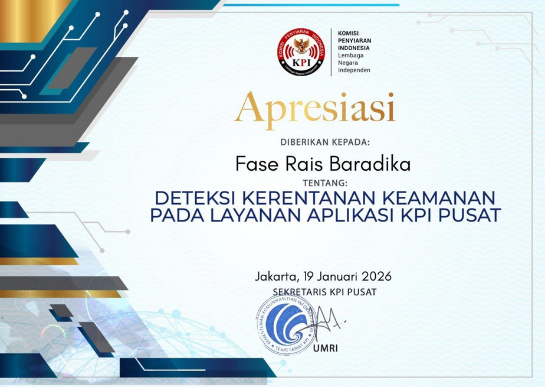
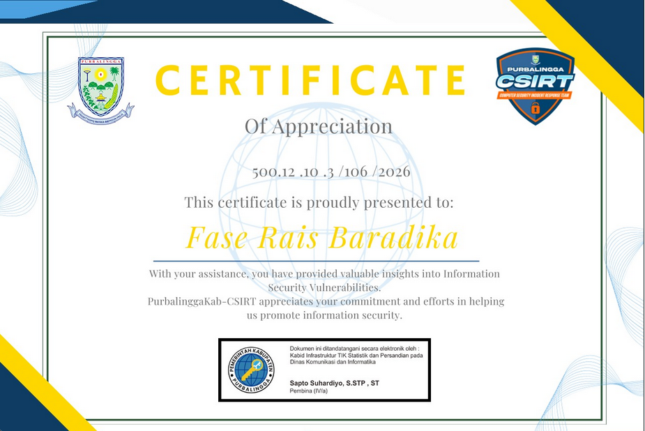
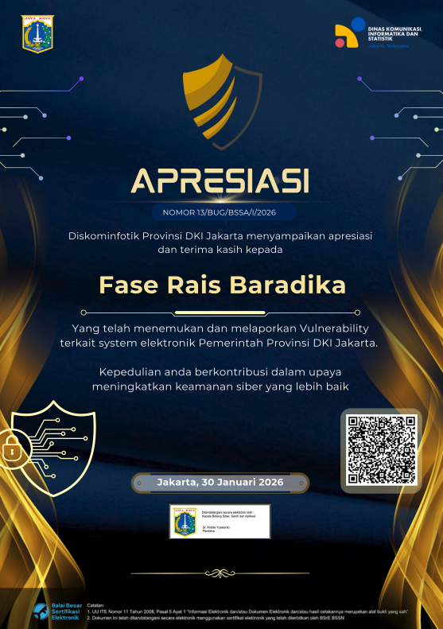
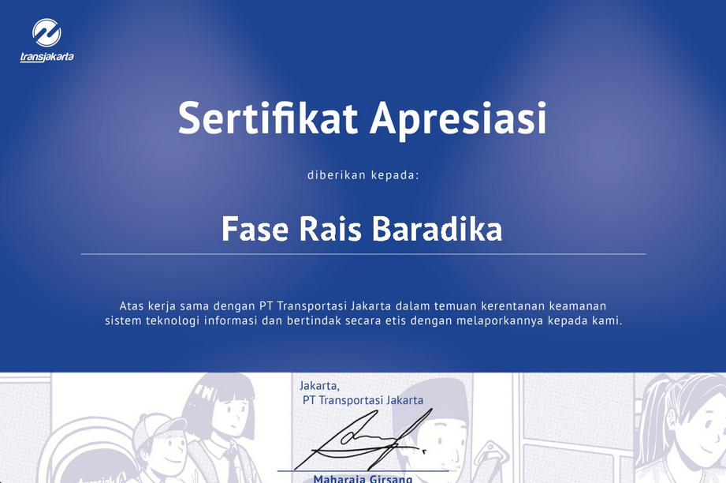
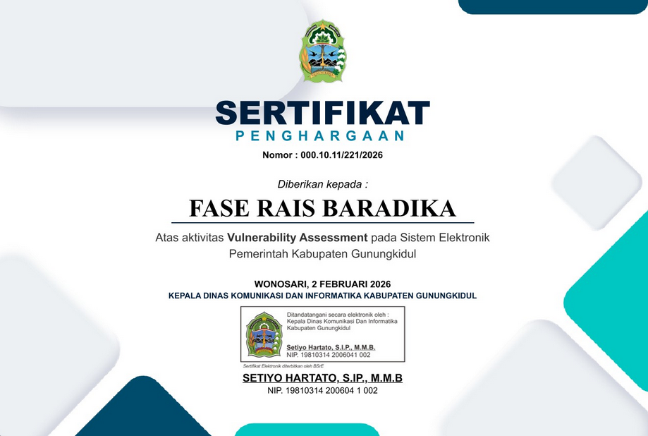
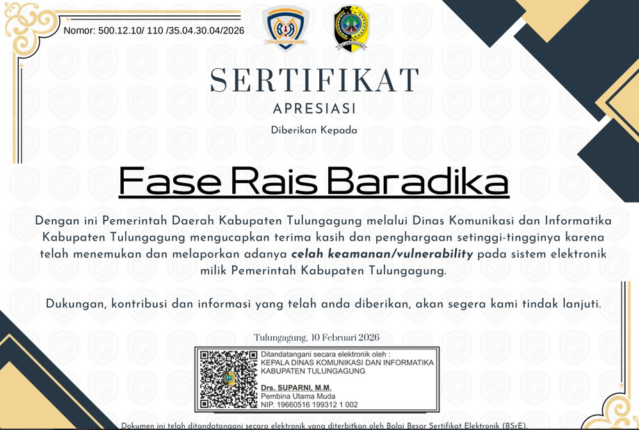

While hunting for vulnerabilities on several **csirt.go.id** programs, I discovered that many of them were running **Zimbra**. After some testing, I realized that a large number of these instances were vulnerable to **CVE-2025-68645**.

Because the same vulnerability appeared across multiple targets, it quickly turned into multiple valid reports and eventually multiple certificates.

## What is CVE-2025-68645?

CVE-2025-68645 is a **Local File Inclusion (LFI)** vulnerability affecting **Zimbra Collaboration Suite (ZCS) versions 10.0 and 10.1**, specifically within the **Webmail Classic UI**.

The vulnerability originates from improper handling of user-supplied parameters inside the `RestFilter` servlet exposed through the `/h/rest` endpoint.

Due to insufficient input validation, attackers can manipulate request parameters to include arbitrary files located inside the **WebRoot directory**.

In certain scenarios, this allows **unauthenticated remote attackers** to retrieve sensitive files from the server, potentially exposing internal configuration files and application resources.

## Vulnerability Root Cause

The issue exists because the `RestFilter` component does not properly validate the file path provided through request parameters.

When a request is sent to `/h/rest`, the application attempts to resolve the requested resource relative to the WebRoot directory. However, directory traversal sequences are not properly restricted.

This allows attackers to manipulate the request path and access files that should not normally be exposed through the web interface.

As a result, the application becomes vulnerable to **Local File Inclusion (LFI)**.

## Affected Versions

The vulnerability affects:

- Zimbra Collaboration Suite **10.0.x**
- Zimbra Collaboration Suite **10.1.x**

Instances running the **Classic Webmail UI** with the `/h/rest` endpoint exposed may be vulnerable.

## How to Exploit CVE-2025-68645

The vulnerability can be triggered by sending a crafted HTTP request to the `/h/rest` endpoint with a manipulated servlet include path.

Example request:

```
GET /h/rest?javax.servlet.include.servlet_path=/WEB-INF/web.xml
```

If the target is vulnerable, the server will return the contents of the requested file instead of blocking access.

In some cases, the server may respond with **403 Forbidden** depending on the file being accessed. When that happens, it is often possible to retrieve other files within the WebRoot directory.

For example:

```
GET /h/rest?javax.servlet.include.servlet_path=/WEB-INF/jetty-env.xml
```

If successful, the response may reveal internal configuration data that can help with further reconnaissance.

In total, i got 6 certificates from this vulnerability (you can skip this, cus i just want to flexing my certs lol).

## Certs:

### Komisi Penyiaran Indonesia



### Pemerintah Daerah Kabupaten Purbalingga



### Dinas Komunikasi, Informatika dan Statistik Provinsi DKI Jakarta



### PT Transportasi Jakarta



### Pemerintah Daerah Kabupaten Gunungkidul



### Pemerintah Daerah Kabupaten Tulungagung


